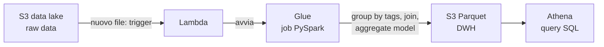

# AWS — Amazon Web Services

La piattaforma cloud usata nel Master (lab su EMR, Glue, S3). I **concetti generali** del cloud — paradigma, microservizi, IaaS/PaaS/SaaS, data lake/lakehouse — stanno in [[Cloud computing]]; qui i **servizi concreti**, in chiave *lookup*: se non sai cosa cercare, scorri la mappa.

Piattaforma per calcolo, storage, database, delivery. Distribuzione geografica in **Region** (collezioni indipendenti di risorse in una geografia), ciascuna con più **Availability Zone** isolate → si collocano risorse e dati in più luoghi per resilienza.

## Mappa dei servizi

| Servizio | Cosa fa | Tipo |
|---|---|---|
| **S3** | object storage scalabile, *no file system*, economico, pay-per-use | storage |
| **EC2** | macchine virtuali (istanze, es. *m5.xlarge*) | calcolo |
| **EMR** | cluster [[Hadoop]]/[[Spark]] gestito | big data |
| **Glue** | ETL serverless + data catalog | data engineering |
| **Athena** | query SQL direttamente su S3, serverless | analytics |
| **Redshift** | data warehouse gestito | analytics |
| **Lambda** | funzioni serverless guidate da eventi | calcolo |
| **SageMaker** | piattaforma ML gestita | ML |
| **IAM** | permessi: *chi può fare cosa* (ruoli/policy) | sicurezza |
| **VPC / subnet** | rete privata isolata | rete |

## I mattoni (cosa significano, e perché li selezioni)

> [!info]
> - **Bucket** (S3) — un contenitore di **oggetti** (file) con nome **globalmente unico**. Non è un vero file system: le "cartelle" sono solo prefissi nel nome.
> - **Istanza** (EC2) — una **macchina virtuale** che affitti (es. *m5.xlarge*): la famiglia (`m5` = general-purpose) e la taglia (`xlarge` = 4 vCore / 16 GiB) ne fissano potenza e prezzo.
> - **Cluster** (EMR) — un **gruppo di istanze EC2** che lavorano insieme con ruoli diversi: **Primary** coordina, **Core** tiene i dati (HDFS) e calcola, **Task** solo calcolo.
> - **IAM** (*Identity & Access Management*) — il sistema dei **permessi**: *chi può fare cosa*. Un **ruolo** è un insieme di permessi (*policy*) che dai a un servizio. Scegliere `EMR_DefaultRole`/`LabRole` significa, via IAM, autorizzare il cluster a leggere quel bucket S3, avviare istanze, ecc. — senza, EMR non potrebbe toccare i tuoi dati.
> - **VPC / subnet** — la **rete privata** isolata in cui vivono le istanze; EMR Studio dev'essere nella *stessa* VPC per **raggiungere** il cluster.

## Serverless

*Functions as a Service*: scrivi **funzioni** che rispondono a **eventi esterni**, senza provisioning né gestione di server. **AWS Lambda** ne è l'esempio — paghi solo l'esecuzione.

## Glue + Athena

- **Glue** — ETL **serverless** e gestito: *crawl & catalogue* dei dati, mapping → script, scheduling dei job. Paghi solo le risorse consumate, a secondi.
- **Athena** — query in **SQL standard direttamente su S3**, sul dato grezzo (CSV/JSON/Parquet), **senza ETL né caricamento**. Pay-per-query (~$5/TB scansionato); risparmi con compressione, formati colonnari e partizioni.
- **Data cleaning automatico** (AWS, dal 2024) — pulizia gestita dei dati ([[Data Quality]]). Trade-off: a seconda del job aggiunge **overhead** a monte (conta dei dati, distribuzione), ma poi rende il **processing più veloce**.

## La pipeline del lab (TEDx)

Esempio end-to-end *event-driven* su AWS:

Il job PySpark legge il dataset dei talk, raggruppa i tag per talk, fa il **join** e produce l'**aggregate model** ([[Aggregate Oriented Model]]) salvato in Parquet, interrogabile da Athena. Caricare un nuovo file in S3 scatena (via Lambda) l'intera pipeline.

## Setup pratico — EMR

Il setup passo-passo del cluster EMR + EMR Studio per far girare Spark/ML è nel lab di Spark: → [[Spark#Su AWS — EMR (il lab)|setup EMR]].

## Vedi anche

[[Cloud computing]] · [[Spark]] · [[Hadoop]] · [[ETL]] · [[Aggregate Oriented Model]] · [[Data Quality]]
