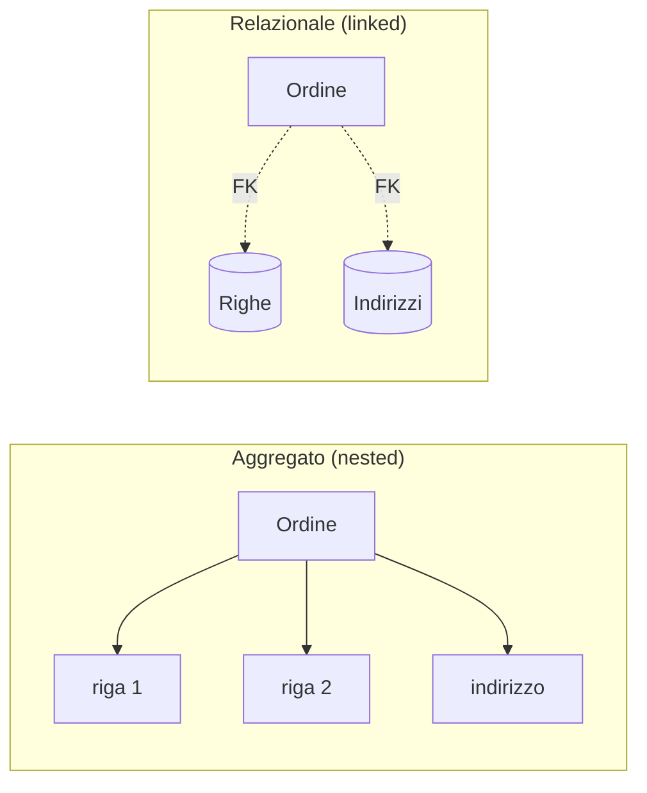

# Aggregate-Oriented Model

## Principio

Nel modello [[Relazioni|relazionale]] ogni cosa è normalizzata (niente tuple annidate, niente ridondanza, schema fisso). Il problema: quando si lavora con dati distribuiti, i **JOIN diventano costosi**, e i dati moderni arrivano da log/web/SW in formati diversi, da ragionare come *liste di elementi*.

L'AO model risponde con l'**aggregato**: una collezione di dati che si legge e si modifica **come un'unità**. Si aggregano (annidano) i dati che si usano insieme, anche a costo di ridondanza controllata.



> [!info]
> Il **"black diamond"** del diagramma: i dati sono **nested** (dentro l'aggregato), non **linked** (collegati via chiave). Tutto ciò che serve insieme sta insieme.

**Vantaggi:**
- Facile **distribuire** i dati su cluster (sharding): l'aggregato è l'unità che si sposta su un nodo.
- Interazione veloce — nessun JOIN.
- **Schema-less** (schema-free).

## Relazioni tra aggregati

Se un aggregato deve riferirsi a un altro: si mette l'**ID** di uno dentro i dati dell'altro, e il "join" lo fa un **programma applicativo** che usa quell'ID per collegarli. **Il database è ignaro della relazione** nei dati — non c'è integrità referenziale, sta all'applicazione.

Esempio (e-commerce, *NoSQL Distilled*): l'ordine **embedda** ciò che legge sempre con sé (righe, indirizzo, pagamento) e **referenzia** il cliente — aggregato a sé — col solo `customerId`:
```json
// aggregato customer
{ "id": 1, "name": "Martin", "billingAddress": [{"city": "Chicago"}] }

// aggregato order
{ "id": 99, "customerId": 1,                 // ← riferimento all'altro aggregato
  "orderItems": [{"productId": 27, "price": 32.45, "productName": "NoSQL Distilled"}],
  "shippingAddress": [{"city": "Chicago"}],
  "orderPayment": [{"ccinfo": "1000-…", "billingAddress": {"city": "Chicago"}}] }
```

> [!tip] Dove tracci il confine
> La decisione chiave è **cosa sta dentro un aggregato e cosa è un aggregato a sé**: lo stesso dominio (Customer, Order, Product, Address) si può raggruppare in modi diversi. Regola: **dentro** ciò che si legge e scrive insieme; **fuori** (riferito per ID) ciò che vive di vita propria o è condiviso (il Customer). È la stessa scelta *embedding vs referencing* di [[MONGO DB]].

## La famiglia aggregate-oriented

| Tipo | Struttura | Esempi |
|---|---|---|
| **Key-Value** | hash table: due colonne `ID → VALUE`; il valore è un *blob* opaco (testo, JSON, XML, qualsiasi cosa). Operazioni: `get`/`put`/`delete` per chiave | Redis, DynamoDB, Riak KV |
| **Column-Family** | aggregato a due livelli: una chiave + un *row aggregate* (gruppo di colonne) | Bigtable, HBase, Cassandra |
| **Documentale** | aggregato come documento JSON/BSON, con struttura visibile e interrogabile | [[MONGO DB|MongoDB]] |

> [!important]
> **Aggregate-oriented vs aggregate-ignorant.** Gli AO lavorano meglio quando *la maggior parte dell'interazione avviene con lo stesso aggregato*. I database **aggregate-ignorant** (come [[Relazioni|SQL]]) sono migliori quando le interazioni usano i dati organizzati in **tante formazioni diverse**. La scelta dipende da *come leggi i dati*, non da una preferenza astratta.

## Casi d'uso adatti

| Caso | Perché AO |
|---|---|
| **Event logging** | store centrale per eventi; sharding per app o tipo di evento |
| **CMS / Blog** | nessuno schema predefinito; utenti, commenti, profili, documenti web |
| **Web / real-time analytics** | metriche nuove aggiungibili senza cambi di schema |
| **E-commerce** | catalogo e ordini a schema flessibile, evolvibile senza migrazioni costose |

## Quando NON usarlo

- **Transazioni complesse cross-documento** — gli AO non sono fatti per operazioni atomiche su più aggregati (alcuni, come RavenDB, fanno eccezione).
- **Aggregato dalla struttura variabile** — se il design dell'aggregato cambia di continuo, dovresti salvarlo al livello di granularità più basso, e allora l'AO perde senso.

→ Confronto con gli altri tipi NoSQL: [[(non solo) Relazioni]].

## Vedi anche

[[(non solo) Relazioni]] · [[MONGO DB]] · [[Relazioni]]
