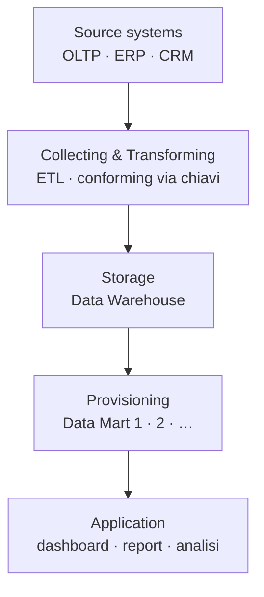

# BI Architecture

## Cos'è la Business Intelligence

Si parla di **business intelligence** quando il sistema informativo ha un impatto sul *decision making process*. È l'iniziativa di **collect, transform, provide** dei dati perché gli utenti possano *plan, control and steer* gli obiettivi dell'azienda.

> [!info]
> **Crisi** — dal greco *krísis*, "decisione, giudizio". La BI è il momento del decidere: non casuale che la radice di crisi sia la scelta.

Perché vediamo proliferare così tanti tool? Perché **i tool cambiano, l'approccio resta**. Vale la pena imparare il processo, non lo strumento del momento.

## Concetti di base

- **Database** — raccolta di dati organizzata per facile accesso, gestione e aggiornamento.
- **Data warehouse** — repository centrale e integrato dei dati aziendali, ottimizzato per l'analisi.
- **Data mart** — porzione del data warehouse rilevante per uno scopo o un reparto specifico.
- **ETL** — *Extract, Transform, Load*.
- **OLTP** — *Online Transaction Processing*: i sistemi operazionali, transazioni correnti.
- **OLAP** — *Online Analytical Processing*: analisi in tempi accettabili. → i due scenari a confronto: [[Database relazionali#OLTP vs OLAP — i due scenari]].

## Il processo BI — il dato in 4 fasi

1. **Collection** — il valore del modello **LLM** sta nella data collection: dati esaustivi, che permettono l'autoalimentazione.
2. **Optimisation** — *garbage in, garbage out*: dati sporchi, parziali o incongruenti producono analisi inutili.
3. **Distribution** — il dato giusto all'attante giusto.
4. **Presentation** — priorità in base all'interlocutore (i **KPI** cambiano col destinatario).

## Architettura di un sistema BI

Tre use case su come i dati attraversano il sistema:

1. **Use case 1** — ogni dato passa attraverso le stesse fasi.
2. **Use case 2** — i sistemi sorgente vanno diretti all'applicativo, passando attraverso *collecting & transforming*.
3. **Use case 3** — ibrido tra i due.

Le **4V + 1** dei big data ([[Dati|Volume, Velocità, Varietà, Veracity]]) culminano nella quinta, il **Value** → ed è il valore che alimenta il *decision support system*.

### I livelli dell'architettura

- **Source systems**
  - *Strutturati* — dati interni.
  - *Non strutturati* — dati esterni.
- **Collecting & transforming** — ETL e optimisation.
- **Storage** — tipicamente **colonnare**, perché scalabile: le mappe possono distribuirsi su più server. *Snowflake* è cloud, ibrido relazionale-colonnare, pensato soprattutto per la fase di provisioning.
- **Provisioning** — la porzione del data warehouse rilevante per scopi specifici (→ i data mart).
- **Application** — accesso ai dati: dashboard, PDF, reportistica in tempo reale.

### Le 4 fasi come 4 domande

Il processo BI risponde, livello per livello, a quattro domande operative:

1. **Collection** — *come trasformo dati di applicazioni diverse in dati standardizzati nel warehouse?*
2. **Optimisation** — *come strutturo, aggrego, modifico il dato perché sia utile all'analisi?*
3. **Distribution** — *come accedo ai dati, con quali strumenti?*
4. **Presentation** — *come presento il dato, in quale formato?*

## Real-time BI

La BI operazionale spinta all'estremo: dato aggiornato in tempo reale, latenza ridotta a **secondi**. Nella BI classica la mancanza temporanea di informazione può creare grossi disagi; in scenari real-time il dato fresco è il prodotto. Esempi: CRM che personalizza in base alle preferenze del momento, logistica che riottimizza le rotte durante un'emergenza, gestione scorte con riordino predittivo, manutenzione proattiva su linee di produzione, modelli di rischio che si raffinano coi dati in arrivo. Pattern architetturale di riferimento: la [[Dati#Lambda architecture|Lambda architecture]].

## Dalla BI all'analitica AI-augmented

Lo stack classico *warehouse-centrico* (sorgenti → ETL → data warehouse → OLAP/dashboard, solo **descrittivo**) sta lasciando il posto a uno stack unificato **lakehouse + semantic layer** che serve BI, machine learning e analitica **generativa/agentica** da un'unica base governata.

| | BI tradizionale | AI-augmented |
|---|---|---|
| Dati | strutturati | strutturati + non strutturati |
| Pipeline | ETL → warehouse | **ELT + lakehouse** (formati aperti, ACID, versioning) |
| Strato semantico | — | **semantic layer**: definizioni di metrica condivise + metadata attivi danno il *contesto di business* agli agenti AI |
| Output | dashboard descrittive | descrittivo **+ predittivo + conversazionale/agentico** |

- **AI-ready data** — un dato è "pronto per l'AI" solo *rispetto a un caso d'uso*: deve essere **rappresentativo** (copre pattern reali, edge case, eccezioni), **qualificato** (semanticamente ricco e validato) e **governato** (policy, sensibilità e *lineage* viaggiano col dato). Non si rende pronto "in generale" o in anticipo. *(Gartner: ~60% dei progetti AI senza dati AI-ready verrà abbandonato entro il 2026.)*
- **MCP** (Model Context Protocol) — standard aperto (Anthropic, nov 2024), "USB-C per l'AI": un solo protocollo bidirezionale al posto di N×M integrazioni custom tra app AI e dati/strumenti aziendali. Un MCP server espone tre primitive: **Tools** (azioni invocabili), **Resources** (dati/contesto leggibili), **Prompts** (template riusabili). Per la BI: gli agenti interrogano direttamente warehouse e semantic layer e rispondono in linguaggio naturale.

→ Infrastruttura dati di questo mondo (vector store, RAG, lakehouse): [[NoSQL]], [[Cloud computing]].

## Riferimenti

- *The Data Warehouse Toolkit* — Ralph Kimball, Margy Ross
- *Designing Cloud Data Platforms* — Danil Zburivsky, Lynda Partner

→ Fondamentali sul dato e le 4V: [[Dati]]

## Vedi anche

[[Dati]] · [[ETL]] · [[NoSQL]] · [[Cloud computing]]
