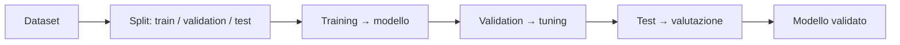
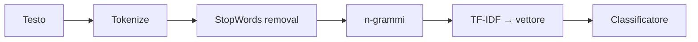

# Machine Learning (con Spark)

Branca dell'AI: algoritmi che **imparano dai dati** per sintetizzare conoscenza. Usi tipici: raccomandazione, *fraud detection*, *churn*, anomaly detection. Al Master si fa **con [[Spark]]** (libreria **MLlib**), soprattutto su testo (NLP).

> [!info] ML, AI, algoritmo, modello
> - **Machine learning** — la macchina **impara dai dati** (dagli *esempi*), non da regole scritte a mano. Un sistema a regole ("se X allora Y") è **AI ma non ML**.
> - **Algoritmo** — una serie di istruzioni.
> - **Modello** — una rappresentazione *imperfetta* della realtà (→ [[Database relazionali#Da tenere in tasca|il dato è un modello]]; *all models are wrong, but some are useful*).

## Il flusso



> [!important] Perché si divide il dataset
> Il modello impara sul **training set** e si misura sul **test set** (mai visto): è l'unico modo per stimare la capacità di **generalizzare**. La **validation** serve a scegliere gli iperparametri senza "sbirciare" il test.

## Supervised vs Unsupervised

| | **Supervised** | **Unsupervised** |
|---|---|---|
| Conosci la classe a priori? | **sì** | **no** |
| Domanda | a quale classe appartiene una nuova osservazione? | quali pattern nascosti ci sono? |
| Problemi | **classificazione** (classe discreta), **regressione** (valore continuo) | **clustering**, topic modeling, riduzione dimensionale |
| Esempio | prezzo di una casa ([[#Regressione lineare|regressione]]); occupazione dal titolo (classificazione) | raggruppare le case in lusso/economiche (K-means) |

## Regressione lineare

Il modello supervisionato per predire un **valore continuo**: descrive la relazione tra una variabile dipendente `y` e una o più indipendenti `x` con una **retta** (`y = β₀ + β₁x`) o, con più predittori, un **iperpiano** (regressione *multipla*).

- **Stima** — i coefficienti `β` si trovano col metodo dei **minimi quadrati**: minimizzano la somma dei quadrati dei **residui** (scarti tra valore osservato e predetto).
- **Valutazione** — **R²**, la quota di varianza spiegata dal modello (∈ [0,1], più alto è meglio); l'analisi dei **residui** verifica le assunzioni (linearità, varianza costante).
- In MLlib: famiglia *Regression* (`LinearRegression`); l'esempio canonico è il **prezzo di una casa** dalle sue feature.

## MLlib — la libreria

| Famiglia | Algoritmi (esempi) |
|---|---|
| **Classificazione** | Logistic regression, **Naive Bayes**, SVM, Random Forest, Decision tree, Gradient-boosted tree, MLP |
| **Regressione** | Linear, Decision/Random-forest/GBT regression, isotonic |
| **Clustering** | K-means, bisecting k-means, GMM |
| **Topic modeling** | LDA |
| **Riduzione dimensionale** | PCA, ALS (*matrix factorization* — i recommender) |

Più: feature transformation, standardizzazione, valutazione, StopWords, Hashing/TF-IDF/Word2Vec.

> [!info] Transformer vs Estimator (il cuore di MLlib)
> - **Transformer** — `.transform(df)`: legge un `inputCol`, scrive un `outputCol` (es. Tokenizer, HashingTF). *Non impara.*
> - **Estimator** — `.fit(df)` → produce un modello (a sua volta un Transformer). *Impara dai dati* (es. IDF → IDFModel, NaiveBayes → modello).
> Si concatenano in una **Pipeline**.

## Text processing (NLP) — da testo a vettori

Un classificatore non legge il testo: va trasformato in **feature vector** (*Vector Space Model* — un documento = vettore di feature pesate).



- **Tokenization** — spezza il testo in *token* (parole).
- **StopWords removal** — toglie le parole vuote (the, di, e…); MLlib ha liste per lingua.
- **n-grammi** — sequenze di n token consecutivi (bigrammi = coppie): catturano "software engineer" come unità.
- **TF-IDF** — peso per parola, alto se **frequente nel documento ma rara nella collezione** (= termine raro e informativo). `HashingTF` (Transformer) conta → `IDF` (Estimator) pesa.
- **Word2Vec** — parola → vettore denso; parole simili = vicine nello spazio (`vec[queen] − vec[king] ≈ vec[woman] − vec[man]`). Reti neurali, non supervisionato. → i [[NoSQL|vector database]].

## Valutazione (classificazione)

Matrice di confusione: **TP / FP / FN / TN**.

- **Precision** = TP/(TP+FP) — quanti dei predetti positivi sono corretti.
- **Recall** = TP/(TP+FN) — quanti dei positivi reali il modello recupera.
- **F1** = media armonica di precision e recall — un solo numero che le bilancia.

> [!warning] L'accuracy inganna
> Su classi **sbilanciate** l'accuracy è fuorviante (predici sempre la classe maggioritaria e "sembri" bravo) → guarda **F1**, precision e recall pesate.

## In pratica (Spark ML)

> [!info] Dal notebook del corso (*EU Occupation Classifier*)
> Predire l'occupazione (ESCO level 3) dal **titolo** dell'annuncio. Pipeline NLP + Naive Bayes su ~20k annunci di lavoro EU, su EMR/S3.

```python
from pyspark.ml.feature import RegexTokenizer, StopWordsRemover, NGram, HashingTF, IDF, StringIndexer
from pyspark.ml.classification import NaiveBayes
from pyspark.ml.evaluation import MulticlassClassificationEvaluator

train, test = ds.randomSplit([0.9, 0.1], seed=12345)            # split riproducibile

tok     = RegexTokenizer(inputCol="title", outputCol="words", pattern="\\W")
remover = StopWordsRemover(inputCol="words", outputCol="cleaned")   # multi-lingua
ngram   = NGram(n=2, inputCol="cleaned", outputCol="bigrams")
tf      = HashingTF(inputCol="ngrams", outputCol="rawFeatures")     # Transformer (conta)
idf     = IDF(inputCol="rawFeatures", outputCol="features")         # Estimator → .fit (pesa)
label   = StringIndexer(inputCol="target", outputCol="label")       # classi → numeri
nb      = NaiveBayes(labelCol="label", featuresCol="features")      # classificatore

# … applica i transformer (e .fit di idf/nb) su train, poi transform su test …
f1 = MulticlassClassificationEvaluator(labelCol="label", metricName="f1").evaluate(predictions)
```

> [!tip] Tuning e decodifica
> - `ParamGridBuilder` + `TrainValidationSplit` provano più iperparametri (es. `smoothing` di Naive Bayes) e tengono il migliore.
> - `IndexToString` ri-converte i numeri predetti nei nomi delle occupazioni.
> - Stesso identico ordine di transform su train **e** test (riusa i transformer già fittati), o i risultati non sono confrontabili.

## Vedi anche

[[Spark]] · [[Data Quality]] · [[Cloud computing]]
