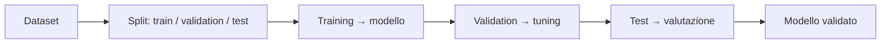
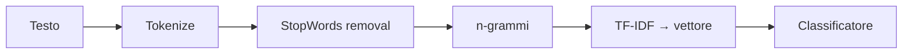

# Machine Learning (con Spark)

Branca dell'AI: algoritmi che **imparano dai dati** invece di eseguire regole scritte da qualcuno. Usi tipici: raccomandazione, individuazione delle frodi, previsione dell'abbandono (*churn*), rilevamento di anomalie. Al Master si lavora **con [[Spark]]** e la sua libreria **MLlib**, soprattutto su testo.

> [!info] ML, AI, algoritmo, modello
> - **Machine learning** — la macchina impara **dagli esempi**. Le mostri mille email già marcate come spam, e lei ricava da sola cosa distingue lo spam. Un sistema a regole scritte a mano ("se contiene 'vinci', allora spam") è **AI ma non ML**: quelle regole le ha decise una persona.
> - **Algoritmo** — una sequenza di istruzioni. È la procedura, non il risultato.
> - **Modello** — ciò che l'algoritmo produce dopo aver visto i dati: una rappresentazione **imperfetta** della realtà, che serve a fare previsioni (→ [[Database relazionali#Da tenere in tasca|il dato è un modello]]; *all models are wrong, but some are useful*).

## Il flusso


```mermaid
flowchart LR
    D[Dataset] --> S[Split: train / validation / test]
    S --> T[Training → modello]
    T --> V[Validation → tuning]
    V --> E[Test → valutazione]
    E --> M[Modello validato]
```

> [!important] Perché si divide il dataset
> Il rischio da evitare si chiama **overfitting**: il modello impara a memoria i dati che gli hai mostrato, casi particolari e rumore compresi, e su dati nuovi sbaglia. Un modello che memorizza sembra bravissimo sugli esempi visti e diventa inutile appena esce di lì.
>
> Da qui i tre insiemi:
> - **training set** — i dati su cui il modello impara;
> - **validation set** — serve a scegliere gli **iperparametri**, cioè le impostazioni che decidi tu prima dell'addestramento e che il modello non impara dai dati (quanti alberi, quanta regolarizzazione);
> - **test set** — dati **mai visti**, usati una volta sola alla fine per stimare quanto il modello **generalizza**.
>
> Perché servono sia validation sia test? Perché scegliere gli iperparametri guardando il test set significa adattarsi anche a quello: il numero finale non sarebbe più una stima onesta. La validation esiste per non "sbirciare".

## Supervised vs Unsupervised

La differenza sta in una domanda sola: **negli esempi che dai in pasto, la risposta giusta c'è già?**

|                             | **Supervised**                                                                                        | **Unsupervised**                                                                  |
| --------------------------- | ----------------------------------------------------------------------------------------------------- | --------------------------------------------------------------------------------- |
| Conosci la classe a priori? | **sì** — ogni esempio ha la sua etichetta                                                             | **no** — hai solo i dati                                                          |
| Domanda                     | a quale classe appartiene una nuova osservazione?                                                     | quali pattern nascosti ci sono?                                                   |
| Problemi                    | **classificazione** (esito discreto: spam / non spam), **regressione** (valore continuo: un prezzo)   | **clustering**, topic modeling, riduzione dimensionale                            |
| Esempio                     | prezzo di una casa ([[#Regressione lineare]]); occupazione dal titolo dell'annuncio (classificazione) | raggruppare le case in fasce simili senza aver deciso prima quali siano (K-means) |

La differenza pratica è il **costo**: il supervised richiede esempi etichettati, e etichettarli di solito vuol dire lavoro umano. L'unsupervised parte dai dati così come sono, ma non puoi dirgli cosa cercare.

## Regressione lineare

Il modello supervisionato per prevedere un **valore continuo**. Descrive il legame tra una variabile che vuoi prevedere (`y`, *dipendente*) e una o più che usi per prevederla (`x`, *indipendenti*) tracciando una **retta**: `y = β₀ + β₁x`. Con più predittori la retta diventa un **iperpiano** — l'equivalente in più dimensioni — e si parla di regressione *multipla*.

Esempio: prevedere il prezzo di una casa dai metri quadri. Ogni casa è un punto sul grafico; la regressione cerca la retta che passa "in mezzo" ai punti nel modo migliore.

In due parole: la retta si sceglie con i **minimi quadrati** e si valuta con l'**R²**, guardando poi i **residui** per verificare che la retta fosse la forma giusta. In MLlib: famiglia *Regression*, classe `LinearRegression`.

> [!info] La trattazione completa sta in [[Modelli lineari]]
> Minimi quadrati, R² e R² aggiustato, lettura dei residui, regressione multipla e ANOVA — insieme al resto della statistica del corso. Qui resta il punto di vista di MLlib.
>
> Per una `y` binaria (sì/no) invece della retta serve la [[Regressione logistica]].

## MLlib — la libreria

| Famiglia | Algoritmi (esempi) |
|---|---|
| **Classificazione** | Logistic regression, **Naive Bayes**, SVM, Random Forest, [[Alberi decisionali\|Decision tree]], Gradient-boosted tree, MLP |
| **Regressione** | Linear, Decision/Random-forest/GBT regression, isotonic |
| **Clustering** | K-means, bisecting k-means, GMM |
| **Topic modeling** | LDA |
| **Riduzione dimensionale** | PCA, ALS (*matrix factorization*, la base dei sistemi di raccomandazione) |

Più tutta la parte di preparazione: trasformazione delle feature, standardizzazione, valutazione, StopWords, Hashing/TF-IDF/Word2Vec.

> [!info] Naive Bayes, il classificatore del lab
> Calcola, per ogni classe, quanto è probabile che un testo appartenga a quella classe viste le parole che contiene. "Naive" (ingenuo) perché **assume che le parole siano indipendenti** tra loro — che la presenza di "software" non dica niente sulla probabilità di trovare "engineer". È palesemente falso, e ciononostante funziona molto bene sul testo, oltre a essere velocissimo da addestrare. È il classico caso di modello sbagliato ma utile. Il teorema che ci sta sotto, con prior e posterior, è in [[Classificatore di Bayes]].

> [!info] Transformer vs Estimator (il cuore di MLlib)
> Tutta MLlib è costruita su due soli concetti:
> - **Transformer** — ha il metodo `.transform(df)`: legge una colonna (`inputCol`), ne scrive un'altra (`outputCol`). **Non impara niente**: applica sempre la stessa operazione. Es. Tokenizer, HashingTF.
> - **Estimator** — ha il metodo `.fit(df)`: guarda i dati, **impara** qualcosa e restituisce un modello — che a sua volta è un Transformer. Es. IDF produce un IDFModel; NaiveBayes produce il classificatore addestrato.
>
> La differenza conta in pratica: un Transformer puoi applicarlo a train e test indifferentemente, un Estimator va addestrato **solo sul train**. Si concatenano in una **Pipeline**.

## Text processing (NLP) — da testo a vettori

Un classificatore non sa leggere: sa solo fare conti su numeri. Quindi ogni testo va prima trasformato in un **feature vector**, una lista di numeri. L'impianto si chiama *Vector Space Model*: ogni documento diventa un punto in uno spazio con una dimensione per ogni parola del vocabolario, e documenti simili finiscono vicini.


```mermaid
flowchart LR
    T[Testo] --> TK[Tokenize] --> SW[StopWords removal] --> NG[n-grammi] --> TF["TF-IDF → vettore"] --> C[Classificatore]
```

- **Tokenization** — spezza il testo in *token*, in pratica le parole. "Senior software engineer" → `[senior, software, engineer]`.
- **StopWords removal** — elimina le parole vuote (*the*, *di*, *e*…): compaiono ovunque, quindi non aiutano a distinguere niente. MLlib ha liste già pronte per lingua.
- **n-grammi** — sequenze di n token consecutivi. Con i bigrammi (n=2), "software engineer" viene trattato come un'unità sola invece che come due parole slegate — e la differenza tra "software engineer" e "sales engineer" si conserva.
- **TF-IDF** — assegna a ogni parola un peso, alto quando la parola è **frequente in quel documento ma rara nell'intera collezione**. L'idea: "engineer" compare in metà degli annunci e distingue poco; "kubernetes" compare di rado e quando c'è dice molto. In MLlib: `HashingTF` (Transformer) conta le occorrenze, `IDF` (Estimator) le pesa in base a quanto la parola è rara.
- **Word2Vec** — approccio diverso: mappa ogni parola in un vettore denso, addestrato in modo che parole usate in contesti simili finiscano vicine nello spazio. Cattura relazioni di significato (`vec[queen] − vec[king] ≈ vec[woman] − vec[man]`). Usa reti neurali ed è non supervisionato. → i [[NoSQL|vector database]].

## Valutazione (classificazione)

L'accuratezza — la percentuale di risposte giuste — non basta, e la **matrice di confusione** spiega perché. Incrocia quello che il modello ha predetto con quello che era vero:

| | **Realtà: positivo** | **Realtà: negativo** |
|---|---|---|
| **Predetto positivo** | **TP** — *true positive*, preso giusto | **FP** — *false positive*, falso allarme |
| **Predetto negativo** | **FN** — *false negative*, mancato | **TN** — *true negative*, scartato giusto |

Su un filtro antispam: **FP** = un'email legittima finita nello spam; **FN** = spam arrivato in posta. Sono due errori diversi, con conseguenze diverse.

Da qui le due metriche che contano:

- **Precision** = TP/(TP+FP) — di tutto quello che ho segnalato, **quanto era davvero da segnalare**. Bassa = troppi falsi allarmi.
- **Recall** = TP/(TP+FN) — di tutto quello che c'era da trovare, **quanto ne ho trovato**. Bassa = troppa roba sfuggita.
- **F1** = media armonica delle due, un solo numero che le bilancia. Si usa l'armonica e non l'aritmetica perché penalizza gli squilibri: chi ha precision 1,0 e recall 0,0 ottiene F1 = 0, non 0,5.

**Le due si oppongono**, e quale privilegiare dipende da quale errore costa di più. Uno screening oncologico vuole **recall alto**: meglio qualche falso allarme che un malato mancato. Un filtro antispam vuole **precision alta**: meglio un po' di spam in posta che una email di lavoro persa.

> [!warning] L'accuracy inganna
> Su classi **sbilanciate** l'accuratezza è fuorviante. Se le transazioni fraudolente sono l'1%, un modello che risponde sempre "non è frode" ha il **99% di accuratezza** e non serve a niente: non ne trova nemmeno una. Guarda F1, precision e recall — pesate, se le classi sono più di due.

> [!info] La trattazione completa sta in [[Valutare un classificatore]]
> Specificità, tassi di falsi positivi e negativi, il tasso di errore pesato con i prior, le misure per più di due classi e la matrice di profitto. Per scegliere **fra** più modelli servono invece misure che non dipendono dalla soglia → [[Confrontare i modelli]].

## In pratica (Spark ML)

> [!info] Dal notebook del corso (*EU Occupation Classifier*)
> Predire l'occupazione (ESCO livello 3) dal **titolo** dell'annuncio. Pipeline NLP + Naive Bayes su circa 20k annunci di lavoro europei, su EMR/S3.

```python
from pyspark.ml.feature import RegexTokenizer, StopWordsRemover, NGram, HashingTF, IDF, StringIndexer
from pyspark.ml.classification import NaiveBayes
from pyspark.ml.evaluation import MulticlassClassificationEvaluator

train, test = ds.randomSplit([0.9, 0.1], seed=12345)            # seed = split riproducibile

tok     = RegexTokenizer(inputCol="title", outputCol="words", pattern="\\W")
remover = StopWordsRemover(inputCol="words", outputCol="cleaned")   # multi-lingua
ngram   = NGram(n=2, inputCol="cleaned", outputCol="bigrams")
tf      = HashingTF(inputCol="bigrams", outputCol="rawFeatures")    # Transformer (conta)
idf     = IDF(inputCol="rawFeatures", outputCol="features")         # Estimator → .fit (pesa)
label   = StringIndexer(inputCol="target", outputCol="label")       # classi → numeri
nb      = NaiveBayes(labelCol="label", featuresCol="features")      # classificatore

# … applica i transformer (e .fit di idf/nb) su train, poi transform su test …
f1 = MulticlassClassificationEvaluator(labelCol="label", metricName="f1").evaluate(predictions)
```

Nota come `outputCol` di uno stadio diventa `inputCol` del successivo: è così che si incatena la pipeline, e basta un nome che non corrisponde perché non giri.

> [!tip] Tuning e decodifica
> - `ParamGridBuilder` + `TrainValidationSplit` provano automaticamente più combinazioni di iperparametri (es. lo `smoothing` di Naive Bayes) e tengono la migliore.
> - `StringIndexer` converte le classi testuali in numeri perché il modello lavora su numeri; `IndexToString` fa il percorso inverso sui risultati, per rileggere i nomi delle occupazioni.
> - Applica **lo stesso identico ordine di trasformazioni** su train e test, riusando i transformer già addestrati sul train. Se ri-addestri l'IDF sul test, i pesi cambiano e i due insiemi non sono più confrontabili.

## Vedi anche

[[Spark]] · [[Valutare un classificatore]] · [[Data Quality]] · [[Cloud computing]]
