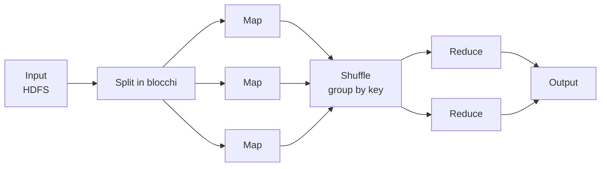

# Hadoop

Framework open-source per **storage e processing distribuiti di grandi volumi di dati su cluster di commodity hardware**, a un costo e in un tempo ragionevoli. Logica: prototipi in piccolo, poi scali lo *stesso* codice. Nato da Doug Cutting e Mike Cafarella (2005-06) per il motore di ricerca Nutch, poi @Yahoo e infine progetto Apache.

Obiettivi: salvare e processare grandi dataset (strutturati **e** non) con la stessa facilità, semplificare il codice anche in ambienti distribuiti, alta affidabilità, scalabilità, *fault tolerance*. Principio cardine:

> [!important]
> **Bring the program to the data, not the data to the program.** Spostare il *codice* (piccolo) verso i nodi dove i dati già risiedono, invece di spostare i dati (enormi). È l'opposto dell'architettura tradizionale.

## L'intuizione: distribuire il lavoro

L'esempio della **Divina Commedia**: per contare le occorrenze di una parola, invece di un solo lettore distribuisci il lavoro su 40 persone, una per canto. Alcune finiscono prima, altre dopo — ma il totale arriva molto più in fretta. Hadoop fa questo coi dati: spezza il lavoro e lo manda ai nodi (*divide & conquer*).

## HDFS — il file system distribuito

Erede del **Google File System**, scritto in Java. I file vengono **spezzati in blocchi** (tipicamente **128 MB**) distribuiti sui nodi. I blocchi contengono **solo dati grezzi**, nessun metadato (attributi, permessi). La velocità di lettura/scrittura è vicina al transfer rate massimo del disco.

- **Hadoop 2:** ogni blocco è replicato **×3** (ridondanza → resilienza ai guasti).
- **Hadoop 3:** introdotto un **bit di parità** (*erasure coding*) per ricostruire i dati persi senza il triplice overhead della replica.
- **Zookeeper** coordina i nodi distribuiti.

## MapReduce — il modello di calcolo

Modello *divide & conquer*: spezza un problema grande in **sotto-problemi indipendenti**, eseguibili **in parallelo** dai worker; i risultati intermedi si **combinano** in quello finale. Funziona perché le operazioni sono **atomiche e senza dipendenze** tra loro — qualsiasi algoritmo gira su Hadoop *a patto di essere traducibile in MapReduce*.

- **Map** — ogni worker elabora il *proprio* blocco ed emette coppie `chiave → valore` intermedie (es. `parola → 1`).
- **Shuffle** — il framework raggruppa per chiave e smista a chi farà il reduce.
- **Reduce** — combina i valori della stessa chiave nel risultato (es. somma → `parola → N`).

> [!note]
> **Come la distribuzione si lega all'esecuzione** (la domanda che avevo lasciato aperta): prima il framework *distribuisce* — manda il codice ai nodi e assegna a ciascuno un blocco (Map); poi *esegue le istruzioni* su ogni pezzo in parallelo; infine *raccoglie e combina* (Shuffle + Reduce). La distribuzione **precede** ed **abilita** l'esecuzione: nessun worker dipende da un altro, per questo possono girare insieme.

### Architettura master-slave (MapReduce v1)
- **JobTracker** (master) — gestisce il ciclo di vita del job: accodamento, interazione col file system, divisione in task, **riesecuzione dei task falliti**, notifica di avanzamento e completamento.
- **TaskTracker** (slave) — esegue i singoli task sul nodo, gestisce i tentativi in caso di fallimento, notifica il master.

## YARN

Da Hadoop 2, **YARN** (*Yet Another Resource Negotiator*) separa la gestione delle **risorse** del cluster dalla logica di calcolo, diventando lo strato su cui girano motori diversi — incluso [[Spark]], che usa YARN per la distribuzione e HDFS per i dati.

## Vedi anche

- [[Spark]] — gira sopra Hadoop/YARN, ne usa HDFS; estende MapReduce con calcolo *in-memory* e *lazy*.
- [[Dati]] — scale-out, le 4V.
- [[Data Ingestion]] · [[Cloud computing]] — su cloud, [[AWS|EMR]]/[[Databricks]] gestiscono il cluster Hadoop/Spark per te.
