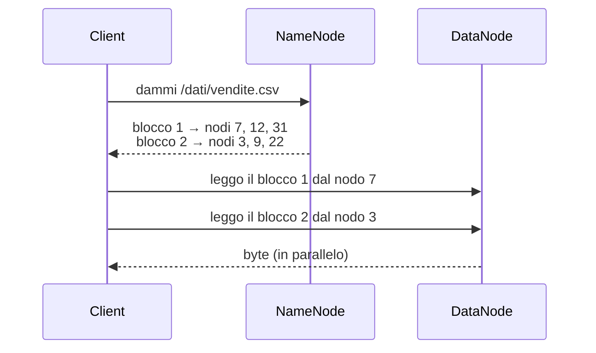
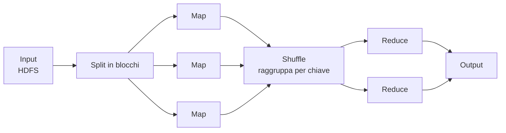

# Hadoop

Framework open-source per **immagazzinare ed elaborare grandi quantità di dati usando tanti computer normali che lavorano insieme**, invece di un solo computer molto potente.

"Computer normali" è il punto: in gergo si dice *commodity hardware*. Sono macchine da poche migliaia di euro, non server specializzati da centinaia di migliaia. Costano poco, quindi puoi permetterti di comprarne tante. E se una si rompe, la sostituisci senza drammi — vedremo che Hadoop dà per scontato che si rompano.

Nato nel 2005-06 da **Doug Cutting** e **Mike Cafarella**, che stavano costruendo il motore di ricerca open-source *Nutch* e non riuscivano a farlo scalare. Si ispirarono a due articoli pubblicati da Google, sul **Google File System** (2003) e su **MapReduce** (2004). Il progetto passò poi a Yahoo, e infine alla fondazione Apache. Il nome viene dall'elefantino di peluche del figlio di Cutting.

## Il problema di partenza

Immagina di avere **1 TB di log** da analizzare — mille miliardi di byte, diciamo un anno di traffico di un sito.

Ti si presentano subito due problemi distinti:

1. **Dove lo metto?** Un disco singolo magari ci sta, ma leggerlo tutto a ~100 MB/s richiede circa **3 ore**. E se quel disco muore, hai perso tutto.
2. **Come lo elaboro?** Un solo processore che macina 1 TB ci mette il tempo che ci mette, e non c'è modo di accorciarlo comprando un processore leggermente migliore.

Hadoop risponde a entrambi, con due componenti separati:

| Componente | Risolve | In una frase |
|---|---|---|
| **HDFS** | dove metto i dati | spezza i file e li sparge su tante macchine |
| **MapReduce** | come li elaboro | spezza il calcolo e lo manda dove stanno i pezzi |
| **YARN** | chi comanda | distribuisce le risorse del cluster tra i lavori in corso |

**Cluster** è la parola per "insieme di macchine che collaborano come se fossero una sola". Ogni macchina del cluster si chiama **nodo**.

## Il principio: portare il programma ai dati

Questo è il ribaltamento che rende Hadoop diverso da tutto quello che c'era prima.

**Come funziona un'architettura tradizionale.** I dati stanno su un database o uno storage centrale. Il programma gira su un server applicativo, separato. Per elaborare i dati, il programma se li fa mandare attraverso la rete.

Finché i dati sono pochi, funziona benissimo. Con 1 TB, no. Una rete a 1 Gbps trasferisce circa **125 MB al secondo**. Per spostare 1 TB servono più di **due ore**, durante le quali il processore non fa nulla: aspetta.

**Come funziona Hadoop.** I dati restano fermi dove sono. Quello che viaggia è il **codice** — poche centinaia di kilobyte, che attraversano la rete in un istante. Ogni macchina esegue il programma sui dati che ha già sul proprio disco.

> [!important]
> **Bring the program to the data, not the data to the program.**
> Sposta il programma (piccolo) verso i dati (enormi), mai il contrario. Tutto il resto dell'architettura di Hadoop discende da qui.

## L'intuizione: dividere il lavoro

Prendi la **Divina Commedia** e conta quante volte compare la parola "amore".

Una persona sola deve leggere tutti i 100 canti, uno dopo l'altro. Ci mette ore.

Adesso distribuisci: **40 persone, ogni persona prende dei canti**. Ognuna conta solo nei suoi. Alla fine sommi i 40 numeri parziali e hai il totale.

Perché funziona? Perché **contare in un canto non richiede di sapere niente degli altri canti**. I lavori sono indipendenti, quindi possono procedere tutti insieme. Alcune persone finiranno prima, altre dopo — ma il totale arriva molto più in fretta.

Questa indipendenza è la condizione che rende possibile tutto Hadoop. Tienila da parte: torna sia in HDFS sia in MapReduce.

## HDFS — dove stanno i dati

**HDFS** sta per *Hadoop Distributed File System*: il file system distribuito di Hadoop. È l'erede diretto del Google File System ed è scritto in Java.

Un **file system** è la parte di un sistema che tiene traccia dei file: dove comincia ciascuno sul disco, come si chiama, chi può leggerlo. "Distribuito" vuol dire che qui i file non stanno su un disco solo, ma sparsi su decine o centinaia di macchine — e chi li usa non se ne accorge: vede un unico albero di cartelle, come su un computer normale.

### I blocchi

Quando salvi un file su HDFS, il file viene **spezzato in blocchi** da **128 MB** l'uno. Un file da 1 GB diventa 8 blocchi. I blocchi finiscono su nodi diversi del cluster.

I blocchi contengono **solo dati grezzi**: sequenze di byte, senza nome del file, senza permessi, senza date. Tutte queste informazioni — i **metadati**, cioè i dati che descrivono i dati — stanno da un'altra parte, e tra un attimo vediamo dove.

**Perché blocchi così grandi?** Un file system normale usa blocchi da 4 KB, trentaduemila volte più piccoli. La ragione sta in come funziona un disco meccanico. Leggere comporta due tempi:

- il **seek**, cioè spostare la testina nel punto giusto: circa **10 millisecondi**, e non dipende da quanto leggi;
- il **transfer**, cioè leggere davvero i dati: circa **100 MB al secondo**.

Con un blocco da 128 MB, il transfer dura circa 1,3 secondi e il seek pesa meno dell'1%. Con blocchi piccoli passeresti la maggior parte del tempo a spostare la testina invece che a leggere. Blocchi grandi = il disco lavora quasi sempre alla sua velocità massima.

### I due tipi di nodo

In un cluster HDFS le macchine non fanno tutte la stessa cosa. Ci sono due ruoli.

**NameNode — il master.** Non contiene **nessun** dato degli utenti. Contiene i **metadati**: l'albero delle cartelle, i nomi dei file, i permessi, e soprattutto la mappa che dice *questo file è fatto da questi blocchi, e ogni blocco sta su questi nodi*. Tiene tutto in memoria RAM, per rispondere in millisecondi.

**DataNode — gli slave.** Contengono i **blocchi** veri e propri, e nient'altro. Un DataNode non sa nemmeno a quale file appartengano i blocchi che custodisce: per lui sono pacchetti di byte con un identificativo. Ogni pochi secondi manda un **heartbeat** ("battito cardiaco") al NameNode, un messaggio che significa *sono vivo e ho questi blocchi*.

> [!tip] L'analogia dell'elenco telefonico
> Il NameNode è l'elenco: sa il numero di tutti, ma non fa le telefonate. I DataNode sono le persone: fanno le telefonate, ma non hanno l'elenco.
> Se il NameNode gestisse anche i dati, dovrebbero passare tutti da lui — e diventerebbe il collo di bottiglia dell'intero cluster. Non toccare i dati è esattamente ciò che lo tiene veloce.

### Cosa succede quando leggi un file


```mermaid
sequenceDiagram
    participant C as Client
    participant N as NameNode
    participant D as DataNode
    C->>N: dammi /dati/vendite.csv
    N-->>C: blocco 1 → nodi 7, 12, 31<br/>blocco 2 → nodi 3, 9, 22
    C->>D: leggo il blocco 1 dal nodo 7
    C->>D: leggo il blocco 2 dal nodo 3
    D-->>C: byte (in parallelo)
```

Tre cose da notare in questo scambio:

1. Il client chiede al NameNode **solo la mappa**, non i dati.
2. Poi va a prendersi i blocchi **direttamente dai DataNode**, senza più passare dal NameNode.
3. I blocchi arrivano **in parallelo**, da macchine diverse contemporaneamente. È qui che si guadagna la velocità.

### Le repliche: perché il cluster sopravvive ai guasti

In un cluster da 1000 macchine economiche, qualcosa si rompe **ogni giorno**. Hadoop non cerca di evitarlo: lo dà per scontato e si organizza di conseguenza.

Ogni blocco viene scritto **3 volte**, su tre nodi diversi (è il comportamento di default in Hadoop 2). Se un disco muore, le altre due copie sono lì.

Dove vengono messe le tre copie non è casuale. HDFS conosce la disposizione fisica delle macchine — quali stanno nello stesso **rack**, cioè nello stesso armadio, attaccate allo stesso switch di rete. È la *rack awareness*, la "consapevolezza dei rack":

- **1ª copia** — sul nodo che sta scrivendo (o su uno vicino);
- **2ª copia** — su un nodo di un **rack diverso**;
- **3ª copia** — su un altro nodo di **quel** rack.

Così sopravvivi a due tipi di guasto diversi: la morte di un singolo disco (coperta dalle copie nello stesso rack, che si raggiungono in fretta) e la morte di un rack intero — switch che salta, alimentazione che va via — coperta dalla copia lontana.

**Il cluster si ripara da solo.** Se un DataNode smette di mandare heartbeat, il NameNode dopo qualche minuto lo dichiara morto. Guarda quali blocchi erano su quella macchina, si accorge che ora hanno solo 2 copie invece di 3, e ordina ad altri nodi di ricopiarle altrove. Nessuno deve intervenire.

Il prezzo è lo **spazio**: 1 TB di dati occupa 3 TB di disco. Per questo **Hadoop 3** ha introdotto l'***erasure coding***, che invece di copiare tutto salva dei **bit di parità** — informazioni di controllo che permettono di ricostruire matematicamente un pezzo perduto, un po' come il RAID. L'overhead scende da +200% a circa +50%, a parità di resistenza ai guasti. Lo svantaggio: quando un blocco va perso davvero, ricostruirlo costa calcolo e traffico di rete, mentre con la replica basta copiare.

> [!warning] Il NameNode è il punto debole
> I DataNode possono morire quanto vogliono. Il NameNode no: se perdi i metadati, i blocchi sui DataNode restano lì ma diventano byte senza senso. Sai *cosa* c'è, non sai più *come* rimetterlo insieme.
>
> Le difese, in ordine storico:
> - **Secondary NameNode** — nonostante il nome **non è un sostituto**. Fa solo manutenzione: unisce periodicamente il registro delle modifiche allo snapshot dei metadati, così il NameNode riparte in fretta. Non prende il suo posto se cade.
> - **High Availability** (da Hadoop 2) — due NameNode, uno **attivo** e uno **standby** che riceve gli stessi aggiornamenti in tempo reale. Se l'attivo cade, lo standby subentra in pochi secondi.
> - **Zookeeper** — il servizio che sorveglia i due, decide chi è l'attivo e coordina il passaggio di consegne. Serve a evitare che entrambi si credano attivi contemporaneamente.

### Il vincolo che sorprende: scrivi una volta, leggi tante

Su HDFS **non puoi modificare un file esistente**. Puoi crearlo, leggerlo, aggiungere roba in fondo, cancellarlo. Non puoi andare a cambiare un record in mezzo.

È una **scelta**, non una funzionalità mancante. Pensa a cosa vorrebbe dire permettere le modifiche: ogni volta che cambi un byte, tre copie sparse sul cluster devono restare d'accordo su qual è la versione buona. Servirebbero blocchi, lock, protocolli di consenso — e la scrittura diventerebbe lenta e fragile. Rinunciandoci, la regola è banale (*un file scritto non cambia più*) e le letture volano.

Da qui discende a cosa serve HDFS e a cosa no:

| Va bene per | Va male per |
|---|---|
| File **grandi**, letti per intero o quasi | Tanti file **piccoli** |
| Scrittura in blocco, poi analisi ripetute | Aggiornamenti frequenti di singoli record |
| **Throughput** alto (tanti dati al secondo) | **Latenza** bassa (risposta rapida su un dato solo) |

Il problema dei file piccoli merita una riga in più, perché è controintuitivo. Ogni file, ogni blocco e ogni cartella occupa spazio **nella RAM del NameNode**, circa 150 byte a testa. Un file da 1 GB (8 blocchi) costa quasi niente. Un milione di file da 1 KB costa mille volte tanto, per la stessa quantità di dati. Un cluster può saturarsi di metadati pur avendo i dischi mezzi vuoti.

Se ti serve leggere e scrivere singoli record in fretta, HDFS non è lo strumento giusto: sopra ci si mette un database come **HBase**, oppure si guarda altrove → [[NoSQL]].

## MapReduce — come si elaborano i dati

MapReduce è il modello di calcolo storico di Hadoop. Applica ai *calcoli* la stessa idea che HDFS applica ai *file*: spezzare in pezzi indipendenti, lavorarli in parallelo, ricomporre.

Il nome viene dalle sue due fasi, **Map** e **Reduce**, più una fase intermedia gestita dal framework, lo **Shuffle**.


```mermaid
flowchart LR
    I[Input<br/>HDFS] --> S[Split in blocchi]
    S --> M1[Map]
    S --> M2[Map]
    S --> M3[Map]
    M1 --> SH[Shuffle<br/>raggruppa per chiave]
    M2 --> SH
    M3 --> SH
    SH --> R1[Reduce]
    SH --> R2[Reduce]
    R1 --> O[Output]
    R2 --> O
```

### Le tre fasi, sull'esempio del conteggio parole

Il problema: contare quante volte compare ogni parola in un enorme file di testo.

**Map.** Ogni worker riceve **un blocco** del file — il blocco che sta già sul suo disco. Lo legge riga per riga ed emette una coppia `chiave → valore` per ogni parola che incontra. Il valore è sempre `1`:

```
"il gatto dorme"   →   il → 1 ,  gatto → 1 ,  dorme → 1
"il cane dorme"    →   il → 1 ,  cane → 1 ,  dorme → 1
```

Nota che il worker **non conta**: non sa quante volte "il" compaia negli altri blocchi, quindi non può. Si limita a segnalare ogni occorrenza.

**Shuffle.** Questa fase la fa il framework da solo, non la scrivi tu. Raccoglie tutte le coppie prodotte da tutti i map, le **raggruppa per chiave** e manda ogni gruppo al worker che farà il reduce:

```
il     → [1, 1]
dorme  → [1, 1]
gatto  → [1]
cane   → [1]
```

È la fase più costosa, perché è l'unica in cui i dati attraversano davvero la rete.

**Reduce.** Ogni worker riceve una chiave con la lista di tutti i suoi valori, e li combina. Qui basta sommare:

```
il → 2 ,  dorme → 2 ,  gatto → 1 ,  cane → 1
```

> [!note] Come la distribuzione si lega all'esecuzione
> Una domanda che viene naturale: il framework prima manda il codice a tutti i nodi e *poi* comincia a eseguire, oppure le due cose si intrecciano?
>
> L'ordine è: prima **distribuisce** — manda il codice ai nodi e assegna a ciascuno un blocco; poi ogni nodo **esegue** sul proprio pezzo, tutti insieme; infine il framework **raccoglie e combina** (Shuffle + Reduce).
>
> La distribuzione **precede** ed **abilita** l'esecuzione. Nessun worker ha bisogno del risultato di un altro per partire — è per questo che possono girare simultaneamente. Se ci fosse una dipendenza, dovrebbero aspettarsi a turno, e il parallelismo svanirebbe.

### Il limite: non tutto è traducibile in MapReduce

Qualsiasi algoritmo gira su Hadoop **a patto di essere esprimibile come task indipendenti**. Questa condizione non è gratis.

Un esempio che **funziona**: la media dei voti per città. Ogni nodo calcola somma e conteggio dei suoi record (map), poi si sommano le somme e i conteggi (reduce). Nessun nodo ha bisogno degli altri.

Un esempio che **non funziona bene**: il saldo progressivo di un conto corrente riga per riga. La riga 500 ha bisogno del risultato della 499, che ha bisogno della 498. C'è una catena di dipendenze, quindi non puoi spezzare il lavoro: i pezzi dovrebbero aspettarsi l'un l'altro.

Quando senti dire "MapReduce va bene per problemi *imbarazzantemente paralleli*", si intende questo: problemi che si tagliano a fette senza che le fette debbano parlarsi.

### L'architettura master-slave (MapReduce v1)

Nella prima versione di Hadoop il calcolo era gestito da due componenti, con la stessa logica master/slave di HDFS:

- **JobTracker** (master) — gestisce il ciclo di vita del lavoro: lo mette in coda, parla col file system per sapere dove sono i blocchi, divide il lavoro in task, li assegna, **rilancia quelli falliti** su un altro nodo, segnala avanzamento e completamento.
- **TaskTracker** (slave) — esegue i singoli task sul suo nodo, ritenta se qualcosa va storto, riferisce al master.

La rilanciabilità dei task è possibile proprio perché sono indipendenti: se un nodo muore a metà, basta rifare *quel* pezzo altrove, senza toccare il resto.

## YARN — chi assegna le risorse

Nella versione 1 il JobTracker faceva **due lavori insieme**: decidere come spartire le risorse del cluster *e* seguire l'esecuzione di ogni singolo job MapReduce. Con cluster grandi diventava un collo di bottiglia. E soprattutto, legava il cluster a un unico modo di calcolare: se non era MapReduce, non girava.

Da Hadoop 2 quel ruolo è stato spezzato in **YARN** (*Yet Another Resource Negotiator*, "l'ennesimo negoziatore di risorse"), che si occupa **solo** di distribuire CPU e memoria:

- **ResourceManager** — uno per cluster, decide chi ottiene quante risorse;
- **NodeManager** — uno per nodo, sorveglia i **container** (le porzioni di CPU e RAM assegnate) su quella macchina;
- **ApplicationMaster** — **uno per applicazione**, segue l'esecuzione di quel lavoro specifico. È qui che si è spostata la parte che prima ingolfava il JobTracker.

La conseguenza importante: YARN è diventato uno **strato neutro** su cui possono girare motori di calcolo diversi. Incluso [[Spark]], che usa YARN per ottenere le risorse e HDFS per leggere i dati — pur non usando affatto MapReduce.

## Dov'è finito Hadoop oggi

MapReduce ha un difetto strutturale: **scrive su disco tra una fase e l'altra**. Per un algoritmo che ripete lo stesso passaggio molte volte — tipico del machine learning — significa rileggere gli stessi dati dal disco a ogni giro. [[Spark]] è nato per questo: tiene i dati in **memoria** tra un passaggio e l'altro, ed è ordini di grandezza più veloce sui carichi iterativi.

Quindi oggi la divisione è: **HDFS e YARN reggono ancora**, MapReduce come modo di scrivere codice è in larga parte superato da Spark.

E in cloud non si installa quasi più niente a mano: [[AWS|EMR]] e [[Databricks]] tirano su un cluster Hadoop/Spark già configurato, lo scalano e lo spengono al posto tuo → [[Cloud computing]].

## Vedi anche

- [[Spark]] — gira sopra YARN e usa HDFS; estende MapReduce con calcolo *in-memory* e valutazione *lazy*.
- [[Dati]] — scale-out contro scale-up, le 4V dei big data.
- [[NoSQL]] — quando servono letture e scritture su singoli record, che HDFS non offre.
- [[Data Ingestion]] · [[Cloud computing]] — come i dati arrivano nel cluster, e chi te lo gestisce.
