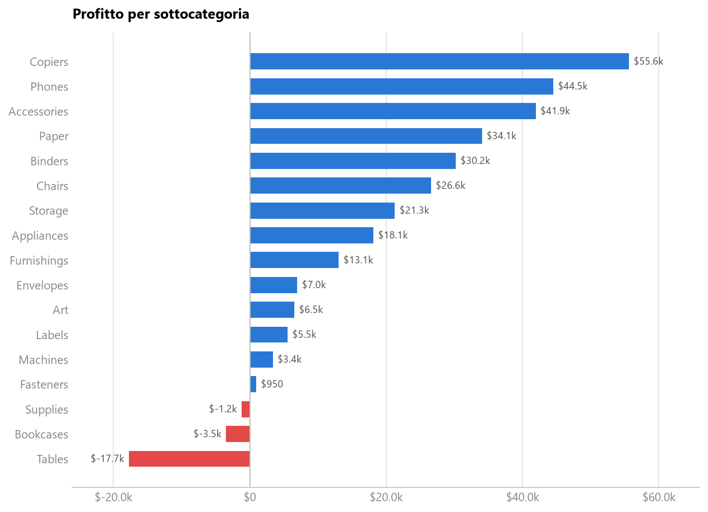
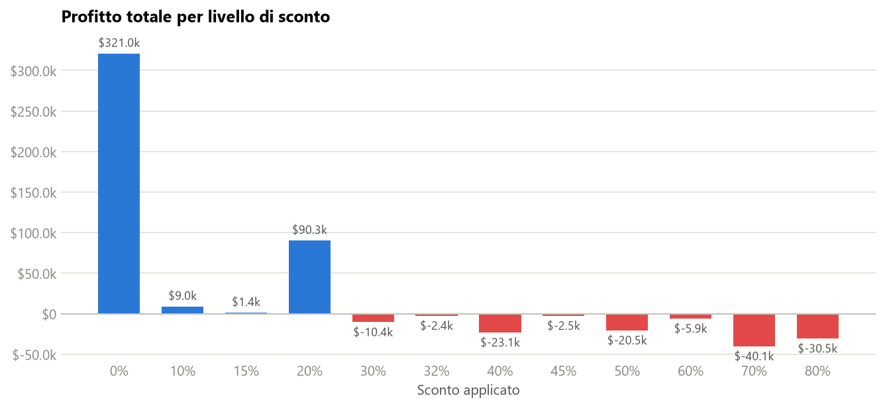

# Case study — Superstore: profittabilità

Analisi end-to-end in Python sul dataset **Sample - Superstore** (Tableau/Kaggle): dove l'azienda guadagna, dove perde, e **perché**. È la strada *codice* sullo stesso dataset che la nota [[Power BI]] percorre in modalità *no-code* — utile vederle affiancate.

- 📓 Notebook: [`superstore_analysis.ipynb`](superstore_analysis.ipynb) — 10+ step, ogni cella spiega *cosa fa* e *cosa cercare*.
- 📊 Dati: [`Sample - Superstore.csv`](<Sample - Superstore.csv>) (encoding `windows-1252`).

## Il metodo, in breve

Non parte dai grafici: parte dalle domande e ci arriva per gradi.

1. **Ispeziona prima di analizzare** — dimensioni, nulli, duplicati, `min`/`max` di `Profit` (ci sono ordini in perdita), granularità (una riga = un prodotto dentro un ordine).
2. **Definisci le metriche una volta** — profitto totale `sum(Profit)` (*dove*) e margine `sum(Profit)/sum(Sales)` (*quanto bene*). ⚠️ il margine è il **rapporto delle somme**, non la media dei margini riga per riga.
3. **Quattro tagli** — profitto e margine per **categoria → sottocategoria → stato → segmento**, scendendo di livello (*drill-down*) dove compare un'anomalia.
4. **Formula un'ipotesi verificabile** — gli indizi convergono: *"le perdite si concentrano dove gli sconti sono alti"*.
5. **Testa e fai la controprova** — profitto per livello di sconto (dove le barre passano da blu a rosso **è** il finding), quota di righe in perdita per fascia, e verifica che i casi anomali (lo stato che perde vendendo tanto) abbiano sconti sopra la media.

> [!important] Il punto di metodo
> Il data scientist a un certo punto **smette di calcolare e ragiona**: quattro output messi in fila diventano un'ipotesi, e l'ipotesi si mette alla prova sui dati — mai fermarsi all'intuizione.

## Due grafici

Il profitto per **sottocategoria** — barre divergenti, il colore codifica il segno, le perdite si raccolgono in basso:

Il **finding** — profitto per livello di sconto: il punto in cui le barre virano al rosso è dove lo sconto smette di essere marketing e diventa perdita:

## Principi di visualizzazione applicati

Gli stessi della nota [[Data Visualization#Principi del buon grafico|Data Visualization]], qui messi in pratica:

- **La forma segue il dato** — valori solo positivi → barre di un colore; positivi e negativi → barre divergenti con la linea dello zero in evidenza.
- **Etichette dirette** sui valori (niente lettura sulla griglia); il margine annotato accanto al profitto, perché il profitto da solo non lo dà.
- **Un grafico = un messaggio**, dichiarato nel titolo. Mostri solo top/bottom 10 su 49 stati? Va detto, o il grafico *mente per omissione*.
- Coppia **blu/rosso verificata per i daltonici**; griglia leggera, niente doppi assi y.

## Vedi anche

[[Power BI]] · [[Data Visualization]] · [[BI Architecture]] · [[Python]]
