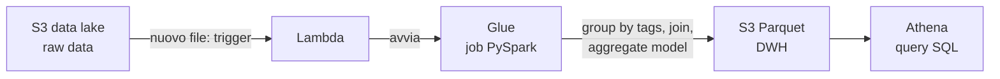

# Cloud computing

La tecnologia nasce sempre da un **bisogno di business**: il cloud è la risposta alla domanda crescente di potenza di calcolo, dati e reattività.

## Evoluzione storica

- **Anni '50 — mainframe.** Un computer, molti utenti (*1 computer, many users*); parte da American Airlines. Diventa l'ossatura di settore bancario, assicurativo e governo. La Cina, nel 2018, investe in mainframe proprietari.
- **Anni '70 — dal centralizzato ai server.** La decentralizzazione non è solo geografica ma anche **per servizi**: server dedicati al singolo servizio (→ microservices), parcellizzazione.
- **2000 — cloud computing.** Architettura distribuita, *serverless*, modello **pay-per-use**: le aziende possono sperimentare. La nascita delle startup dipende in larga parte da questo — senza cloud bisogna sempre procurarsi e distribuire la potenza di calcolo in proprio.

## Virtualizzazione

Architettura virtuale: le risorse si spostano da una macchina all'altra in base alle necessità del momento. Tecnologizzazione e interconnessione alimentano la crescita delle richieste, aumentano i dati (vedi la crescita esponenziale dei nuovi prodotti sul mercato — l'adozione di TikTok, ChatGPT): diviene necessario un nuovo paradigma.

## I tre pilastri del nuovo paradigma

### 1. Microservizi

Decomposizione **funzionale** del sistema in componenti **deployabili in modo indipendente** (Lewis & Fowler). Ognuno fa una cosa e si rilascia, scala, aggiorna da solo — senza ridistribuire il monolite.
- **Docker** — risolve il problema *"gira ovunque"* coi **container** (Linux containers): impacchettano applicazione + librerie + versioni, isolandole. Evitano il conflitto classico *"in sviluppo funziona, in produzione no"* (es. Python3 + lib v2 vs Python2 + lib v1: ogni servizio nel suo container, niente collisione).
  - **Immagine** — snapshot **immutabile**, costruito da un **Dockerfile**; sta in un *registry* (come il file `.ova` scaricato per il Master).
  - **Container** — l'esecuzione dell'immagine (la "VM effettiva").
- **Kubernetes** — orchestrazione dei container; poi la versione più digeribile fatta dalla community.

Ma non basta: servono sempre più servizi e complessità, affidabilità, scalabilità.

### 2. Reattività: da CapEx a OpEx

Il cloud sposta la spesa da capitale (CapEx) a operativa (OpEx):
- Non si comprano più i server *upfront*, non si assume personale per le macchine: si **noleggia**. Ragionamento operazionale — non serve andare in banca a chiedere soldi.
- Si modula il contratto col fornitore: potenza di calcolo per mesi, minuti, secondi, poi si spegne. **Economia di scala.**
- Si finisce per offrire non solo il ferro (il server), ma anche il database (login, installazioni…) e infine il software: **SaaS** — i bisogni delle aziende sono simili, si sviluppa una volta e si vende. L'azienda esternalizza i software non-core (CRM ecc.). Così nascono Salesforce, Google… → **servitisation**.

### 3. Cosa è il cloud computing

> [!info]
> *Web-based computing resources, from servers and storage to enterprise-level applications.*

**5 caratteristiche:**
1. On-demand services
2. Network access
3. Resource pooling
4. Rapid elasticity
5. Measured service (→ *service-level agreement*, SLA)

**Vantaggi:** risorse "infinite", scalabilità, gestione semplificata.
**Fattori frenanti:** security e compliance; trasparenza; portabilità; comparazione dei costi (con cosa lo confronto?); l'OpEx riduce il valore patrimoniale dell'azienda rispetto al CapEx.

## Modelli di servizio

Quanto dello stack affitti, dal ferro all'applicazione:

| | Cosa affitti | Esempio |
|---|---|---|
| **IaaS** — Infrastructure as a Service | CPU, storage, rete, OS — l'infrastruttura nuda | EC2, S3 |
| **PaaS** — Platform as a Service | piattaforma per sviluppare e deployare app, coi linguaggi supportati dal provider | AWS Glue, Athena |
| **SaaS** — Software as a Service | l'applicazione pronta, via interfaccia/API | Salesforce, Gmail, Tableau Online |

Le grandi aziende scelgono spesso una **soluzione ibrida**, a seconda di cosa è core e cosa no.

### Modelli di deployment
**Public** (costi ridotti, niente manutenzione, scalabilità quasi illimitata, alta affidabilità) · **Private** (sicurezza personalizzata, controllo esclusivo — *packaged* o *custom*) · **Hybrid** (mix) · **Community**.

### Prezzo
Domande da porsi: quanto costa 1h di calcolo su un server "pronto" per big data? 1 GB trasferito? 1 GB di storage al mese? E manutenzione, recovery, aggiornamenti, licenze?
- **Spot instance** — sfrutti la capacità **inutilizzata** del cloud, sconti **fino al 90%** sull'on-demand. Prezzo del compromesso: sono **interrompibili** quando il prezzo spot supera il tuo massimo o la domanda sale. Vanno usate per carichi tolleranti alle interruzioni.
- **Reserved instance / Saving plan** — pagamento anticipato per uno sconto forte sull'uso orario di un'istanza riservata.

## AWS

Piattaforma cloud: calcolo, storage, database, delivery. Distribuzione geografica in **Region** (collezioni indipendenti di risorse in una geografia), ciascuna con più **Availability Zone** isolate → si collocano risorse e dati in più luoghi per resilienza. Servizi chiave: **S3** (storage scalabile, *no file system*, economico, pay-per-use), **EC2** (calcolo), **EMR** ([[Hadoop]]/[[Spark]] gestito), **Athena**, **Redshift** (DW), **Glue**, **Lambda**, **SageMaker** (ML).

> [!info] I mattoni (cosa significano, e perché li selezioni)
> - **Bucket** (S3) — un contenitore di **oggetti** (file) con nome **globalmente unico**. Non è un vero file system: le "cartelle" sono solo prefissi nel nome.
> - **Istanza** (EC2) — una **macchina virtuale** che affitti (es. *m5.xlarge*): la famiglia (`m5` = general-purpose) e la taglia (`xlarge` = 4 vCore / 16 GiB) ne fissano potenza e prezzo.
> - **Cluster** (EMR) — un **gruppo di istanze EC2** che lavorano insieme con ruoli diversi: **Primary** coordina, **Core** tiene i dati (HDFS) e calcola, **Task** solo calcolo.
> - **IAM** (*Identity & Access Management*) — il sistema dei **permessi**: *chi può fare cosa*. Un **ruolo** è un insieme di permessi (*policy*) che dai a un servizio. Scegliere `EMR_DefaultRole`/`LabRole` significa, via IAM, autorizzare il cluster a leggere quel bucket S3, avviare istanze, ecc. — senza, EMR non potrebbe toccare i tuoi dati.
> - **VPC / subnet** — la **rete privata** isolata in cui vivono le istanze; EMR Studio dev'essere nella *stessa* VPC per **raggiungere** il cluster.

### Serverless
*Functions as a Service*: scrivi **funzioni** che rispondono a **eventi esterni**, senza provisioning né gestione di server. **AWS Lambda** ne è l'esempio — paghi solo l'esecuzione.

## Data architecture moderna

### Data lake — il paradigma
Cos'è il data lake e le sue fonti: [[Dati#Data Lake]]. Schema-on-write vs schema-on-read e il lakehouse: [[ETL#Data warehouse vs data lake]]. Qui il taglio è la **differenza di filosofia** col warehouse:

| **Data Warehouse** | **Data Lake** |
|---|---|
| sottoinsiemi aggregati, viste on-demand | **store everything as-is** |
| curato da esperti, strutturato (tabelle/report) | il business decide cosa serve, quando |
| qualità nota e tracciata | dal grezzo al conformato; qualità non sempre nota |
| top-down | rapido cambiamento, *lineage* e storicizzazione, esplorazione bottom-up |

### Delta Lake — il lakehouse
Tecnologia open-source ([delta.io](https://delta.io)) sopra **[[Spark]]** per data lake robusti: **transazioni ACID** su Spark, *schema enforcement*, **time travel**, upsert/delete, unificazione streaming + batch. È la base del **lakehouse** ([[ETL]]).

### AWS Glue + Athena
- **Glue** — ETL **serverless** e gestito: *crawl & catalogue* dei dati, mapping → script, scheduling dei job. Paghi solo le risorse consumate, a secondi.
- **Athena** — query in **SQL standard direttamente su S3**, sul dato grezzo (CSV/JSON/Parquet), **senza ETL né caricamento**. Pay-per-query (~$5/TB scansionato); risparmi con compressione, formati colonnari e partizioni.
- **Data cleaning automatico** (AWS, dal 2024) — pulizia gestita dei dati ([[Data Quality]]). Trade-off: a seconda del job aggiunge **overhead** a monte (conta dei dati, distribuzione), ma poi rende il **processing più veloce**.

### La pipeline del lab (TEDx)
Esempio end-to-end *event-driven* su AWS:

Il job PySpark legge il dataset dei talk, raggruppa i tag per talk, fa il **join** e produce l'**aggregate model** ([[Aggregate Oriented Model]]) salvato in Parquet, interrogabile da Athena. Caricare un nuovo file in S3 scatena (via Lambda) l'intera pipeline.

## Implicazioni organizzative e di rete

*(Sezione di sintesi a partire dallo spunto delle slide — "organisational and networking analysis" — non una loro trascrizione.)*

### Organizzazione: chi decide cambia
Le slide contrappongono l'**IT centrale** (un'unica funzione che fa da gatekeeper a tutti i servizi delle business unit) all'approccio **distribuito** (ogni unità possiede i propri servizi). Il cloud abilita il secondo, e con esso uno spostamento di *potere decisionale*:

- **Conway's law** *(ipotesi/inquadramento)* — l'architettura di un sistema rispecchia la struttura di comunicazione di chi lo costruisce. [[#1. Microservizi|Microservizi]] ↔ **team piccoli e autonomi**: non scegli prima la tecnologia e poi l'organizzazione, le due si plasmano a vicenda.
- Il passaggio **CapEx → OpEx** toglie il *gate* dell'acquisto hardware: non serve più passare dalla funzione che compra i server. Più autonomia per i team, ma anche meno controllo centrale sulla spesa → serve **governance** (FinOps, budget per team).
- **Implicazione operativa**: il cloud significa **affittare capacità** invece di possederla. Non si gestisce ferro né cluster — si noleggia a consumo e si concentra il tempo sul *core*, esternalizzando l'*undifferentiated heavy lifting*. È lo stesso ragionamento del SaaS visto sopra.

### Rete: il dato ha gravità
- **Data gravity** *(inquadramento)* — è più economico portare il **calcolo dove sta il dato** che il contrario. È lo stesso principio di [[Hadoop|Hadoop]] ("move computation to data"), qui a scala cloud: collochi compute e storage nella stessa **Region** per non pagare latenza e transfer.
- **Costi di egress** — far *entrare* i dati nel cloud è gratis o quasi; **farli uscire** (egress) o spostarli tra region/provider è la voce che pesa. Progetta per **minimizzare i movimenti** cross-region/cross-cloud — è anche ciò che rende [[#AWS Glue + Athena|Athena su S3]] conveniente (il dato non si sposta, la query va al dato).
- **Perimetro di sicurezza** — VPC, ruoli, isolamento: ogni servizio esposto è una superficie in più. Parallelo con la "nuova superficie privacy" di un LLM che manda dati a un'API terza ([[BI Architecture#Dalla BI all'analitica AI-augmented|MCP]], [[Data Ingestion#Etica e legalità|scraping]]).
- **Identità di rete** — dietro CGNAT si condivide l'IP (e i throttle) con altri; in cloud è l'opposto e il punto di forza: **IP, region e zone si scelgono**, e con esse latenza, resilienza e conformità (dove risiede il dato).

---

## Vedi anche

[[BI Architecture]] · [[Dati]] · [[Spark]] · [[Hadoop]] · [[ETL]] · [[Aggregate Oriented Model]] · [[Data Ingestion]]
