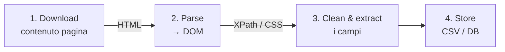

# Data Ingestion — Web Scraping

**Web scraping:** estrarre contenuto *strutturato* da una pagina web attraverso un programma.

**Crawling vs scraping** — il crawling simula l'esplorazione umana del WWW (navigare di link in link); lo scraping estrae i dati una volta sulla pagina.

## I task dello scraping

1. **Identifying pages** — quali pagine.
2. **Understanding structure** — com'è fatta la pagina.
3. **Navigating** — muoversi tra le pagine.
4. **Structuring data collection**
   - **field** — una porzione della pagina
   - **dataset** — l'insieme strutturato dei field raccolti

## Costruire uno scraper

Per i siti che generano i tag **dinamicamente** → XPath o AI. Altrimenti → **CSS Selector**: una query che identifica i campi comuni all'elemento che mi interessa.

```
h2.font-medium.line-clamp-1
a.block
```

Regole di lettura del selettore:
- Lo **spazio** nella query indica **annidamento** (verifica l'annidamento diretto con `>`).
- Il **`.`** indica la classe, il **`#`** l'**id** (`element#unique_id`).
- Togliendo un tag o una classe e ottenendo lo stesso risultato → ho ottimizzato il selettore.

## Anatomia di una pagina

L'HTML è fatto di **elementi** (tag): ognuno ha un tag di apertura `<el>` e uno di chiusura `</el>`. Due attributi cardine per lo scraping:
- **id** — identificatore *unico per pagina* (`<div id="ads">`): àncora precisa a un singolo elemento.
- **class** — categoria *riutilizzabile* (`<div class="card">`): più elementi la condividono → utile per raccogliere liste.

Si ispeziona col browser (Chrome → *Developer Tools*). Due sintassi per puntare ai nodi:
- **CSS Selector** — `h2.line-clamp-1` (tag.classe), `div > h2` (figlio diretto), `.items-baseline .tabular-nums` (discendente).
- **XPath** — espressioni di percorso su documenti XML/HTML: `/bookstore/book/title` naviga l'albero per livelli. Più potente sui documenti generati dinamicamente.

## La pipeline dello scraping (4 passi)



Su un sito con lista + dettaglio: scarichi la pagina-lista, ne estrai i **link** (`ul.grid > li > a`), e per ciascuno ripeti i 4 passi sulla pagina di dettaglio.

## Strumenti

| Tool | Note |
|------|------|
| **Beautiful Soup** | Python, parsing HTML |
| **jsoup** | equivalente Java |
| **Scrapy** | framework Python; fa richieste HTTP e parsa l'HTML, ma **non esegue JavaScript** (non guida un *phantom browser*) → veloce, ma cieco sulle pagine JS-heavy senza add-on |
| **Selenium** | nato per il test di siti web, emula l'utente; guida un browser vero e *rende* anche il JS |

> [!info]
> **Phantom browser** = *headless browser*, un browser senza interfaccia grafica che renderizza la pagina (incluso il JavaScript) via codice. Lo storico era PhantomJS, oggi deprecato in favore di Chrome headless (Puppeteer/Playwright). Scrapy *non* ne usa uno di default: per questo non vede i contenuti generati via JS.

## In pratica (requests + BeautifulSoup)

> [!info] Dal corso (*basic web scraper*) + BeautifulSoup
> Il notebook del corso parte da `requests` + `str.find()` *per mostrarne il limite* (si rompe coi tag annidati/attributi) → da qui si passa a un parser vero. Lo stack base: `requests` scarica, **BeautifulSoup** parsa, i selettori CSS estraggono.

```python
import requests
from bs4 import BeautifulSoup

html = requests.get(url, headers={"User-Agent": "Mozilla/5.0 ..."}).text
soup = BeautifulSoup(html, "html.parser")

titoli = [el.get_text(strip=True) for el in soup.select("h2.line-clamp-1")]
link   = [a["href"] for a in soup.select("ul.grid > li > a")]
```

Lista → dettaglio + paginazione:
```python
import time
for page in range(1, 6):
    soup = BeautifulSoup(requests.get(f"{base}?page={page}").text, "html.parser")
    for a in soup.select("li > a"):
        det = BeautifulSoup(requests.get(a["href"]).text, "html.parser")
        ...                       # estrai i campi dal dettaglio
    time.sleep(2)                 # rate cap (vedi Etica)
```

Se c'è un'**API** (meglio dello scraping):
```python
data = requests.get(api_url, params={"q": "x", "page": 1}).json()
```

> [!warning] Cosa NON si può / gotcha
> - `requests`/Scrapy **non eseguono JavaScript**: per pagine JS-heavy serve Selenium/Playwright.
> - Rispetta `robots.txt`, rate e ToS → `sleep()` e `User-Agent` veri ([[#Etica e legalità|etica]]).

> [!tip] Come fare X
> - "estrai per CSS" → `soup.select("div.card > h2")` · "un solo elemento" → `soup.select_one(...)`
> - "attributo / testo" → `el["href"]` · `el.get_text(strip=True)`

## Scraping con AI generativa

Gli LLM (GPT-4o, Gemini, **Claude**) "leggono" la pagina come farebbe un umano: estraggono struttura da siti messy, semi-strutturati, persino PDF. Descrivi *cosa* vuoi in linguaggio naturale ("estrai nomi azienda, città, contatti") e il modello trova il pattern — niente XPath/regex su misura per ogni layout.

| | **Selector-based** (BeautifulSoup, Scrapy) | **LLM-based** (GPT-4o, Gemini, Claude) |
|---|---|---|
| Come | regole CSS/XPath che scrivi a mano | descrivi l'obiettivo, il modello legge HTML/testo/screenshot |
| Pro | veloce, economico, deterministico, esatto | layout-agnostico, *self-healing*, semantico |
| Contro | si rompe ai redesign; una regola per layout | costo token, latenza, possibili allucinazioni |
| Per | pagine stabili e ben strutturate, a volume | sorgenti messy, variabili, non strutturate |

**Quattro metodi** (cambia *cosa vede* il modello): ① HTML→LLM (manda l'HTML ridotto, attento ai token); ② testo/Markdown pulito prima (Firecrawl, Jina Reader → meno rumore, meno costo); ③ **vision** (screenshot a un LLM multimodale → ottimo per pagine JS-heavy/canvas); ④ **schema-guided** (passi uno schema JSON, il modello lo riempie via function calling → output validato e type-safe).

**Pipeline tipica:** `retrieve (requests/Selenium/Playwright) → clean (togli nav/ads → Markdown) → extract (LLM: prompt + schema → JSON) → validate & store (schema check → CSV/DB)`.

Landscape (2025-26): **Firecrawl** (crawl + Markdown LLM-ready), **Crawl4AI** (self-host, LLM locali), **ScrapeGraphAI** (graph-based, multi-LLM), **Jina Reader** (single-page in una call), **llm-scraper** (schema + function calling), **LangChain/LlamaIndex** (orchestrazione).

> [!tip]
> **In pratica: ibrido.** Uno scraper classico recupera e ripulisce la pagina, poi l'LLM la interpreta — più economico che dare HTML grezzo al modello, più robusto dei soli selettori. Controllo dei costi: pre-pulisci a Markdown, *cache*, `temperature=0`, versiona i prompt (le allucinazioni si battono **validando contro uno schema**).

**In pratica — ScrapeGraphAI** (schema-guided, dal notebook del corso):
```python
import os
from pydantic import BaseModel, Field
from scrapegraphai.graphs import SmartScraperGraph

class Progetto(BaseModel):                  # lo schema guida l'estrazione
    titolo: str = Field(description="titolo del progetto")
    descrizione: str = Field(description="descrizione")

graph = SmartScraperGraph(
    prompt="Elenca i progetti con la descrizione",
    source="https://example.com",           # URL o HTML grezzo
    schema=Progetto,
    config={"llm": {"api_key": os.getenv("OPENAI_API_KEY"), "model": "openai/gpt-4o-mini"},
            "headless": True},
)
result = graph.run()                         # → JSON validato sullo schema
```
> [!warning] Segreti
> Mai la **API key in chiaro** nel notebook: usala da variabile d'ambiente (`os.getenv("OPENAI_API_KEY")`). Una chiave committata è una chiave **esposta** — va revocata e rigenerata.

> [!tip]
> **Strategia**: selector-based dove la struttura è stabile (gratis e scala), LLM come *fallback* sui campi/siti che cambiano spesso. L'LLM che manda testo a un'API terza è una **nuova superficie privacy** — niente dati personali.

## Quando fermarsi

Porsi il problema di *come* terminare lo scraping (varie tecniche). Con le **API**: l'ultima pagina riporta un array con meno risultati rispetto alla precedente. In generale, **se c'è un'API è meglio di Selenium**.

## Formati di output: JSONL vs Parquet

| | **JSONL** (JSON Lines) | **Parquet** |
|---|---|---|
| Struttura | testo, **un oggetto JSON per riga** | binario, **colonnare** |
| Leggibile a occhio | sì | no |
| Append / streaming | facile (aggiungi righe) | scomodo |
| Compressione | scarsa | ottima |
| Lettura analitica | legge tutto | legge solo le colonne che servono → veloce |
| Quando | ingestion, log, dati in arrivo riga per riga | grandi dataset per l'analisi |

In breve: **JSONL per ingerire**, **Parquet per analizzare**.

## Pulizia dei dati: OpenRefine

Strumento open-source per ripulire dati sporchi: *faceting* (esplorare i valori di un campo), **clustering** (raggruppare varianti dello stesso valore, es. "Palermo"/"palermo"/"PA"), trasformazioni di massa. È il passo di *optimisation* prima di caricare i dati, l'inizio della [[Data Quality]]. → da installare e provare.

## Etica e legalità

Alcuni siti non gradiscono lo scraping — per **carico** sui server, **privacy** (siti privati), **data ownership**. Le regole non cambiano con l'AI. Per "farsi riconoscere" ed evitare comportamenti fraudolenti:
- **inserisci `sleep()`** tra le richieste, metti un *rate cap* (molte API bloccano tutto a poche chiamate ravvicinate);
- **identìficati** (User-Agent vero) e, dove sensato, **notifica**;
- **chiedi il dato**: sei sicuro che non esista già in formato strutturato? **Preferisci un'API ufficiale** o una sorgente strutturata esistente;
- attento ai **dati personali** (GDPR) e alla proprietà del dato;
- controlla sempre **`robots.txt`**, i *Terms of Service* e i **limiti/rate** delle API.


## Vedi anche

[[ETL]] · [[Data Quality]] · [[Dati]]
