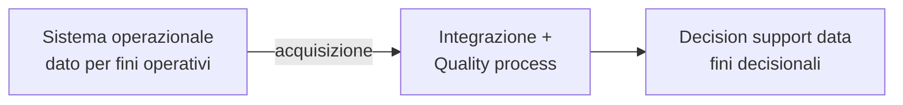

# Data Quality

La fase di **optimisation** della [[BI Architecture|pipeline BI]] e il cuore della *transform* in [[ETL]]. Principio fondante (*garbage in, garbage out*): un'analisi vale quanto i dati che la nutrono.

> [!important]
> **La qualità del dato non è un problema tecnologico, è un problema di processo di business.** E **dipende dall'uso**: lo stesso dato può essere "abbastanza buono" per un fine e inservibile per un altro.

## Perché il dato è sporco

Il dato nasce per fini **operazionali**: il modello e i requisiti sono dettati dai processi operativi, non dall'analisi. Prima di usarlo per decidere serve sempre un lavoro di *quality improvement*.



Cause tipiche: errore di inserimento dell'utente, **unità di misura** diverse per lo stesso dato, **formati** diversi (date, numeri), dati **non sincronizzati**, comportamenti malevoli.

**Conseguenze** della bassa qualità: costi più alti, inefficienza operativa, **decisioni rallentate**, opportunità perse, e soprattutto **credibilità** (del fornitore verso il cliente, dell'azienda verso l'esterno). Casi-monito: lo scandalo **Enron** (2001, cifre false), l'errore della busta agli **Oscar** (PwC, 2017).

## Le dimensioni della qualità (ISO/IEC 25012)

Quindici caratteristiche su due piani — *inerenti* al dato e *dipendenti dal sistema*. Le principali:

### Accuracy (accuratezza)
Similarità tra il valore osservato `V` e il valore reale/corretto `V'`.
`Accuracy = valori corretti / valori osservati` — il "corretto" viene da un **oracolo**, un **gold set** (esperto esterno) o una **ground truth**.
- **Sintattica** — il valore appartiene al dominio? ("Mauro" e "Lauro" sono entrambi sintatticamente validi in un dominio di nomi).
- **Semantica** — il valore è *quello vero*? ("Lauro" è valido ma se la persona si chiama "Mauro" è semanticamente errato).

### Completeness (completezza)
`Completeness = valori completi / valori osservati`. Il punto difficile è **interpretare un dato mancante** — dipende:
- **omesso deliberatamente** (il dato esiste ma non è stato dichiarato);
- **non esiste** (non tutti hanno una email);
- **non raccolto** (il modulo non prevedeva quel campo);
- **errore** (perso lungo la catena).

### Consistency (consistenza)
Valori che non si contraddicono, rispettando le **regole semantiche** (tra attributi della stessa tupla, tra tuple). Es. incoerente: `cittadinanza=italiana, età=5, stato civile=sposato`. O eventi in ordine impossibile in un rapporto di lavoro.

### Currency e Timeliness
- **Currency** (aggiornamento) — quanto in fretta il dato è aggiornato nel sistema. Caso particolare dell'accuracy (Redman): un dato corretto al caricamento diventa errato se l'entità cambia stato prima dell'uso. Critico per dati **volatili**, irrilevante per caratteristiche "permanenti".
- **Timeliness** (tempestività) — il dato è aggiornato *in tempo per il mio scopo*?
- **Volatility** (volatilità) — quanto rapidamente il dato cambia nel tempo.

## Gestire i dati mancanti

| Strategia | Quando |
|---|---|
| **Modificare processo/sistema** | aspettare che il dato venga raccolto a monte |
| **Case deletion** | elimino le righe con `NULL` — se i casi sono pochi, o se il campo è chiave per l'analisi |
| **Imputation** | stimo il mancante da dati completi (regressione, decision tree) |
| **Special value** | valore-segnaposto dedicato |
| **Do nothing** | alcuni algoritmi sono robusti ai mancanti |

## Migliorare la qualità

1. **Inspection & modification** (sul dato) — confronto con dati certificati e correggo/scarto. Dove trovo dati migliori? *Database bashing* (confronto record tra due o più DB), **business rule** (procedure automatiche che validano i valori contro vincoli), confronto col mondo reale (costoso).
2. **Process improvement & control** — individuo ed elimino le cause dei problemi *nei processi*.
3. **Process design** — inserisco **quality gate** (vincoli di qualità) già in fase di progettazione.

## Data profiling

Esame preliminare di una sorgente con raccolta di **statistiche** (count, valori null, min/max, lunghezza dei campi) per fotografare lo stato del dato. Si fa prima del processo di qualità, e si ripete periodicamente. Lo strumento interattivo è **[[Data Ingestion|OpenRefine]]** (faceting, clustering, trasformazioni).

## I framework di riferimento

| Framework | A cosa serve |
|---|---|
| **DAMA-DMBOK** | body of knowledge del data management; definisce le dimensioni core |
| **ISO 8000** | standard per qualità dei dati e master data (provenienza, scambio tra organizzazioni) |
| **ISO/IEC 25012** (SQuaRE) | modello a 15 caratteristiche per dati in sistemi digitali strutturati |
| **FAIR** | dati *Findable, Accessible, Interoperable, Reusable* — focus su metadati e identificatori (open data, ricerca) |
| **IMF DQAF · Eurostat ESS QAF** | qualità delle statistiche ufficiali (banche centrali, istituti statistici) |

> [!tip]
> **Da tenere in tasca**: la dashboard più bella è inutile se la sorgente è sporca. Prima di analizzare, fai **data profiling** (quanti null, formati, duplicati) e definisci **due o tre business rule** esplicite — è lì che si gioca la credibilità del numero, non nella visualizzazione. La domanda guida resta quella dell'[[ETL]]: *qual è la domanda di business?* — perché "abbastanza buono" si misura sull'uso.

## In pratica (pandas)

> [!info] Dal notebook del corso (*Data Quality concepts in action*)
> Le dimensioni di qualità riprodotte in pandas su un dataset volutamente sporco — le operazioni di [[Data Ingestion|OpenRefine]] in codice.

**Profiling + faceting** (vedere lo stato del dato, senza modificarlo):
```python
df.describe(include="all").round(2)        # profiling: count, min/max, unici, freq
df["country"].value_counts(dropna=False)   # faceting: espone le categorie incoerenti
```

**Accuracy** = corretti / osservati:
```python
valid = df["age"].between(0, 120)          # sintattica: il valore è nel dominio?
print(f"{valid.mean():.0%}")               # %; df.loc[~valid] = le righe sbagliate
df["ok"] = df["speaker"] == df["id"].map(gold_speaker)   # semantica: vs gold set
```

**Completeness** + gestione mancanti:
```python
df.notna().mean()                          # completezza per colonna
df.dropna(subset=["rating"])               # 1. case deletion
df["rating"].fillna(df["rating"].mean())   # 2. imputation (media; o regressione/tree)
df["rating"].fillna(-1)                    # 3. special value
```

**Consistency** (regole semantiche, intra-riga):
```python
viol = (df["age"] < 18) & (df["views"] > 1_000_000)   # regola: under-18 ≠ 1M+ views
df.loc[viol]
```

**Business rules → quality gate** (il report da girare a ogni load):
```python
rules = {
    "age_plausible": df["age"].between(0, 120),
    "rating_in_0_5": df["rating"].between(0, 5) | df["rating"].isna(),
    "id_present":    df["id"].notna(),
}
report = pd.DataFrame(rules)
report.all(axis=1).sum()                   # righe che passano TUTTE le regole
```

> [!tip] Come fare X
> - "date in formati misti" → `pd.to_datetime(s, format="mixed", dayfirst=True)`
> - "togli tag HTML" → `s.str.replace(r"<[^>]+>", "", regex=True)`
> - "database bashing" → `df.merge(reference, on="id")` poi confronta i campi in conflitto
> - "`value.log()` di OpenRefine" → `np.log(df["x"])` per ispezionare campi sbilanciati

## Vedi anche

- [[ETL]] — la *transform* è dove la qualità si impone; [[BI Architecture]] — l'optimisation; [[Dati]] — *garbage in, garbage out*, le 4V (Veracity).
