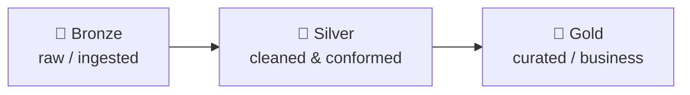

# ETL — Extract, Transform, Load

Il processo nel **data warehousing** responsabile di tirare fuori i dati dai sistemi sorgente e metterli nel data warehouse. È la fase di *collecting & transforming* dell'[[BI Architecture|architettura BI]] e il motore della [[Dati|pipeline del dato]].

## Il flusso

```
ERP, CRM, altre fonti
  → estrazione
  → staging
  → trasformazione (pulizia, combinazione)
  → caricamento
  → data presentation area
```

## Le tre fasi

### Extract
Estrarre dai sistemi sorgente: ERP, CRM, [[Database relazionali|OLTP]], file, API, scraping. Modalità:
- **Full extract** — si prende tutto ogni volta.
- **Incremental extract** — solo ciò che è cambiato dall'ultima volta.

### Transform
Il cuore. Non è solo pulizia: ha a che fare con **definizioni e semantica**. Combinare dati da fonti diverse significa decidere *cosa vuol dire* ciascun campo.

> [!example]
> **L'esempio del fatturato.** In un'azienda ogni divisione ha la sua definizione di "fatturato". Per le **Vendite** è il valore degli ordini firmati (*booking*). Per l'**Amministrazione** è il ricavo effettivamente fatturato e riconosciuto a bilancio, al netto di resi e note di credito. Il **Marketing** magari lo conta lordo IVA, o annualizza i contratti ricorrenti. Il **Controllo di gestione** spalma il ricavo nel tempo secondo la *revenue recognition*. Stessa parola, quattro numeri diversi. Se l'ETL non impone **una** definizione condivisa (*conformed*, l'unica fonte di verità), due dashboard mostrano fatturati diversi e la fiducia nei dati crolla. La trasformazione è il luogo dove questa semantica si decide una volta per tutte.

Operazioni tipiche: pulizia, normalizzazione, **conforming** (riconciliare campi che dicono la stessa cosa), business rules, aggregazione. → il dettaglio della pulizia e delle dimensioni di qualità vive in [[Data Quality]].

### Load
Caricare nella **data presentation area** (il warehouse e i data mart, organizzati per l'utente).

## Staging area

Area intermedia dove i dati atterrano *prima* della trasformazione. **Non è accessibile all'utente finale**: lì avvengono le operazioni "pericolose" — data cleaning, lookup, join, creazione dei data mart. Ai business user non interessa cosa avviene dentro l'ETL, vogliono il risultato. La staging isola queste operazioni dai sistemi sorgente (che non vanno appesantiti) e permette di rilanciare le trasformazioni senza ri-estrarre.

### Perché non leggere direttamente dai sistemi operazionali

- **Qualità** — il dato operazionale è sporco (legge GIGO). → [[Data Quality]].
- **Denormalizzazione** — servono viste che supportino davvero e in fretta la decisione, non lo schema [[Normalizzazione|normalizzato]] dell'OLTP.
- **Change resilience** — il warehouse dev'essere indipendente dai sistemi sorgente (se cambiano, l'analisi regge).
- **Consistenza** — e non appesantire i sistemi operazionali con query analitiche.

## Chi agisce dove

- Il **data scientist** lavora sul **data lake** (post-merge, dati grezzi e abbondanti).
- Il **data warehouse** è alimentato con **validation rules** — *structure checks* e *quality checks*, tipicamente curate dagli statistici.
- A valle, su dati validati e puliti, intervengono **data analyst** e gli altri ruoli di business.

## ETL vs ELT

Con i **big data** si può passare da ETL a **ELT**: l'ordine si inverte.

| | **ETL** (classico) | **ELT** (big data / cloud) |
|---|---|---|
| Ordine | trasforma *prima* di caricare | carica il grezzo, trasforma *dentro* il warehouse |
| Dove trasforma | motore ETL dedicato | il warehouse stesso |
| Adatto a | storage costoso, schema rigido | storage cloud economico, data lake |

### Medallion architecture

Con l'ELT la trasformazione non è un salto unico ma un **raffinamento progressivo della qualità** in tre strati (il pattern di Databricks):



- **Bronze** = *Extract + Load*: dato atterrato così com'è dalle sorgenti (scraping, API, CRM, ERP), storia completa, **immutabile**.
- **Silver** = *Transform (clean)*: parsing, correzione valori, conflict resolution, deduplica, join tra sorgenti.
- **Gold** = *Transform (serve)*: dati aggregati e modellati, data mart pronti per BI, KPI e feature ML.

> [!tip]
> **Lake e warehouse non sono un'alternativa** ma **fasi dello stesso percorso**. Bronze è il [[Dati#Data Lake|lake]] (grezzo), Gold è il [[BI Architecture|warehouse]] (curato); il [[#Data warehouse vs data lake|lakehouse]] è ciò che permette di tenerli sullo stesso impianto. La "cultura aziendale" decide *quanto in là* lungo questo gradiente serve spingersi, non *se* lake oppure warehouse.

## Data warehouse vs data lake

- **Data warehouse** — schema imposto in scrittura (*schema-on-write*): struttura definita prima del caricamento, dati puliti e pronti.
- **Data lake** — accoglie il dato grezzo così com'è; lo schema si applica in lettura (*schema-on-read*) — di qui i termini **schema-free / schema-less**.

| | **Warehouse** | **Lake** |
|---|---|---|
| Schema | schema-on-write (modellato prima) | schema-on-read (interpretato in query) |
| Dato | strutturato, pulito, conformato | grezzo: strutturato, semi e non strutturato |
| Utenti | BI, reporting, decisione | data science, ML, esplorazione |
| Trade-off | affidabile e veloce; rigido, costoso da scalare | economico e flessibile; qualità e governance deboli |

Il **lakehouse** integra i due: aggiunge uno **strato di tabelle transazionali** sopra il lake, così *una sola copia* serve sia BI sia ML. Lo abilita un **formato di tabella aperto** — **Delta Lake** / Apache Iceberg — che porta sui file aperti (Parquet su S3/ADLS/GCS) le garanzie da warehouse: **transazioni ACID**, *schema enforcement* ed *evolution*, **time travel**, indici. Una copia sola = niente duplicazione, governance e *lineage* unificati. È il terreno di [[Databricks]] (Delta Lake, Spark + Photon, Delta Live Tables per i layer medallion, Unity Catalog, MLflow) — tutto sugli stessi dati governati.

## Strumenti

- **[[KNIME]]** — ETL *visuale* a nodi/workflow, alternativa no-code agli script; lo strumento del lab (CSV → dedup → JSON → [[MongoDB|MongoDB Atlas]]).
- **Snowflake** — cloud, ottimo per la *presentation*.
- **[[Databricks]]** — buono per tutto (è la piattaforma lakehouse).
- **Orchestrazione** — Apache Airflow (DAG, scheduling, retry).
- **Transform nel warehouse** — dbt.
- **Pulizia interattiva** — [[Data Ingestion|OpenRefine]].

> [!tip]
> **Come si scelgono.** Il **Gartner Magic Quadrant** classifica i vendor su due assi — *completeness of vision* × *ability to execute* — in **Leaders / Challengers / Visionaries / Niche Players**. Tra i Data Integration Tools i Leader sono Informatica, Oracle, Microsoft, IBM, AWS, Google, Talend; *challenger* notevoli Fivetran e Matillion. Utile per orientarsi, non per decidere al posto del caso d'uso.

## Idempotenza

Un buon processo ETL deve essere **idempotente**: rilanciarlo sugli stessi dati produce lo stesso risultato, senza duplicare o corrompere. Pratico: chiavi e upsert, non append ciechi.

## Da tenere in tasca

- Quando non si sa bene cosa si sta cercando, meglio **partire da pochi dati**.
- Meglio ancora: **farsi dire bene qual è la domanda di business** — è da lì che tutto il resto prende senso.

## Vedi anche

[[Dati]] · [[BI Architecture]] · [[Data Quality]] · [[Cloud computing]]
