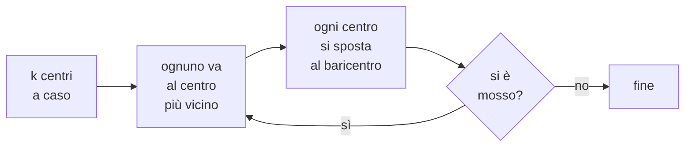

# Clustering

**In una riga:** trovare gruppi nei dati **senza sapere in anticipo** quali gruppi esistono.

> [!important] È l'altra metà del mondo
> Fino a qui ogni modello aveva una risposta giusta da imparare: chi fuma, chi non paga, quanto costa la casa. Si chiama **supervisionato** perché qualcuno ha già etichettato gli esempi.
>
> Il clustering è **non supervisionato**: non c'è nessuna etichetta. Hai solo i dati, e chiedi alla macchina *"secondo te, chi somiglia a chi?"*
>
> Non esiste una risposta giusta da controllare. Esistono raggruppamenti più o meno **utili**.

> [!example] Il cassetto dei calzini
> Rovesci il cassetto sul letto e li dividi in mucchietti. Nessuno ti ha detto quali mucchietti fare: li scopri tu, mettendo insieme quelli che si somigliano.
>
> Puoi dividerli per colore, per lunghezza, per stagione. **Nessuna divisione è "quella giusta"** — dipende da cosa ci devi fare.

Usi tipici: segmentare i clienti per campagne diverse, raggruppare quartieri simili, trovare profili ricorrenti in un questionario.

---

## k-means

Il metodo più usato, e il ragionamento sta in quattro passi.

> [!important] Come funziona
> **1.** Decidi **quanti gruppi** vuoi. Quel numero è `k`, e lo scegli tu.
>
> **2.** Butti `k` centri **a caso** nello spazio dei dati.
>
> **3.** Ogni osservazione va nel gruppo del **centro più vicino**.
>
> **4.** Ogni centro si sposta **nel mezzo** delle osservazioni che ha appena raccolto.
>
> Poi si ripetono 3 e 4 finché i centri smettono di muoversi.



Il nome viene da lì: `k` gruppi, e ogni centro è una **media** (*mean*) delle osservazioni che contiene.

> [!warning] Dipende da dove parte
> I centri iniziali sono casuali, e partenze diverse possono dare risultati diversi. Non è un difetto occasionale: capita spesso.
>
> Il rimedio è farlo ripartire **molte volte** da punti diversi e tenere il risultato migliore. In R è l'argomento `nstart = 25`, e va messo sempre.

---

## Quanti gruppi?

È la domanda difficile, perché non c'è una risposta giusta da controllare.

### Il metodo del gomito

Si misura quanto sono **compatti** i gruppi: la somma delle distanze di ogni punto dal proprio centro. Si chiama **WSS**, *within sum of squares* — la variabilità **dentro** i gruppi.

> [!info] Perché non si può semplicemente minimizzarla
> Più gruppi fai, più il WSS scende. Con un gruppo per ogni persona il WSS è **zero** — e non hai raggruppato niente.
>
> Quindi non si cerca il minimo: si cerca il punto dove **smette di convenire**.

```
 WSS │●
     │ ●
     │  ●
     │    ●
     │      ●___          ← il GOMITO: qui smette di convenire
     │          ●──●──●──●
     └────────────────────
       1  2  3  4  5  6  7
              k
```

Fino al gomito ogni gruppo in più fa un lavoro vero. Dopo, migliora di briciole. **Si prende il k del gomito.**

È lo stesso identico criterio dello [[PCA#Lo scree plot e il gomito|scree plot]] della PCA.

> [!tip] Il criterio vero non è matematico
> Il gomito spesso non è netto, e due persone ne leggono due diversi. Non è un dramma, perché la domanda finale è un'altra:
>
> **i gruppi che escono si riescono a descrivere a parole?**
>
> Se con k=4 puoi dire *"questi sono i giovani che spendono poco, questi le famiglie, questi i professionisti, questi i pensionati"*, quel k funziona. Se con k=7 tre gruppi sono indistinguibili, k=7 non serve, anche se il WSS è più basso.

---

## Le due cose che rovinano tutto

> [!warning] 1. Senza scaling, il risultato è sbagliato
> k-means lavora su **distanze**. Con l'età da 18 a 80 e il reddito da 10.000 a 90.000, il reddito domina completamente: i gruppi finiscono per essere solo fasce di reddito.
>
> Non perché conti di più, ma perché ha i numeri più grandi (→ [[Preprocessing#4. Scaling]]).
>
> **Standardizzare prima non è consigliato: è obbligatorio.**

> [!warning] 2. Trova gruppi anche quando non ce ne sono
> Se chiedi quattro gruppi, k-means te ne dà quattro. **Sempre.** Anche su dati completamente casuali, senza alcuna struttura.
>
> L'algoritmo non sa dirti *"guarda, qui non c'è niente da raggruppare"*. Sta a te controllare che i gruppi trovati abbiano un senso.

E un limite strutturale da conoscere: k-means cerca gruppi **tondi e di dimensione simile**. Se i tuoi gruppi veri hanno forma allungata o a mezzaluna, non li trova — li taglia male. In quel caso servono altri metodi.

---

## Come si leggono i gruppi

Ottenuti i gruppi, il lavoro comincia adesso: **capire chi sono**.

Si guardano le **medie di ogni variabile dentro ciascun gruppo**, e si cerca cosa distingue ognuno dagli altri:

| | età | reddito | spesa | acquisti/anno |
|---|---|---|---|---|
| **gruppo 1** | 26 | basso | bassa | **molti** |
| **gruppo 2** | 41 | alto | **alta** | pochi |
| **gruppo 3** | 68 | medio | bassa | pochi |

Da qui escono i nomi: *giovani frequenti*, *alto-spendenti occasionali*, *pensionati*. **Un cluster senza un nome è un cluster inutile**: se non sai descriverlo, non ci puoi fare niente.

---

## In R

```r
# 1. SOLO variabili numeriche, e standardizzate
d <- scale(dati[, numeriche])

# 2. cercare il gomito
wss <- sapply(1:10, function(k) kmeans(d, k, nstart = 25)$tot.withinss)
plot(1:10, wss, type = "b",
     xlab = "numero di gruppi (k)", ylab = "WSS")

# 3. il clustering vero, con k scelto dal gomito
set.seed(1)
km <- kmeans(d, centers = 4, nstart = 25)

km$size       # quanti in ciascun gruppo
km$centers    # i CENTRI: la tabella da leggere per dare i nomi

# 4. riattaccare il gruppo ai dati originali
dati$gruppo <- factor(km$cluster)
aggregate(. ~ gruppo, data = dati[, c(numeriche, "gruppo")], FUN = mean)
```

> [!tip] Tre argomenti da non dimenticare
> - **`scale()`** prima di tutto, sempre
> - **`nstart = 25`** per non dipendere dalla partenza casuale
> - **`set.seed()`** per poter rifare identico lo stesso risultato
>
> E per disegnarli: le prime due componenti della [[PCA]] sono il modo standard di vedere i gruppi su un piano quando le variabili sono tante.

---

## Da tenere in tasca

| domanda | risposta rapida |
|---|---|
| Cos'è il clustering? | trovare gruppi **senza etichette** |
| Che tipo di metodo è? | **non supervisionato** |
| Esiste la risposta giusta? | **no**. Esistono raggruppamenti **utili** |
| Come funziona k-means? | centri a caso → assegni → sposti → ripeti |
| Cosa decidi tu? | **k**, il numero di gruppi |
| Come scelgo k? | il **gomito** del WSS, più il buon senso |
| Cos'è il **WSS**? | quanto sono compatti i gruppi. Scende sempre con k |
| Serve standardizzare? | **obbligatorio**: lavora su distanze |
| Trova gruppi sempre? | **sì**, anche dove non ce ne sono |
| Che forma trova? | gruppi **tondi** e di dimensione simile |
| Come si leggono? | dalla tabella dei **centri**, dando un nome a ciascuno |
| Comando R? | `kmeans(scale(dati), centers = k, nstart = 25)` |

## Vedi anche

[[PCA]] · [[Preprocessing]] · [[Machine Learning]] · [[Variabilità]] · [[R]]
