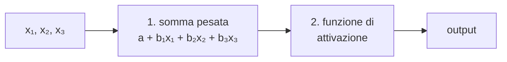
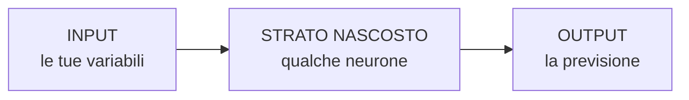

# Reti neurali

**In una riga:** tante regressioni logistiche impilate una sopra l'altra.

Detta così sembra una battuta, ed è letteralmente com'è fatta. Tutto il resto sono dettagli.

---

## Il neurone

Un singolo neurone fa **due cose in fila**, e le conosci entrambe:



**Passo 1**: moltiplica ogni input per un peso e somma. È `a + b₁x₁ + b₂x₂ + …`, cioè **una retta** (→ [[Modelli lineari]]).

**Passo 2**: schiaccia il risultato con una funzione. Se quella funzione è la **logistica**, il neurone fa esattamente il conto della [[Regressione logistica#Il modello|regressione logistica]].

> [!important] Un neurone = una regressione logistica
> Non "assomiglia a". **È**, con altri nomi:
>
> | nel neurone | in statistica |
> |---|---|
> | pesi | coefficienti `β` |
> | bias | intercetta |
> | funzione di attivazione | la curva a S |
> | addestramento | stima dei parametri |
> | funzione di perdita | meno la log-verosimiglianza |
>
> Anche la **loss** è la stessa: la *cross-entropy* di cui parlano i libri di reti neurali è `−log(verosimiglianza)`, cioè la [[Regressione logistica#Come fa il computer a trovare a e b|log-verosimiglianza]] cambiata di segno. Massimizzare la verosimiglianza o minimizzare la cross-entropy sono la stessa operazione.

---

## Lo strato nascosto

Se un neurone è una logistica, perché disturbarsi?

> [!warning] Il limite di un modello lineare
> Una logistica traccia un **confine dritto**: da una parte i sì, dall'altra i no (→ [[Regressione logistica#Il modello]]).
>
> Se i tuoi dati sono fatti così — un cerchio di punti "sì" circondato da punti "no" — **nessuna retta li separa**. Puoi girarla come vuoi, sbaglierai sempre un pezzo.
>
> ```
>        no   no   no
>     no    ● ● ●    no
>     no  ●  SÌ  ●   no
>     no    ● ● ●    no
>        no   no   no
> ```
>
> Serve un confine **curvo**, e un modello lineare non può produrlo.

La soluzione: **mettere neuroni in mezzo**.



Lo **strato nascosto** (*hidden layer*) si chiama così perché non lo vedi: non è né i dati che metti dentro né la risposta che esce.

Ogni neurone nascosto costruisce **una sua retta**. L'output le combina. Mettendo insieme più rette curvate si ottiene qualsiasi forma — anche un cerchio.

> [!info] Quanti neuroni nascosti
> È la manopola principale, in R si chiama `size`.
>
> | | effetto |
> |---|---|
> | **pochi** (2-3) | confini semplici, rischio di non cogliere la forma |
> | **tanti** | qualsiasi forma, ma **overfitting** |
>
> Non si indovina: si sceglie in [[Validazione#Cross-validation|cross-validation]], come ogni altra manopola.
>
> Una rete con almeno uno strato nascosto si chiama **percettrone multistrato** (*MLP*). Le reti "profonde" del deep learning sono la stessa cosa con molti strati impilati.

---

## Come impara

Stessa logica delle manopole della verosimiglianza, con un'aggiunta.

1. si parte da pesi **a caso**
2. si fa passare un'osservazione e si guarda **quanto si sbaglia**
3. si aggiustano i pesi un pochino, nella direzione che riduce l'errore
4. si ripete, migliaia di volte

Il passo 3 si chiama **backpropagation**, retropropagazione: l'errore misurato all'uscita viene rimandato all'indietro per capire **quanto ciascun peso ha contribuito** a sbagliare, strato per strato.

> [!info] È lo stesso "iterativo, non analitico" della logistica
> Nessuna formula chiusa. Si parte, si guarda da che parte si migliora, ci si sposta, si riprova (→ [[Regressione logistica#Come fa il computer a trovare a e b]]).
>
> Con una differenza pratica: la logistica converge sempre allo stesso punto, una rete no. Partenze casuali diverse danno risultati diversi, e per questo si addestra più volte.

---

## Cosa serve sapere per usarle

> [!warning] Lo scaling è obbligatorio
> I pesi si muovono a passi della stessa grandezza per tutte le variabili. Se una va da 0 a 1 e un'altra da 0 a 90.000, l'addestramento diventa instabile o non parte proprio.
>
> **Sempre standardizzare** (→ [[Preprocessing#4. Scaling]]).

> [!warning] Overfittano facilmente
> Una rete con abbastanza neuroni può imparare a memoria qualsiasi dataset. I freni:
>
> - **pochi neuroni nascosti**
> - **decay**, una tassa sui pesi grandi — è esattamente la [[Regolarizzazione|regolarizzazione ridge]] applicata a una rete
> - fermare l'addestramento prima che sia troppo tardi (*early stopping*)

> [!warning] Sono scatole chiuse
> Una logistica ti dà un [[Regressione logistica#Odds ratio: come si legge il risultato|odds ratio]] per variabile: leggibile, difendibile davanti a un cliente.
>
> Una rete con dieci neuroni nascosti ti dà **centinaia di pesi** che non significano niente presi uno per uno. Sai che funziona, non sai perché.
>
> Se devi spiegare le decisioni — credito, sanità, selezione del personale — questo è un problema serio, non un dettaglio (→ [[Spiegare i modelli]]).

### Quando conviene davvero

| | |
|---|---|
| **sì** | tanti dati, relazioni molto non lineari, immagini e testo |
| **no** | pochi dati, serve interpretabilità, relazioni semplici |

> [!tip] Su dati tabellari raramente vincono
> Su tabelle di righe e colonne — quasi tutto quello che vedi in un corso di data mining — **random forest e gradient boosting battono le reti quasi sempre**: sono più veloci, non chiedono scaling e non vanno regolate come orologi.
>
> Le reti dominano dove i dati hanno una struttura particolare: pixel di un'immagine, sequenze di parole. Per una tabella di clienti, prova prima un [[Alberi decisionali#Random forest|random forest]].

---

## In R

```r
library(nnet)

# SEMPRE standardizzare prima
train_s <- scale(train[, numeriche])

# classificazione: size = neuroni nascosti, decay = penalita' sui pesi
rete <- nnet(target ~ ., data = train_ok,
             size = 5, decay = 0.01, maxit = 500)

predict(rete, newdata = test_ok, type = "class")

# regressione: linout = TRUE toglie lo schiacciamento in uscita
nnet(y ~ ., data = train_ok, size = 3, linout = TRUE)
```

Regolare le manopole con `caret`:

```r
griglia <- expand.grid(size = c(2, 5, 10), decay = c(0, 0.01, 0.1))

m <- train(target ~ ., data = train, method = "nnet",
           preProcess = c("center", "scale"),
           tuneGrid = griglia, trControl = ctrl, trace = FALSE)
```

> [!tip] `trace = FALSE` e `maxit`
> Senza `trace = FALSE` la console si riempie di righe di avanzamento.
>
> Se vedi `converged` non è arrivata alla fine: alza `maxit`. E se ottieni risultati diversi a ogni esecuzione è normale — i pesi iniziali sono casuali. Usa `set.seed()`.

---

## Da tenere in tasca

| domanda | risposta rapida |
|---|---|
| Cos'è un neurone? | **somma pesata + funzione che schiaccia** |
| Cioè? | una **regressione logistica** |
| Cos'è la cross-entropy? | meno la **log-verosimiglianza**. Stessa cosa |
| A cosa serve lo strato nascosto? | a fare confini **curvi** |
| Cos'è `size`? | quanti neuroni nascosti. Tanti → **overfitting** |
| Cos'è `decay`? | la **tassa sui pesi**, come il ridge |
| Cos'è la backpropagation? | l'errore rimandato indietro per correggere i pesi |
| Serve standardizzare? | **obbligatorio** |
| Risultati sempre uguali? | **no**: pesi iniziali casuali |
| Si interpretano? | **no**. Sono scatole chiuse |
| Su dati tabellari? | prova prima un **random forest** |
| Comando R? | `nnet(y ~ ., size = 5, decay = 0.01)` |

## Vedi anche

[[Regressione logistica]] · [[Alberi decisionali]] · [[Regolarizzazione]] · [[Spiegare i modelli]] · [[Validazione]] · [[Machine Learning]]
