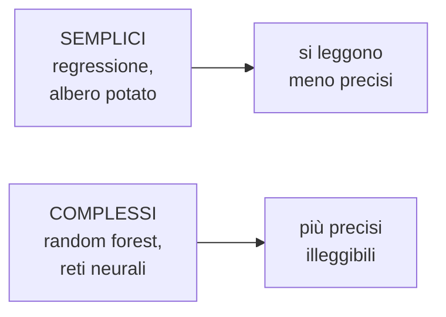

# Spiegare i modelli

**In una riga:** il modello funziona, ma **perché** ha deciso così?

> [!important] Non è una curiosità accademica
> - una banca che rifiuta un prestito **deve** poter dire perché, per legge
> - un medico non somministra una terapia perché "l'ha detto il computer"
> - un modello che decide in base al codice postale può essere **discriminatorio** senza che nessuno se ne accorga
> - e se non sai perché funziona, non sai **quando smetterà** di funzionare

---

## Il compromesso di fondo



| modello | quanto si legge | come |
|---|---|---|
| [[Modelli lineari\|regressione lineare]] | **massimo** | un coefficiente per variabile |
| [[Regressione logistica\|logistica]] | **alto** | un odds ratio per variabile |
| [[Alberi decisionali\|albero potato]] | **alto** | si legge il disegno |
| [[Alberi decisionali#Random forest\|random forest]] | basso | centinaia di alberi |
| [[Reti neurali\|rete neurale]] | **nullo** | centinaia di pesi senza significato |

Quelli in fondo si chiamano **black box**, scatole nere: entra qualcosa, esce una risposta, in mezzo non si vede niente.

> [!tip] La prima domanda è sempre la stessa
> **Ti serve davvero un black box?**
>
> Se una logistica ben fatta ottiene 0,82 di AUC e un random forest 0,84, quei due punti valgono la rinuncia a spiegare le decisioni? Spesso no.
>
> Un modello semplice che passa i controlli e che il cliente capisce vale più di uno leggermente migliore che nessuno può difendere.

---

## Importanza delle variabili

Il primo strumento, e il più usato: **quali variabili contano di più?**

> [!info] Come si misura
> Il modo più intuitivo si chiama **permutation importance**, ed è furbo:
>
> 1. misuri quanto il modello sbaglia, così com'è
> 2. prendi **una** variabile e ne **mescoli i valori a caso** fra le righe, distruggendo il legame col target
> 3. rimisuri l'errore
>
> **Se l'errore peggiora molto, quella variabile era importante.** Se non cambia niente, il modello non la stava usando.
>
> Si ripete per ogni variabile, e ne esce una classifica.

```r
varImp(modello)      # in caret, per quasi tutti i modelli
```

> [!warning] Importanza non è causa
> La classifica dice **cosa il modello usa**, non cosa causa cosa.
>
> Se il numero di ombrelli venduti prevede benissimo gli incidenti stradali, l'ombrello risulterà importante. Non li causa: è la pioggia (→ [[Test statistici#Test di correlazione — due variabili numeriche|correlazione non è causa]]).
>
> E fra due variabili correlate l'importanza si divide in modo arbitrario: una può risultare in cima e l'altra in fondo, solo per come è andata.

---

## Il modello surrogato

L'idea più elegante, ed è quella usata nel corso.

> [!important] Fai imparare a un modello semplice le risposte di quello complesso
> 1. addestri il **black box** e ottieni le sue previsioni
> 2. prendi quelle previsioni e le usi come **target** per un modello semplice — un albero, una regressione
> 3. addestri il modello semplice a **imitare** il black box
>
> Se l'albero riproduce bene le risposte della foresta, **leggendo l'albero capisci come ragiona la foresta**.

> [!example] È il traduttore
> Un esperto risponde in una lingua che non parli. Assumi un traduttore che ascolta mille sue risposte e impara a riprodurle.
>
> Il traduttore non è l'esperto, e ogni tanto sbaglia. Ma è l'unico modo che hai di capire cosa stava dicendo.

```r
copia <- df
copia$target <- predict(foresta, df, type = "prob")[, "si"]   # le prob del black box

surrogato <- rpart(target ~ . , data = copia)   # un albero che le imita
rpart.plot(surrogato)
```

> [!warning] È un'approssimazione, e va verificata
> Prima di fidarti del surrogato, controlla **quanto bene imita**: il suo R² rispetto alle previsioni del black box.
>
> Se imita bene, la spiegazione è credibile. Se imita male, stai leggendo una storia inventata — e credere a una spiegazione sbagliata è peggio che non averne nessuna.
>
> E in ogni caso il surrogato spiega **il modello**, non la realtà.

---

## Globale o locale

Due domande diverse, che si confondono spesso:

| | domanda | strumenti |
|---|---|---|
| **globale** | come ragiona il modello **in generale**? | importanza delle variabili, surrogato |
| **locale** | perché ha deciso così **per questa persona**? | LIME, SHAP |

La seconda è quella che serve quando qualcuno bussa e chiede *"perché avete rifiutato **la mia** domanda?"*. Rispondere "in generale il reddito conta molto" non basta.

**LIME** e **SHAP** rispondono caso per caso: dicono quanto ciascuna variabile **di quella persona** ha spinto verso il sì o verso il no. SHAP in più garantisce che i contributi sommati ricostruiscano esattamente la previsione.

---

## kNN, il modello senza modello

Vale la pena conoscerlo perché è l'estremo opposto ed è nel corso.

**kNN** = *k nearest neighbours*, i `k` vicini più prossimi.

> [!example] Come funziona
> Arriva un cliente nuovo. Cerchi **i 5 clienti passati che gli somigliano di più**, guardi cosa hanno fatto, e rispondi con la maggioranza.
>
> Non c'è nessun addestramento. Non c'è nessuna formula. **Il modello sono i dati stessi.**

| | |
|---|---|
| **pro** | semplicissimo, coglie qualsiasi forma di confine |
| **contro** | lento in previsione (deve confrontare con tutti), **richiede scaling** obbligatorio, peggiora molto con tante variabili |

> [!warning] Perché soffre con tante variabili
> Con cinquanta variabili, in uno spazio a cinquanta dimensioni, **tutti i punti sono più o meno alla stessa distanza da tutti**. Il concetto di "vicino" perde significato.
>
> Si chiama **maledizione della dimensionalità**, e colpisce tutti i metodi basati su distanze — [[Clustering|k-means]] compreso. Un motivo in più per ridurre le variabili prima, con la [[PCA]].

```r
m <- train(target ~ ., data = train, method = "knn",
           preProcess = c("center", "scale"),     # indispensabile
           tuneGrid = data.frame(k = c(3, 5, 7, 11, 15)),
           trControl = ctrl)
```

`k` piccolo segue ogni increspatura dei dati (overfitting), `k` grande liscia troppo. Si sceglie in [[Validazione#Cross-validation|cross-validation]].

---

## Da tenere in tasca

| domanda | risposta rapida |
|---|---|
| Perché spiegare? | obblighi di legge, fiducia, **scoprire le discriminazioni** |
| Il compromesso? | **semplice si legge, complesso è più preciso** |
| Prima domanda? | **mi serve davvero** un black box? |
| Cos'è l'importanza per permutazione? | **mescoli** una variabile e vedi se l'errore peggiora |
| Importanza = causa? | **no** |
| Cos'è il **surrogato**? | un modello semplice che **imita** il black box |
| Va verificato? | **sì**: quanto bene imita |
| Globale o locale? | come ragiona **in generale** / perché **per questa persona** |
| Strumenti locali? | **LIME**, **SHAP** |
| Cos'è **kNN**? | guarda i **k vicini** e vota. Nessun addestramento |
| Il limite di kNN? | scaling obbligatorio, e **crolla con tante variabili** |

## Vedi anche

[[Alberi decisionali]] · [[Reti neurali]] · [[Regressione logistica]] · [[PCA]] · [[Validazione]] · [[Machine Learning]]
