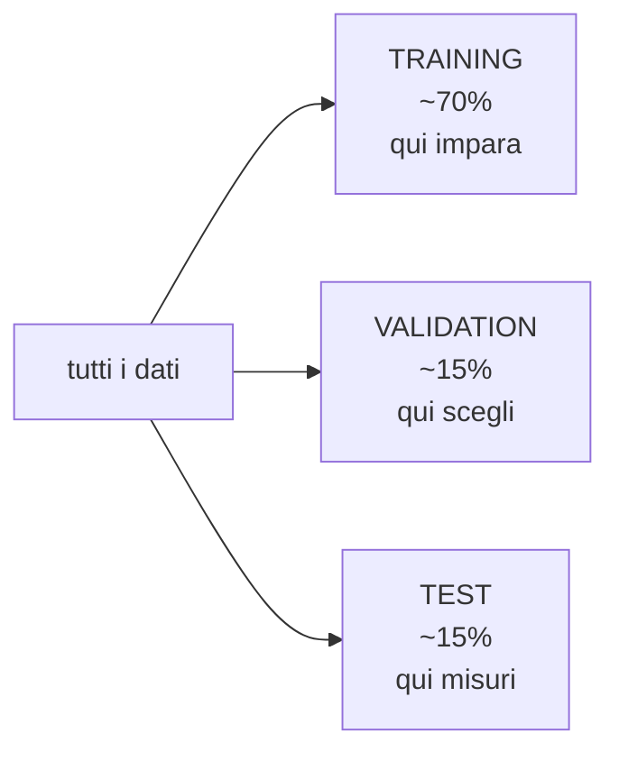
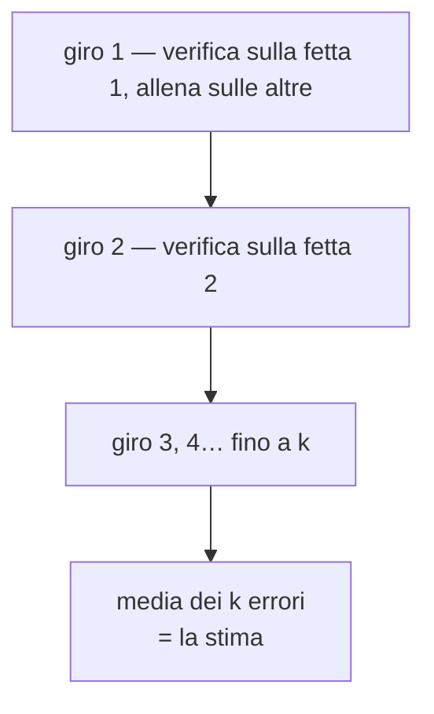

# Validazione

**In una riga:** capire quanto il modello funzionerà su gente che **non ha mai visto**.

> [!example] Studiare per un esame
> Ti eserciti su dieci compiti vecchi finché li fai tutti giusti. Sei bravo, o hai imparato a memoria quei dieci?
>
> L'unico modo di saperlo è **un compito nuovo**. Se vai bene lì, hai capito la materia. Se crolli, avevi memorizzato.
>
> Un modello è identico. **Quanto sbaglia sui dati con cui è stato addestrato non dice niente**, e spesso mente.

Il rischio ha un nome: **overfitting**. Il modello impara i dettagli e il rumore del suo training, e su dati nuovi crolla (→ [[Alberi decisionali#Il problema: se lo lasci correre, impara a memoria]]).

---

## Dividere i dati



| insieme | a cosa serve | quante volte lo guardi |
|---|---|---|
| **training** | il modello impara qui | continuamente |
| **validation** | scegliere fra modelli e regolare le manopole | molte volte |
| **test** | la stima onesta di quanto funziona | **una volta sola, alla fine** |

> [!important] Perché servono tre insiemi e non due
> Sembra che training e test bastino. Non basta, e il motivo è sottile.
>
> Se provi venti modelli e tieni quello che va meglio **sul test**, hai usato il test per scegliere. Quel test non è più "dati mai visti": l'hai consultato venti volte, e il modello vincente è in parte vincente per fortuna su *quei* dati.
>
> Il risultato che riporti è **gonfiato**. La validation esiste proprio per fare le scelte, così il test resta vergine.

> [!warning] Il test si guarda alla fine, e una volta sola
> Se guardi il test, non ti piace il numero e cambi il modello, **hai appena bruciato il test**. Da quel momento è diventato un validation set, e non hai più una stima onesta.
>
> Questa è la regola che chi comincia rompe sempre.

### Come si divide

A caso, ma con una precauzione:

> [!tip] Dividi in modo stratificato
> Se gli insolventi sono il 5%, una divisione a caso può metterne 8% nel training e 2% nel test. I due insiemi non sono più confrontabili.
>
> La divisione **stratificata** mantiene le stesse proporzioni ovunque. In `caret` è il default di `createDataPartition`.

E se i dati hanno un ordine temporale — previsioni, serie storiche — **non si divide a caso**: si addestra sul passato e si verifica sul futuro. Altrimenti il modello impara da dati che nella realtà non avrebbe ancora avuto. È un'altra forma di [[Preprocessing#La regola d'oro|leakage]].

---

## Cross-validation

Il problema di mettere da parte una fetta: **butti via dati**. Con 200 osservazioni, toglierne 60 per il test è doloroso. E il risultato dipende da quali 60 ti sono capitate.

La **cross-validation** risolve entrambe le cose.

> [!important] Come funziona, in tre righe
> 1. dividi i dati in **k fette** (di solito **k = 5** o **k = 10**)
> 2. addestri su `k−1` fette e verifichi sulla fetta rimasta
> 3. **ripeti k volte**, cambiando ogni volta quale fetta fa da verifica
>
> Alla fine hai k misure di errore, e prendi la **media**.



Il guadagno è doppio: **ogni osservazione fa da dato nuovo esattamente una volta**, e la media di k misure balla molto meno di una misura sola.

> [!info] Quante fette?
> - **k = 5 o 10** è lo standard. Buon compromesso fra affidabilità e tempo
> - **k più grande** = stima più accurata, ma k addestramenti da fare
> - **k = n** (una fetta per osservazione) si chiama *leave-one-out*: precisissima e lentissima, si usa solo con pochissimi dati

> [!warning] La cross-validation non sostituisce il test set
> Serve a **scegliere** — quale modello, quali manopole. Fa il lavoro della validation, non quello del test.
>
> Il test messo da parte all'inizio resta lì, intatto, per la misura finale.

E vale sempre la regola d'oro: **anche il preprocessing va rifatto dentro ogni giro**. Se standardizzi tutto prima di dividere in fette, ogni giro ha già visto un pezzo della sua fetta di verifica.

---

## Bootstrap

Un'altra idea, per un'altra domanda: **quanto è incerta la mia stima?**

> [!example] Il sacchetto delle biglie
> Hai 100 osservazioni. Ne estrai 100 **rimettendo dentro** ogni volta quella pescata.
>
> Ottieni un dataset nuovo da 100, in cui qualcuna compare due o tre volte e qualcun'altra non compare affatto. Ripeti **mille volte**: mille dataset diversi, tutti plausibili quanto il tuo.
>
> Calcoli il tuo numero su ciascuno, e guardi **quanto balla**.

Il punto: non potendo raccogliere mille campioni veri, li **simuli** dal campione che hai. È lo stesso ragionamento sulla [[Inferenza#La stima è un numero ballerino|variabilità delle stime]], fatto a forza bruta invece che con una formula.

Serve quando l'intervallo di confidenza non ha una formula comoda, oppure per stimare l'incertezza di cose strane — la differenza fra due mediane, un indice costruito a mano.

E il bootstrap è anche il mattone del **bagging**, che sta dentro il [[Alberi decisionali#Random forest|random forest]] e dentro l'[[Preprocessing#Le strade|imputazione dei mancanti]].

---

## Confrontare più modelli

Una volta che ogni modello ha la sua misura in cross-validation, si confrontano. Con una cautela:

> [!warning] Una differenza piccola non è una differenza
> Modello A: 0,82 di accuratezza. Modello B: 0,81. **Non hai dimostrato che A è migliore.**
>
> Ogni misura ha la sua incertezza, perché è la media di k giri che fra loro variano. Se le due fasce si sovrappiano, i modelli sono equivalenti.
>
> Guarda la **dispersione fra i fold**, non solo la media. È lo stesso principio della [[Alberi decisionali#La regola a una deviazione standard|regola a una deviazione standard]]: a parità di risultato, vince il modello **più semplice**.

---

## In R

Tutto passa da `caret`, e da due funzioni.

```r
library(caret)

# 1. dividere, in modo stratificato
set.seed(1)
i <- createDataPartition(dati$target, p = 0.7, list = FALSE)
train <- dati[i, ]
test  <- dati[-i, ]

# 2. impostare la validazione
ctrl <- trainControl(method = "cv", number = 5, classProbs = TRUE)

# 3. addestrare: caret fa da solo i 5 giri
m <- train(target ~ ., data = train, method = "glm",
           family = "binomial", trControl = ctrl)

m               # la stima cross-validata
m$resample      # i 5 risultati, uno per fetta: guarda quanto ballano
```

Confrontare più modelli sulle **stesse** fette:

```r
alberi <- train(target ~ ., data = train, method = "rpart", trControl = ctrl)
knn    <- train(target ~ ., data = train, method = "knn",   trControl = ctrl)

confronto <- resamples(list(logistica = m, albero = alberi, knn = knn))
summary(confronto)
bwplot(confronto)     # i boxplot delle metriche: si vede la sovrapposizione
```

E solo alla fine, una volta sola:

```r
previsti <- predict(m, newdata = test)
confusionMatrix(previsti, test$target)
```

> [!tip] `method` dentro `trainControl`
> `"cv"` cross-validation · `"repeatedcv"` la ripete più volte con divisioni diverse · `"boot"` bootstrap · `"none"` nessuna validazione.
>
> `set.seed()` prima di dividere serve a poter **rifare identico** lo stesso esperimento. Senza, ogni esecuzione dà numeri diversi e non capisci più se è cambiato il modello o solo il sorteggio.

---

## Da tenere in tasca

| domanda | risposta rapida |
|---|---|
| Perché validare? | l'errore sui dati **già visti** mente |
| I tre insiemi? | **training** impara · **validation** sceglie · **test** misura |
| Quante volte guardo il test? | **una sola, alla fine** |
| Perché non bastano due insiemi? | scegliere sul test **gonfia** il risultato |
| Cos'è la cross-validation? | k fette, k giri, si fa la **media** |
| Quanti fold? | **5 o 10** |
| Sostituisce il test? | **no**. Fa il lavoro della validation |
| Cos'è il bootstrap? | riestrai **con reimmissione** per stimare l'incertezza |
| Divisione stratificata? | mantiene le **proporzioni** delle classi |
| Dati temporali? | si allena sul **passato**, mai a caso |
| A vince 0,82 contro 0,81? | **no**: guarda la dispersione fra i fold |
| Comandi R? | `createDataPartition`, `trainControl`, `train`, `resamples` |

## Vedi anche

[[Preprocessing]] · [[Scegliere la soglia]] · [[Alberi decisionali]] · [[Machine Learning]] · [[R]]
