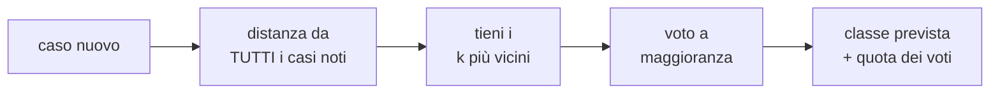

# kNN

**In una riga:** per classificare un caso nuovo, guardi i **k casi più simili** che conosci già e segui la maggioranza.

**kNN** sta per *k nearest neighbours*, i **k vicini più prossimi**. `k` è un numero che scegli tu: 3, 5, 15.

> [!example] Il quartiere
> Vuoi indovinare se una persona appena trasferita guadagna più di 50.000 dollari l'anno.
>
> Cerchi le **5 persone che le somigliano di più**: stessa età più o meno, stesse ore di lavoro a settimana. Quattro su cinque guadagnano più di 50.000. Rispondi **"sì"**, con probabilità **4/5 = 0,8**.
>
> Non hai stimato nessun coefficiente. Hai solo **confrontato e contato**.

---

## Come funziona

Tre passi, sempre gli stessi:

1. **misuri la distanza** fra il caso nuovo e ogni caso del training
2. **tieni i k più vicini**
3. **voti**: vince la classe più frequente fra i vicini

La probabilità che il modello restituisce è la **quota di vicini** di quella classe. Con `k = 5` e 4 vicini "sì", la probabilità di "sì" è 0,8.



> [!info] Non è un modello, è una regola
> La [[Regressione logistica|logistica]] riassume i dati in pochi coefficienti e poi li butta via. kNN non riassume niente: **tiene in memoria tutto il training** e lo riconsulta a ogni previsione.
>
> Per questo si dice che kNN è una **regola di decisione**, più che un modello.

### La distanza

"Vicino" vuol dire **a distanza piccola nello spazio delle variabili**. Ogni caso è un punto: con due variabili (età, ore di lavoro) è un punto su un piano.

| distanza | come si calcola | l'idea |
|---|---|---|
| **euclidea** | radice della somma delle differenze al quadrato | la linea retta, "in linea d'aria". È il default |
| **Manhattan** | somma delle differenze in valore assoluto | il percorso a isolati, come in una città a griglia |
| **coseno** | l'angolo fra i due vettori | conta la **direzione**, non la lunghezza |

> [!example] Euclidea, con i numeri
> Persona A: 30 anni, 40 ore. Persona B: 34 anni, 43 ore.
>
> Differenze: 4 anni e 3 ore. Distanza euclidea = `√(4² + 3²) = √25 = 5`.
>
> Manhattan = `4 + 3 = 7`.

### Il voto pesato

Nel voto semplice il vicino più vicino e il quinto contano uguale. Una variante dà **più peso a chi è più vicino**: ogni vicino vota con peso `1 / distanza`.

Un vicino a distanza 0,5 vale 2 voti. Uno a distanza 4 vale un quarto di voto.

---

## La scelta di k

`k` è la **manopola** del metodo, e comanda il compromesso fra le due forme di errore.

| k | cosa succede | rischio |
|---|---|---|
| **piccolo** (1, 3) | segui ogni singolo caso, anche quello strano | **sensibile al rumore**: un solo caso anomalo cambia la risposta. Overfitting |
| **grande** (50, 80) | voti su una folla | nella cerchia entrano **punti di altre classi**, e il confine si appiattisce. E ogni previsione costa di più |

> [!important] k si sceglie in cross-validation
> Si prova una griglia di valori — per esempio 3, 11, 19, … — e per ciascuno si misura il **tasso di errore cross-validato**, cioè calcolato sulla matrice di confusione della cross-validation.
>
> Si tiene il `k` con l'errore più basso (→ [[Validazione#Cross-validation]]).

> [!tip] Con due classi, k dispari
> Con `k = 4` può finire 2 a 2. Un `k` dispari evita il pareggio.

---

## Preparare i dati

kNN vive di distanze. Tutto quello che rovina le distanze rovina il modello.

> [!warning] Lo scaling è obbligatorio
> Età va da 17 a 90. Un reddito va da 0 a 100.000.
>
> Nella distanza euclidea una differenza di 10.000 dollari **schiaccia** una differenza di 40 anni. Il reddito decide tutto da solo, solo perché è scritto con numeri più grandi.
>
> **Si standardizza sempre** prima, così ogni variabile ha varianza 1 e pesa alla pari (→ [[Preprocessing#4. Scaling]]). Il rischio è peggiore se la variabile dai numeri grandi è anche **irrilevante**: domina una distanza che non dice niente.

| problema | perché | cosa fare |
|---|---|---|
| **variabili categoriali** | non si può sottrarre "Married" da "Divorced" | trasformarle in [[Preprocessing#Le variabili categoriali\|dummy]] 0/1, oppure usare solo le numeriche |
| **valori mancanti** | senza un valore non si calcola la distanza | imputarli prima (→ [[Preprocessing#1. Dati mancanti]]) |
| **variabili inutili** | aggiungono rumore alla distanza | selezionare le variabili prima |
| **tante variabili** | "vicino" perde significato | ridurle, anche con la [[PCA]] |

> [!tip] Le componenti principali come input
> Un trucco pratico: invece delle variabili originali, dare a kNN le **componenti principali** calcolate dalla matrice di correlazione.
>
> Sono già standardizzate e non correlate fra loro, quindi ogni direzione pesa alla pari. Il costo: con molte categoriali, le dummy fanno crescere il numero di colonne.

### Selezionare le variabili: stepdisc

kNN non ha coefficienti, quindi non dice quali variabili contano. La selezione va fatta **prima**, con un altro strumento.

L'idea della selezione **stepdisc** (*stepwise discriminant*) è girare la domanda: invece di chiedere "x prevede y?", chiede **"la media di x cambia fra le classi di y?"**. Si risponde con un'[[Modelli lineari#ANOVA|ANOVA]] per ogni variabile.

1. per ogni variabile, un'ANOVA con la classe come fattore. Entra quella con la **F più alta**: è la più discriminante
2. si ripete sulle rimaste, **tenendo conto** di quelle già entrate
3. ci si ferma quando nessuna aggiunge una differenza significativa

> [!example] Sui fiori iris
> Tre specie, quattro misure. Entra per prima la **lunghezza del petalo** (F = 1180, enorme). Poi larghezza del sepalo, poi larghezza del petalo.
>
> La **lunghezza del sepalo** arriva ultima con p = 0,08: al netto delle altre tre, la sua media non cambia in modo significativo fra le specie. È la variabile meno utile.

---

## Il limite: tante variabili

> [!warning] La maledizione della dimensionalità
> Con due variabili, "vicino" ha un senso chiaro. Con cinquanta, **tutti i punti sono più o meno alla stessa distanza da tutti**.
>
> I k "vicini" non sono più simili al caso nuovo degli altri: sono solo i meno lontani di una folla ugualmente lontana. Il voto diventa casuale.
>
> Colpisce tutti i metodi basati su distanze, [[Clustering|k-means]] compreso.

---

## Pigro contro diligente

kNN è l'esempio classico di apprendimento **pigro** (*lazy learning*).

| | **lazy** — kNN | **eager** — logistica, alberi, reti |
|---|---|---|
| addestramento | **nessuno**: salva i dati | stima un modello compatto (coefficienti, pesi, regole) |
| dopo l'addestramento | tiene **tutto** il training | il training si può buttare |
| previsione | **lenta**: confronta con ogni caso | veloce: applica il modello |
| memoria | tanta | poca |

> [!example] Studiare o portarsi il libro
> Lo studente **eager** studia prima e all'esame risponde a memoria, veloce.
>
> Lo studente **lazy** non studia: porta il libro e lo sfoglia a ogni domanda. Nessuna fatica prima, tanta fatica a ogni risposta.

---

## kNN o logistica?

| | kNN | [[Regressione logistica]] |
|---|---|---|
| forma del confine | **qualsiasi**: non assume niente | una retta (o una curva se aggiungi i quadrati) |
| spiegazione | **nessuna**: niente coefficienti | un odds ratio per variabile |
| stabilità | **instabile**: pochi casi cambiati spostano le previsioni | stabile |
| dove vince | confini **molto non lineari** | confini lineari, bisogno di spiegare |

kNN si dice **non parametrico**: non stima parametri e non fa ipotesi sulla forma del confine. È il suo pregio e il suo difetto insieme. Si adatta a tutto, quindi **tende all'overfitting** e generalizza male.

> [!info] Quanto può andare bene
> Con tantissimi dati, il kNN con `k = 1` sbaglia **al massimo il doppio** del [[Classificatore di Bayes#Bayes error rate|Bayes error rate]], il minimo errore possibile. È un risultato teorico, valido quando il campione tende all'infinito.
>
> Nella pratica le sue prestazioni sono paragonabili ad alberi e reti neurali.

### Pregi e difetti

| ✓ | ✗ |
|---|---|
| semplicissimo da capire e da programmare | **overfitting** facile |
| usa informazione **locale**: si adatta a ogni zona dello spazio | vuole variabili **numeriche** |
| nessuna ipotesi sulla forma del confine | serve scegliere `k` e le variabili |
| | tiene in memoria **tutto** il training |
| | **lento** in previsione |
| | crolla con **tante variabili** |

### E per un target numerico

Stesso meccanismo, ultimo passo diverso: invece di votare, fa la **media** della `y` dei k vicini. Cinque vicini con reddito 30, 32, 35, 40, 38 mila → previsione **35 mila**.

---

## In R

Con `caret`, sul dataset **adult** (censimento USA: il target `incometgt` vale `H` se il reddito supera 50.000 dollari, `L` altrimenti).

```r
library(caret)

ctrl <- trainControl(method = "cv", number = 10, classProbs = TRUE)

# kNN vuole numeri: teniamo il target e le sole colonne numeriche
keep <- c("incometgt", names(train.df)[sapply(train.df, is.numeric)])

# la griglia di k da provare: 3, 11, 19, ... 83
griglia <- expand.grid(k = seq(3, 83, by = 8))

knn <- train(incometgt ~ ., data = train.df[, keep],
             method = "knn",
             preProcess = c("center", "scale"),   # obbligatorio
             tuneGrid = griglia,
             trControl = ctrl)

plot(knn)              # accuratezza cross-validata per ogni k
knn$bestTune           # il k scelto
confusionMatrix(knn)   # la matrice di confusione cross-validata
```

> [!tip] Prova con e senza scaling
> Addestra una seconda volta **senza** `preProcess` e confronta: `table(predict(knn), predict(knn_senza))`. Le righe fuori diagonale sono i casi che cambiano classe solo perché è cambiata la scala.

Il cuore del **voto pesato**, scritto a mano:

```r
library(FNN)

vicini <- get.knnx(trainX, testX, k = 5)   # indici e distanze dei 5 vicini

i <- 1                                     # il primo caso da classificare
classi <- trainY[vicini$nn.index[i, ]]     # le classi dei suoi vicini
pesi   <- 1 / (vicini$nn.dist[i, ] + 1e-5) # piu' vicino = peso maggiore
                                           # (+1e-5 evita di dividere per zero)
punteggi <- tapply(pesi, classi, sum)      # somma dei pesi per classe
names(which.max(punteggi))                 # vince la classe col peso totale piu' alto
```

> [!info] Altre distanze in `caret`
> Il `method = "knn"` di `caret` usa solo la distanza euclidea. Per provare Manhattan o coseno serve un **metodo personalizzato**: una lista con le funzioni `fit` e `predict` scritte a mano, passata a `train(method = ...)`. Così si mettono in griglia insieme `k` e la distanza.

---

## Da tenere in tasca

| domanda | risposta rapida |
|---|---|
| Cos'è **kNN**? | guarda i **k casi più simili** e segue la maggioranza |
| La probabilità prevista? | la **quota dei vicini** di quella classe |
| Distanza di default? | **euclidea** |
| Voto pesato? | ogni vicino pesa `1 / distanza` |
| k piccolo? | segue il rumore: **overfitting** |
| k grande? | entrano vicini di altre classi, e costa di più |
| Come scelgo k? | minimo errore in **cross-validation** |
| Scaling? | **obbligatorio** |
| Categoriali? | vanno trasformate in **dummy** |
| Tante variabili? | "vicino" perde senso: **maledizione della dimensionalità** |
| Lazy o eager? | **lazy**: niente addestramento, previsione lenta |
| Rispetto alla logistica? | qualsiasi confine, ma **nessuna spiegazione** e instabile |
| Target numerico? | **media** della y dei vicini |
| Comando R? | `train(y ~ ., method = "knn", preProcess = c("center", "scale"))` |

## Vedi anche

[[Preprocessing]] · [[Validazione]] · [[PCA]] · [[Clustering]] · [[Regressione logistica]] · [[Classificatore di Bayes]] · [[Spiegare i modelli]] · [[R]]
