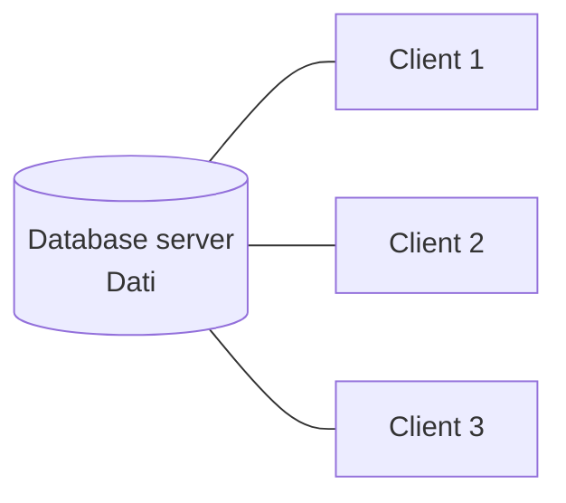
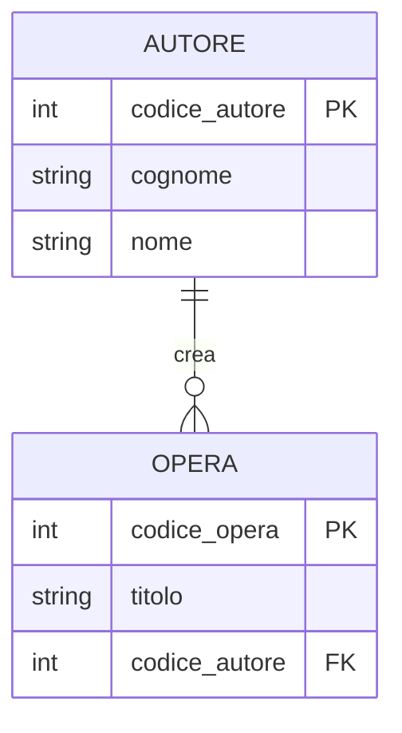

# Database relazionali

Hub dei database relazionali. La progettazione vive in [[Modello ER]] e [[Normalizzazione]]; il linguaggio in [[SQL]] e [[Logica booleana]]. Le alternative nel mondo [[NoSQL]].

## Cos'è un database

Un **database (DB)** è una collezione di dati (di solito di grosse dimensioni) organizzata per gestire — inserire, ricercare, recuperare — informazioni in modo rapido. Esempi: elenco telefonico, guida TV, prenotazioni aeree, carriere studenti.

- **DBMS** (DataBase Management System) — il *software* che gestisce i dati: Oracle, MySQL, SQL Server, SQLite.
- **DB** — l'*insieme dei dati*. Nel parlato "DB" indica sia i dati sia il software.

Un DBMS può gestire più DB contemporaneamente. I dati vivono in **tabelle** (dette anche *relazioni*): le colonne sono **attributi** (campi, field), le righe sono **tuple** (record).

## Perché esistono: dato e business si influenzano a vicenda

Il punto di partenza del corso (caso moda *wholesale → retail*): **la gestione del dato influenza i processi di business, e i processi influenzano la gestione del dato.** Aprire negozi monomarca non serviva solo a vendere — serviva a *raccogliere dati di vendita in tempo reale*. Corollario: i **trade-off** tra obiettivi degli attori (es. triage: velocità vs completezza) si scaricano sui dati che decidi di raccogliere.

## Peculiarità del modello relazionale

- **Gestione centralizzata** — un'unica versione dei fatti (l'opposto del file `.xlsx` girato via email che dopo una settimana esiste in 100 versioni divergenti).
- **Viste diverse dallo stesso dato** — schemi esterni personalizzati per utente/programma sopra un unico schema logico/fisico.
- **Forte strutturazione del dato**.
- **Supporto transazionale**.

Sono garantite dal paradigma **client/server**: i dati stanno sul *database server*, le applicazioni sono client. Il valore aggiunto del DBMS: gestione concorrente di inserimenti/letture, interrogazioni veloci, controllo degli accessi, backup e recovery.



## Strutturazione del dato

Sul livello di struttura i dati si dividono in tre categorie (esempio dei CV):

| Categoria | Esempio CV | Definizione |
|---|---|---|
| **Non strutturati** | CV in testo libero | nessuna struttura |
| **Semi-strutturati** | CV europeo | non tabellari, ma con *qualche* forma di struttura |
| **Strutturati** | CV giapponese (*rirekisho*) | formato tabellare, righe e colonne identificabili |

I DBMS relazionali richiedono dati **fortemente strutturati, in strutture definite a priori**. Il prezzo: per memorizzare un attributo che vale solo per alcune tuple devo aggiungere una colonna piena di `NULL` (es. "conosce il giapponese"). Una struttura JSON ([[Aggregate Oriented Model|NoSQL]]) invece omette il campo dove non serve.

> [!info]
> **Dato e struttura sono un modello.** Un modello è una rappresentazione *ridotta e semplificata* della realtà, fatta da un soggetto, che conserva gli aspetti utili a un dato scopo. Al cambiare dello scopo la struttura dati può dover cambiare. Per questo i DB nascono con un fine specifico e poi vengono "riadattati" per altri.

## Chiave primaria e chiave esterna

Ripetere la stessa informazione su più righe favorisce gli errori (stesso dato scritto in modo diverso, aggiornamenti parziali, cancellazioni incomplete). La cura: spezzare la tabella in tabelle distinte **collegate da chiavi**. Questo spezzettamento è la [[Normalizzazione|normalizzazione]].

- **Chiave primaria (PK)** — uno o più attributi che identificano *univocamente* una tupla nella tabella. Non ammette valori duplicati né `NULL`.
- **Chiave esterna (FK, *foreign key*)** — un attributo che identifica una tupla in *un'altra* tabella. Ammette (e spesso ha) valori duplicati.

Criterio pratico per distinguerle guardando i dati: **i duplicati sono vietati nella PK, frequenti nella FK**. Attributi omonimi di tabelle diverse si disambiguano con la notazione `tabella.attributo`.



## OLTP vs OLAP — i due scenari

Due fini diversi nel mondo delle basi di dati ([[BI Architecture]], [[ETL]]):

| | **Transazionale (OLTP)** | **Analitico (OLAP)** |
|---|---|---|
| Esempio | gestione bonifici | analisi giacenze medie dei conti |
| Operazioni | tante, piccole, lettura+scrittura | poche, grosse, sola lettura |
| Su | porzioni ristrette di dati | grosse porzioni, classi di clienti |
| Critico | **consistenza** (un bonifico non si interrompe a metà), scalabilità sui picchi | **qualità** del dato, integrazione di sorgenti diverse |

- **OLTP** — Online Transaction *Processing*: i sistemi operazionali. Database **normalizzati** ([[Normalizzazione]]).
- **OLAP** — Online Analytical *Processing*: l'analisi, organizzata come **cubo n-dimensionale**. Qui la normalizzazione conta poco o è controproducente.

## Algebra relazionale

Modello matematico che descrive **operandi** (le tabelle) e **operatori**. Combinandoli si ricostruisce l'unitarietà dell'informazione che si era persa spargendo i dati su tabelle distinte — è la base concettuale di [[SQL]].

| Operatore | Simbolo | Cosa fa |
|---|---|---|
| **Proiezione** | π | seleziona alcune *colonne* (attributi) |
| **Selezione** | σ | seleziona alcune *righe* (tuple) che soddisfano una condizione |
| **Prodotto cartesiano** | × | tutte le combinazioni riga-riga di due tabelle |
| **Join** | ⋈ | prodotto cartesiano *seguito da* una selezione sulla condizione di collegamento |

> [!important]
> Il **join** è esattamente "prodotto cartesiano + selezione": genero tutte le coppie e poi tengo solo quelle dove le chiavi combaciano. È il motivo per cui in [[SQL]] una `WHERE` su più tabelle ha due anime — le condizioni di *collegamento* e quelle di *selezione*.

## Relazioni molti-a-molti

Quando la relazione è **molti-a-molti**, diventa essa stessa una tabella (**tabella ponte**): prende tutti gli attributi della relazione e aggiunge le chiavi esterne delle entità coinvolte, che insieme fungono da chiave primaria. Vedi [[Modello ER]] per la traduzione completa ER → relazionale.

## Regola sui JOIN

```
N tabelle → N-1 JOIN
```

## Da tenere in tasca

- Il modello relazionale è di **Edgar F. Codd (1970)**: dati in tabelle (*relazioni*) di righe e colonne, ogni riga con una chiave univoca. Tecnologia matura, ancora il punto di riferimento.
- Separare i dati su più tabelle "sembra innaturale ma ha dei vantaggi": meno ridondanza, meno errori.
- La componente *dati* di un sistema informativo è la più stabile nel tempo: molti DB in uso hanno decenni e poche modifiche.
- **NoSQL = Not Only SQL**: nato da chi conosceva benissimo il relazionale, per gestire diversamente alcune sue criticità → [[NoSQL]].

## Vedi anche

[[Modello ER]] · [[Normalizzazione]] · [[SQL]] · [[NoSQL]]
