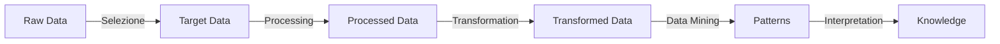
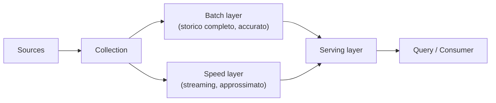

# Dati — Fondamentali

## Pipeline del dato

Il percorso *raw → knowledge* (Fayyad, KDD): ogni passo restringe e arricchisce.

> [!quote]
> "An organization should retain data that result in knowledge."

## Le 4V dei Big Data

Le caratteristiche che definiscono — e rendono difficili — i big data:

- **Volume** — la mole generata ogni secondo (Meta processa >4 PB/giorno). Richiede storage e calcolo speciali.
- **Velocità** — il ritmo di generazione e movimento; spinge verso lo streaming *real-time*.
- **Varietà** — la diversità di formato (vedi sotto).
- **Veracity** — qualità e affidabilità; con tante sorgenti, garantire dati accurati è una sfida (*cleaning*).

→ La **quinta V**, il **Value**, è la sintesi: è il valore estratto che alimenta il *decision support system* ([[BI Architecture]]).

### Varietà: i livelli di struttura

| Tipo | Struttura | Esempio |
|---|---|---|
| **Strutturati** | schema rigido, tabelle righe/colonne ([[Relazioni|RDBMS]]) | anagrafica clienti di una banca |
| **Semi-strutturati** | non tabellari ma con tag/marker e metadati | JSON, XML; clickstream / web log |
| **Non strutturati** | nessun formato predefinito | testo, immagini, video, recensioni, post |

I dati non strutturati sono i più diffusi e i più difficili da trattare con strumenti tradizionali.

## Due approcci all'analisi

### Top-Down (deduttivo, tradizionale)
Teoria → ipotesi → osservo i dati per confermarla → conferma o smentita. Uso: *information retrieval*, analytics **descrittiva e diagnostica**. È l'approccio del data warehouse classico (schema deciso prima).

### Bottom-Up (induttivo, data-driven)
Osservazione → riconoscimento di pattern → ipotesi → teoria. Approccio big data: **ingest all data** (a prescindere dai requisiti) → **store all** → **analyse**. Uso: *optimization*, analytics **predittiva e prescrittiva**. È l'approccio del [[#Data Lake|data lake]].

## Scale up vs scale out

Il bivio architetturale di fronte al Volume:

| | **Scale-up** (verticale) | **Scale-out** (orizzontale) |
|---|---|---|
| Come | macchina più potente (disco, RAM, CPU) | tanti computer *standard*, dato e calcolo distribuiti |
| Limite | tetto fisico e costo dell'hardware | gestione della distribuzione |
| Mondo | [[Relazioni|SQL]] tradizionale | [[Hadoop]], [[Spark]], [[(non solo) Relazioni|NoSQL]] |

Lo scale-out è il principio dei big data: distribuire su *commodity hardware* invece di comprare un mainframe. Vedi [[Cloud computing]] per l'evoluzione mainframe → client/server → cloud.

## Data Lake

Repository che accoglie grandi quantità di dati eterogenei nel **formato nativo** (*schema-on-read*). Immaginalo come un lago con immissari (le fonti, strutturate e non). Ospita dato *machine-generated* (IoT, log), *human-generated* (tweet, email, video) e operazionale (vendite, magazzino). Caratteristiche: ingestione rapida, flessibilità, scalabilità, buono per l'esplorazione e l'approccio bottom-up. Confronto pieno con il warehouse e il lakehouse in [[ETL]] e [[Cloud computing]].

## Lambda architecture

Pattern per servire insieme dati storici e in tempo reale, con due percorsi paralleli:

- **Batch layer** — ricalcola viste complete e accurate su tutto lo storico (alta latenza).
- **Speed layer** — elabora in streaming gli ultimi dati (bassa latenza, approssimato).
- **Serving layer** — fonde i due e risponde alle query.

Risponde all'esigenza della BI in tempo reale (vedi [[BI Architecture#Real-time BI]]).

## Da tenere in tasca

- *Garbage in, garbage out*: un'analisi vale quanto i dati che la nutrono.
- **Polyglot persistence** — un'applicazione usa più database insieme, ciascuno per ciò in cui è forte (relazionale per le transazioni, documentale per schema flessibile, grafo per le relazioni, time-series per gli eventi). → [[(non solo) Relazioni]].

## Vedi anche

[[BI Architecture]] · [[ETL]] · [[(non solo) Relazioni]] · [[Hadoop]] · [[Spark]]
