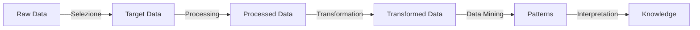
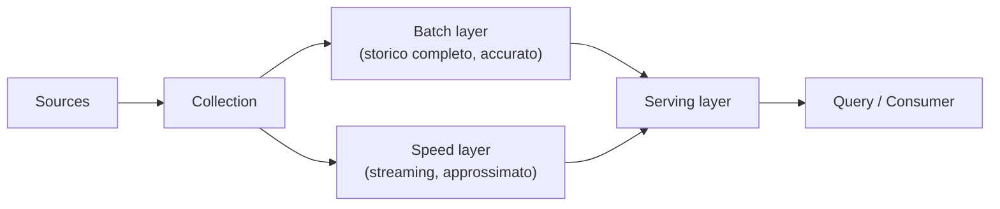

# Dati — Fondamentali

I concetti di base che tornano in tutte le altre note: come un dato grezzo diventa una decisione, cosa rende "big" i big data, e i due bivi architetturali (crescere in altezza o in larghezza, lago o magazzino).

## Pipeline del dato

Un dato appena raccolto non serve a niente. Serve quando qualcuno ci prende una decisione. Il percorso che porta dall'uno all'altro si chiama **KDD** — *Knowledge Discovery in Databases*, formalizzato da Usama **Fayyad** negli anni '90.

Ogni passo fa due cose insieme: **restringe** la quantità di dati e ne **aumenta il valore**. Seguiamolo su un esempio concreto — i log di un sito di e-commerce.

| Passo | Cosa succede | Nell'esempio |
|---|---|---|
| **Selezione** | scegli quali dati ti servono davvero, e scarti il resto | dei log tieni solo gli eventi di acquisto, non ogni clic |
| **Processing** | pulisci: righe rotte, duplicati, valori mancanti | togli gli ordini di test e le sessioni dei bot |
| **Transformation** | metti i dati nella forma che l'analisi richiede | aggreghi per cliente e per mese |
| **Data mining** | applichi algoritmi che cercano regolarità | scopri che chi compra X ricompra entro 30 giorni |
| **Interpretation** | dai un senso al risultato e decidi | mandi il promemoria al 25º giorno |

Solo l'ultimo passo produce **conoscenza**: un pattern trovato da un algoritmo resta un fatto statistico finché qualcuno non lo legge e non ne fa qualcosa.

> [!quote]
> "An organization should retain data that result in knowledge."
>
> Cioè: non conservare dati perché *potrebbero* servire, ma perché sai a quale decisione portano. È il criterio con cui si decide cosa tenere quando lo spazio costa.

## Le 4V dei Big Data

Le quattro caratteristiche che definiscono i big data. Sono anche, esattamente, le quattro cose che li rendono difficili da trattare con gli strumenti tradizionali.

- **Volume** — la mole di dati generata. Meta processa più di 4 petabyte al giorno (un petabyte è un milione di gigabyte). A questi numeri un singolo database non regge: servono storage e calcolo distribuiti.
- **Velocità** — il ritmo con cui i dati arrivano e si muovono. I tick di borsa, i sensori di una linea di produzione. Se il dato conta *adesso*, elaborarlo stanotte è inutile: spinge verso lo *streaming* in tempo reale.
- **Varietà** — la diversità di formato: tabelle, JSON, testo libero, immagini. È il punto su cui i database relazionali soffrono di più, perché pretendono uno schema deciso in anticipo. Approfondita qui sotto.
- **Veracity** — quanto ti puoi fidare. Con decine di sorgenti diverse, la stessa città può arrivare scritta in quattro modi, e un sensore guasto può mandare numeri plausibili ma falsi. Da qui la fase di *cleaning* → [[Data Quality]].

C'è poi una **quinta V, il Value**, che sta su un piano diverso: non è una caratteristica dei dati, è il risultato. È il valore effettivamente estratto, quello che alimenta le decisioni ([[BI Architecture]]). Le prime quattro descrivono un problema; la quinta dice se valeva la pena risolverlo.

### Varietà: i livelli di struttura

| Tipo | Struttura | Esempio |
|---|---|---|
| **Strutturati** | schema rigido deciso prima, righe e colonne ([[Database relazionali|RDBMS]]) | anagrafica clienti di una banca |
| **Semi-strutturati** | non tabellari, ma con tag o marcatori che indicano cos'è cosa | JSON, XML, log di navigazione |
| **Non strutturati** | nessun formato prestabilito | testo, immagini, video, recensioni, post |

I dati non strutturati sono insieme **i più diffusi** (la gran parte di ciò che produciamo) **e i più difficili**. Il motivo: un database sa ordinare e filtrare numeri e date, ma non sa da solo cosa dice una recensione. Per interrogarla, prima va trasformata in qualcosa di numerico → [[Machine Learning]].

## Due approcci all'analisi

Ci sono due modi opposti di mettere in relazione una domanda e i dati. Cambia **chi viene prima**.

### Top-Down (deduttivo, tradizionale)

Parti da una **teoria**, ne ricavi un'ipotesi, poi guardi i dati per vedere se regge. Esempio: "credo che gli sconti aumentino il riacquisto" → misuro → confermato o smentito.

Sai già cosa cerchi, quindi puoi decidere in anticipo quali dati raccogliere e come strutturarli. È l'approccio del data warehouse classico: **lo schema si progetta prima** dei dati.

### Bottom-Up (induttivo, data-driven)

Parti dai **dati**, cerchi regolarità senza sapere in anticipo quali, e dalle regolarità ricavi un'ipotesi e poi una teoria. Il motto è *ingest all data → store all → analyse*: raccogli tutto a prescindere dai requisiti, perché non sai ancora cosa ti servirà.

È l'approccio big data, e quello del [[#Data Lake|data lake]]: **lo schema si decide dopo**, quando leggi.

### I quattro tipi di analytics

I due approcci servono domande diverse. Queste quattro etichette ricorrono ovunque, conviene averle chiare:

| Tipo | Risponde a | Esempio | Approccio |
|---|---|---|---|
| **Descrittiva** | cos'è successo? | le vendite sono calate del 12% a marzo | top-down |
| **Diagnostica** | perché è successo? | il calo viene tutto dal canale mobile | top-down |
| **Predittiva** | cosa succederà? | questo cliente ha il 70% di probabilità di disdire | bottom-up |
| **Prescrittiva** | cosa conviene fare? | offrigli lo sconto X entro giovedì | bottom-up |

La progressione è anche di difficoltà e di valore: descrivere il passato è facile e serve poco, suggerire l'azione giusta è difficile e vale molto.

## Scale up vs scale out

Il bivio che ti si presenta davanti al Volume: quando una macchina non basta più, ne compri **una più grossa** o **tante piccole**?

| | **Scale-up** (verticale) | **Scale-out** (orizzontale) |
|---|---|---|
| Come | una macchina più potente: più RAM, più CPU, dischi più veloci | tanti computer standard, con dati e calcolo distribuiti |
| Limite | esiste un tetto fisico, e il costo cresce più in fretta della potenza | la complessità di far collaborare le macchine |
| Mondo | [[Database relazionali|SQL]] tradizionale | [[Hadoop]], [[Spark]], [[NoSQL]] |

Il limite dello scale-up è concreto: **il server più potente al mondo esiste**, e oltre quello non puoi andare. Inoltre il prezzo non è lineare — raddoppiare la potenza costa molto più del doppio, perché entri nella fascia dell'hardware specializzato.

Lo scale-out non ha quel tetto: se serve di più, aggiungi macchine. In cambio ti prendi la complessità della distribuzione — coordinare i nodi, gestire i guasti, spezzare i calcoli. **I big data hanno scelto questa strada**, e framework come Hadoop esistono proprio per nascondere quella complessità a chi scrive il codice.

Per l'evoluzione storica mainframe → client/server → cloud, vedi [[Cloud computing]].

## Data Lake

Un **data lake** è un archivio che accoglie grandi quantità di dati eterogenei **nel formato in cui arrivano**, senza trasformarli prima.

L'immagine è quella di un lago con i suoi immissari: i fiumi portano acqua diversa, e il lago la accoglie tutta. Le fonti sono di tre tipi:

- **machine-generated** — sensori IoT, log dei server;
- **human-generated** — email, tweet, documenti, video;
- **operazionale** — vendite, magazzino, i dati gestionali di sempre.

**Il punto tecnico è quando si decide lo schema.** Un data warehouse classico è *schema-on-write*: definisci le tabelle prima, e un dato che non ci entra viene rifiutato o adattato all'ingresso. Il data lake è *schema-on-read*: butti dentro il file com'è, e la struttura la imponi **al momento della lettura**, diversa a seconda di cosa ti serve.

Cosa ci guadagni: ingestione rapida (niente da progettare prima), flessibilità, costi di storage bassi, e la possibilità di esplorare dati per cui non avevi ancora una domanda. È l'infrastruttura naturale dell'approccio bottom-up.

> [!warning] Il rischio: il *data swamp*
> Senza catalogo, senza documentazione e senza regole di qualità, "butta dentro tutto" diventa una palude: terabyte di file che nessuno sa più cosa contengano né se siano affidabili. La flessibilità dello schema-on-read sposta il lavoro più avanti nel tempo, **non lo elimina**.

Il confronto pieno con warehouse e lakehouse sta in [[ETL]] e [[Cloud computing]].

## Lambda architecture

Un pattern per rispondere a un'esigenza contraddittoria: i risultati devono essere **esatti** (e quindi calcolati su tutto lo storico, il che richiede tempo) e insieme **aggiornati adesso**.

La soluzione è non scegliere: si fanno **entrambe le cose, su due percorsi paralleli**.

- **Batch layer** — ricalcola da zero le viste complete su **tutto lo storico**. Accurato, lento (ore).
- **Speed layer** — elabora **solo i dati appena arrivati**, in streaming. Rapido, approssimato.
- **Serving layer** — fonde i risultati dei due e risponde alle interrogazioni.

Esempio concreto, il contatore di visualizzazioni di un video: ogni notte il batch layer ricalcola il totale esatto su tutto lo storico; durante il giorno lo speed layer somma al volo le visualizzazioni delle ultime ore, con una stima; il serving layer presenta le due cose come un'unica cifra sempre aggiornata. La stima del giorno viene poi "corretta" dal ricalcolo notturno.

Il costo di questo schema: **la stessa logica va scritta due volte**, una per il batch e una per lo streaming, e le due devono restare d'accordo. È il motivo per cui esistono alternative più recenti che usano un solo percorso.

Risponde all'esigenza della BI in tempo reale → [[BI Architecture#Real-time BI]].

## Da tenere in tasca

- ***Garbage in, garbage out*.** Un'analisi vale quanto i dati che la nutrono. Nessun algoritmo recupera un dato raccolto male: se la fonte è sbagliata, il risultato è sbagliato in modo più convincente.
- **Polyglot persistence.** Un'applicazione non è obbligata a usare un solo database: ne usa più d'uno, ciascuno per ciò in cui è forte. Un e-commerce può tenere gli ordini su un relazionale (servono le transazioni), il catalogo su un documentale (schema flessibile), le raccomandazioni su un database a grafo (contano le relazioni) e le metriche su un time-series. → [[NoSQL]].

## Vedi anche

[[BI Architecture]] · [[ETL]] · [[NoSQL]] · [[Hadoop]] · [[Spark]] · [[Data Quality]]
