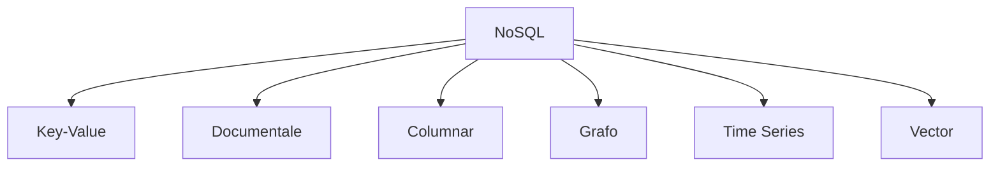
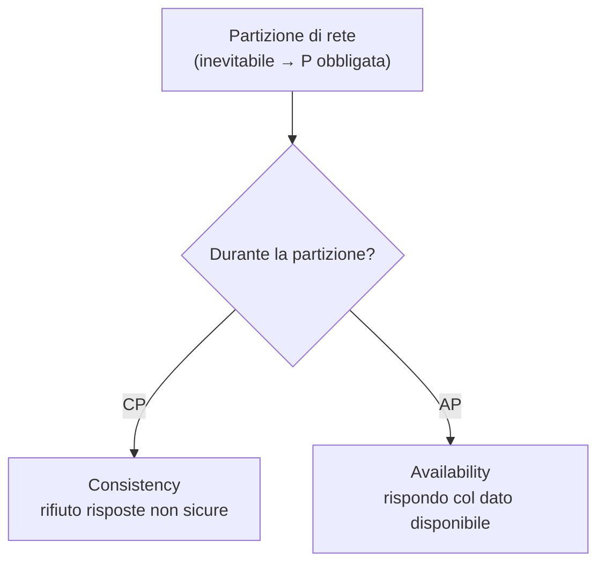

# NoSQL — Tipi di database

**NoSQL = Not Only SQL.** Nato dall'esigenza di gestire grandi volumi di dati, segna lo spostamento dal costruire grandi piattaforme hardware ([[Dati#Scale up vs scale out|scale-up]]) all'usare **cluster di server più piccoli** (scale-out). Il termine è usato spesso in modo improprio: indica i database *non relazionali* che si discostano dal modello classico — niente schema fisso, di solito niente join, scalabilità orizzontale.

## Cosa cambia rispetto al relazionale

| | **SQL** ([[Database relazionali|relazionale]]) | **NoSQL** |
|---|---|---|
| Struttura | tabelle, schema fisso | schema-free; key-value, documenti, grafi, colonne |
| Scalabilità | verticale (hardware più potente) | **orizzontale** (più server nel pool) |
| Dati | strutturati | strutturati + semi + non strutturati |
| Transazioni | **ACID**, consistenza forte | spesso *eventual consistency* (sacrifica ACID per performance) |
| Query | linguaggio maturo, query complesse | variabile per tipo; a volte solo query semplici |
| Cloud | reti locali (JDBC/ODBC) | nativo cloud, API REST, elasticità |

## La tassonomia

### Key-Value
Coppie chiave→valore, come un dizionario Python: accesso in **tempo costante** tramite chiave. Il valore è un *blob opaco* (il DB non ne interpreta la struttura). Massima semplicità e velocità. Uso: caching, sessioni, profili utente.
Esempi: **Redis**, DynamoDB.

### Documentale
Memorizza dati semi-strutturati come **documenti** (JSON, BSON, XML). Schema-free, ogni documento può differire dagli altri nella stessa collezione. A differenza del key-value, il DB **vede dentro** il documento → query sui campi, indici su qualsiasi attributo, retrieval parziale. → vedi [[MongoDB]] e [[Aggregate Oriented Model]].
Esempi: **MongoDB**.

> [!info]
> **Documentale vs Key-Value:** entrambi gestiscono aggregati, ma il key-value tratta il valore come opaco (accesso *solo* per chiave), il documentale ne espone la struttura (query *su campi* interni).

### Columnar
Orientato alle **colonne** anziché alle righe: ogni colonna sta in blocchi fisici propri. Vantaggi per l'analitica ([[Database relazionali|OLAP]], data warehousing): legge solo le colonne che servono (I/O efficiente), **compressione** ottima (stesso tipo di dato per blocco), aggregazioni rapide (`SUM`, `COUNT`, `AVG` su blocchi contigui). È il motivo per cui lo storage analitico è colonnare ([[BI Architecture]]).
Esempi: **Apache Cassandra**.

### Grafo
Dati come **nodi** (vertici) e **archi** (relazioni). Le relazioni sono memorizzate a livello di record → *traversal* efficienti senza i join costosi del relazionale. Schema-less. Uso: dati fortemente interconnessi (social, supply chain, reti). → vedi [[Graph databases]] e [[Neo4j]].
Esempi: **Neo4j**.

### Time Series
Ottimizzato per dati **indicizzati nel tempo** (metriche, eventi, misure). Append efficiente in ordine temporale, compressione, query *time-based* (aggregazione per ora/giorno, down-sampling, retention automatica). Uso: monitoring, IoT, sensori.
Esempi: **InfluxDB**.

### Vector
Memorizza dati come **vettori di feature** (rappresentazioni numeriche in spazio multidimensionale). Ottimizzato per **similarity search** (k-NN: trova i vettori più vicini), alta dimensionalità, scala a miliardi di vettori. Cuore delle app AI/LLM: embedding, RAG, raccomandazione, anomaly detection.
Esempi: **Pinecone**, **Chroma**.

## ACID — le garanzie transazionali

Quattro proprietà che rendono affidabile una transazione (forti nei [[Database relazionali|relazionali]], spesso allentate nei NoSQL):

- **Atomicity** — la transazione è un blocco unico: o tutta o niente (se fallisce a metà, *rollback*). Es. bonifico: o addebito *e* accredito, o nessuno dei due.
- **Consistency** — porta il DB da uno stato valido a un altro valido, rispettando tutti i vincoli (chiavi, FK).
- **Isolation** — transazioni concorrenti non si vedono a vicenda i risultati intermedi (no interferenze).
- **Durability** — una volta committata, la modifica resta anche dopo un crash di sistema.

## CAP theorem (Brewer)

In un sistema **distribuito** è impossibile garantire tutte e tre insieme — se ne scelgono **due**:

- **Consistency** — ogni lettura vede l'ultima scrittura (tutti i nodi, stesso dato nello stesso istante).
- **Availability** — ogni richiesta riceve risposta (non necessariamente l'ultima versione).
- **Partition tolerance** — il sistema regge anche se la rete si spezza in tronconi.

Poiché le partizioni di rete sono una realtà, **P è di fatto obbligata**: la scelta vera è tra **CP** (banca: meglio non rispondere che dare un saldo sbagliato) e **AP** (rispondo sempre, accettando dati momentaneamente non allineati). Il "CA" puro esiste solo in assenza di distribuzione. → applicato a MongoDB in [[MongoDB]].

## Polyglot persistence

Un'applicazione usa **più database insieme**, ciascuno dove è forte: relazionale per transazioni strutturate, documentale per schema flessibile, grafo per relazioni complesse, time-series per eventi. Non "quale DB", ma "quale DB per questo pezzo di problema".

## Da tenere in tasca

- La domanda di MongoDB — *"How often do I read these data together?"* — è la domanda di tutti gli aggregati: embedding (sì) vs referencing (no).
- Scalabilità NoSQL = **scale out** (più nodi), non scale up.
- Vector DB + RAG sono l'infrastruttura dati delle app LLM ([[BI Architecture#Dalla BI all'analitica AI-augmented|analitica AI-augmented]]).

## Vedi anche

[[Database relazionali]] · [[MongoDB]] · [[Neo4j]] · [[Graph databases]] · [[Aggregate Oriented Model]]
