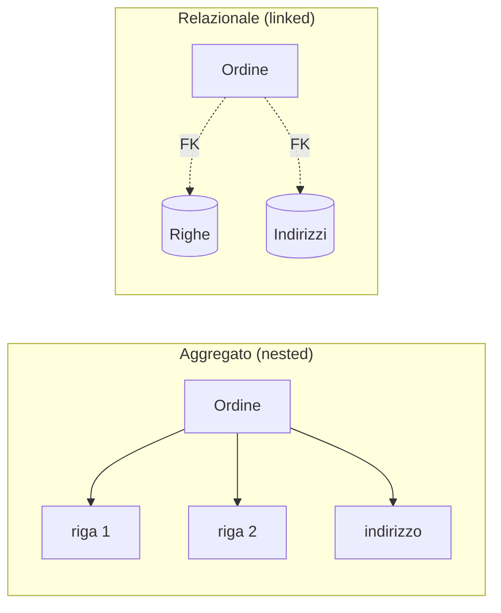

# Aggregate Oriented Model

Il modello dati condiviso dalla maggior parte dei database [[NoSQL]]. L'idea in una riga: **tieni insieme i dati che usi insieme**, anche se questo significa ripeterli.

## Il problema che risolve

Nel modello [[Database relazionali|relazionale]] si fa l'opposto: si **normalizza**, cioè si spezzano i dati in tante tabelle in modo che ogni informazione stia scritta **una volta sola**. Un ordine sta nella tabella ordini, le sue righe nella tabella righe, l'indirizzo nella tabella indirizzi. Per rimettere insieme un ordine completo si usa un **JOIN**, l'operazione che riunisce le righe collegate.

Su una macchina sola il JOIN è veloce: le tabelle sono sullo stesso disco. **Su un cluster no.** Se le righe dell'ordine stanno sul nodo 3 e l'indirizzo sul nodo 17, ricomporre l'ordine richiede di far viaggiare dati attraverso la rete. E la rete è ordini di grandezza più lenta della memoria. Più cresce il cluster, più il JOIN diventa costoso.

C'è anche una ragione che viene dai dati stessi: quelli moderni arrivano da log, web e applicazioni in formati eterogenei, e si prestano più a essere pensati come **liste di elementi** che come tabelle a schema fisso.

## L'aggregato

L'**aggregato** è una collezione di dati che si legge e si scrive **come un'unità sola**. Invece di spezzare l'ordine in tre tabelle, lo salvi tutto insieme: righe e indirizzo stanno **dentro** l'ordine.



> [!info] Nested contro linked
> È la distinzione da tenere. **Nested**: il dato sta fisicamente *dentro* l'aggregato, e leggendo l'ordine ti arriva già con sé. **Linked**: il dato sta altrove e l'ordine contiene solo una chiave che lo indica, quindi serve un secondo accesso per recuperarlo.
> (Nella notazione UML dei diagrammi di classe questo rapporto si disegna con un **rombo pieno**, il simbolo della composizione: la parte non esiste senza il tutto. Una riga d'ordine senza il suo ordine non ha senso.)

Cosa ottieni:

- **Distribuzione facile.** L'aggregato è l'unità che si sposta su un nodo. Questo rende semplice lo *sharding* — spezzare i dati tra le macchine del cluster: metti ordini diversi su nodi diversi, e ogni ordine resta comunque completo dov'è. Nessuna query dovrà attraversare la rete per ricomporlo.
- **Letture veloci.** Nessun JOIN: un accesso e hai tutto.
- **Atomicità.** Le modifiche a un aggregato o riescono tutte o falliscono tutte. È l'unica garanzia transazionale che questi database offrono — e vale **dentro** un aggregato, non tra aggregati diversi.
- **Schema-less.** Non devi dichiarare in anticipo la struttura: due ordini nella stessa collezione possono avere campi diversi, e aggiungerne uno nuovo non richiede di migrare i dati esistenti.

> [!warning] "Schema-less" non vuol dire "senza schema"
> Lo schema c'è sempre: se il codice legge `order.shippingAddress.city`, sta assumendo una struttura. La differenza è **chi lo fa rispettare**. Nel relazionale è il database, che rifiuta i dati sbagliati. Qui è l'applicazione — e se sbaglia, il dato malformato entra e te ne accorgi mesi dopo in lettura.

Il prezzo di tutto questo è la **ridondanza**: l'indirizzo di Martin è scritto dentro ogni suo ordine. Se cambia casa, i vecchi ordini conservano il vecchio indirizzo. Spesso è quello che vuoi davvero — un ordine spedito nel 2024 *deve* ricordare dove fu spedito — ma va deciso, non subito.

## Relazioni tra aggregati

Un aggregato che deve riferirsi a un altro contiene il suo **ID**. Il collegamento poi lo fa un **programma applicativo**: legge l'ID, fa una seconda interrogazione, unisce i risultati.

La conseguenza va capita bene: **il database non sa che quella relazione esiste**. Per lui `customerId: 1` è un numero come un altro. Quindi nessuna integrità referenziale — puoi cancellare il cliente 1 e ritrovarti ordini che puntano al nulla, senza che nessuno protesti. Nel relazionale la chiave esterna lo impedirebbe. Qui la responsabilità è tutta dell'applicazione.

Esempio (e-commerce, da *NoSQL Distilled*): l'ordine **embedda** ciò che legge sempre insieme a sé — righe, indirizzo, pagamento — e **referenzia** il cliente, che è un aggregato a sé, col solo `customerId`:

```json
// aggregato customer
{ "id": 1, "name": "Martin", "billingAddress": [{"city": "Chicago"}] }

// aggregato order
{ "id": 99, "customerId": 1,                 // ← riferimento all'altro aggregato
  "orderItems": [{"productId": 27, "price": 32.45, "productName": "NoSQL Distilled"}],
  "shippingAddress": [{"city": "Chicago"}],
  "orderPayment": [{"ccinfo": "1000-…", "billingAddress": {"city": "Chicago"}}] }
```

> [!tip] Dove tracci il confine
> La decisione vera del design è **cosa sta dentro un aggregato e cosa è un aggregato a sé**. Lo stesso dominio (Customer, Order, Product, Address) si può raggruppare in modi diversi, e non c'è una risposta giusta in assoluto: dipende da come l'applicazione legge i dati.
>
> La regola pratica: **dentro** ciò che si legge e si scrive sempre insieme; **fuori**, riferito per ID, ciò che ha vita propria o è condiviso da più aggregati — come il Customer, che esiste anche senza ordini ed è puntato da tutti.
>
> È la stessa scelta *embedding vs referencing* di [[MongoDB]].

## La famiglia aggregate-oriented

Tre modi di realizzare la stessa idea, che si distinguono per **quanto il database vede dentro l'aggregato**.

| Tipo | Struttura | Esempi |
|---|---|---|
| **Key-Value** | una tabella a due colonne, `ID → VALUE`. Il valore è un *blob* opaco: testo, JSON, un'immagine, qualsiasi cosa. Operazioni: `get`, `put`, `delete` per chiave | Redis, DynamoDB, Riak KV |
| **Column-Family** | aggregato a due livelli: una chiave di riga, e dentro **gruppi di colonne** leggibili separatamente | Bigtable, HBase, Cassandra |
| **Documentale** | aggregato come documento JSON/BSON, con la struttura **visibile e interrogabile** dal database | [[MongoDB]] |

**Key-value: cosa vuol dire "opaco".** Il database non guarda dentro il valore, lo tratta come una sequenza di byte. Semplicissimo e velocissimo, ma con una conseguenza netta: **non puoi cercare per contenuto**. Nessun "dammi tutti gli ordini sopra i 50 euro" — se non hai la chiave, non trovi il dato. Devi sapere già cosa vuoi.

**Column-family: i due livelli.** Immagina un utente identificato da `userId`. Dentro, le colonne sono raggruppate in famiglie: una `profilo` (nome, email, data iscrizione) e una `attività` (ultimo accesso, pagine viste). Puoi leggere solo la famiglia `profilo` senza tirare su anche l'altra. Utile quando l'aggregato è grande e le sue parti si usano in momenti diversi.

**Documentale: struttura visibile.** All'opposto del key-value: il database capisce il JSON, quindi puoi interrogare i campi interni e costruirci indici sopra.

> [!important] Aggregate-oriented contro aggregate-ignorant
> I database **aggregate-oriented** vanno bene quando *la maggior parte delle operazioni riguarda un aggregato alla volta*: leggo un ordine, mostro un ordine, aggiorno un ordine.
>
> I database **aggregate-ignorant** — i relazionali — vanno meglio quando gli stessi dati devono essere **ricombinati in tante formazioni diverse**: oggi il fatturato per regione, domani i prodotti più venduti per fascia d'età. Non avendo scelto un raggruppamento privilegiato, li servono tutti ugualmente bene.
>
> Il criterio è **come leggi i dati**, non una preferenza astratta per una tecnologia. Se non sai ancora quali saranno le domande, aggregare è una scommessa.

## Casi d'uso adatti

| Caso | Perché AO |
|---|---|
| **Event logging** | archivio centrale di eventi, sempre scritti e letti uno per uno; si distribuisce per applicazione o tipo di evento |
| **CMS / Blog** | nessuno schema prestabilito: post, commenti, profili, pagine hanno forme diverse e cambiano spesso |
| **Web / real-time analytics** | si aggiungono metriche nuove senza toccare lo schema né migrare lo storico |
| **E-commerce** | catalogo e ordini evolvono di continuo (un prodotto nuovo ha attributi che gli altri non hanno) |

Il filo comune: dati che si leggono **per unità intere** e che **cambiano forma nel tempo**.

## Quando NON usarlo

- **Transazioni che toccano più aggregati.** L'atomicità vale dentro un aggregato. Se un'operazione deve modificare due cose insieme — addebita un conto *e* accredita l'altro — il database non garantisce che riescano o falliscano insieme. Alcuni prodotti fanno eccezione (RavenDB, e le versioni recenti di MongoDB), ma non è il terreno di questi sistemi.
- **Aggregato dalla struttura instabile.** Se non riesci a decidere cosa sta dentro e continui a cambiare idea, ogni ripensamento ti costa la riscrittura dei dati salvati. A quel punto conviene salvare tutto al livello di dettaglio più fine — cioè spezzato — e allora il modello aggregato non ti sta più dando niente.

→ Confronto con gli altri tipi NoSQL: [[NoSQL]].

## Vedi anche

[[NoSQL]] · [[MongoDB]] · [[Database relazionali]] · [[Normalizzazione]]
