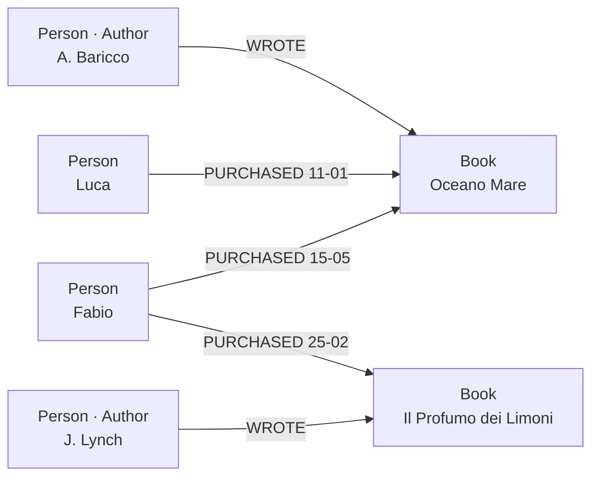

# Neo4j

Il principale **graph database nativo** ([[Graph databases]]): core open-source (Community) + commerciale (Enterprise). Prima release 2007, oggi linea 5.x. Usato da NASA, eBay, UBS, **ICIJ (Panama Papers)**, e da molti stack di fraud-detection e raccomandazione. Linguaggio di query: **Cypher** (dichiarativo, basato su pattern, in via di standardizzazione come **ISO GQL**). Supporta **transazioni ACID** (come SQL).

## Index-free adjacency — perché è veloce

Storage a grafo nativo: **ogni nodo conosce i suoi vicini direttamente, via puntatori** — per passare da un nodo all'altro non si consulta nessun indice.

La conseguenza sul costo: in un RDBMS ogni salto richiede un lookup su indice, `O(log n)`, che cresce col dataset; qui un passo di traversal costa **O(grado)** — proporzionale a *quanti vicini ha quel nodo*, non a quanto è grande il database. È il motivo per cui i **join si fanno per attraversamento di percorso, non per prodotto cartesiano**: in un RDBMS il costo di un singolo join dipende dalla dimensione della tabella ponte `Person_has_skill`; in Neo4j no.

## I 4 elementi fondamentali (metamodello)

| Elemento | Descrizione |
|---|---|
| **Nodi** | rappresentano entità; ID interno auto-assegnato; simili agli oggetti OO / alle entità [[Modello ER\|ER]] |
| **Relazioni** | connessioni binarie tra nodi (vedi regole sotto) |
| **Proprietà** | coppie chiave-valore (string, number, boolean, array) su nodi *e* relazioni; schema-less |
| **Etichette** (label) | non gerarchiche, come **tag**: raggruppano per ruolo (`:User`, `:Product`) e abilitano indici per gruppo |

> [!note]
> Capacità di visualizzare insieme **semantica e dato**.

### Le regole delle relazioni

Ogni relazione **deve** avere:
- un **nome** e una **direzione** — sono loro a dare struttura e significato al legame;
- un **nodo di start e uno di end** — *niente relazioni penzolanti*: per costruzione ogni relazione punta sempre a nodi esistenti (l'analogo di una FK che non può puntare nel vuoto).

**Può** inoltre contenere proprietà. Altre regole:
- una relazione è definita rispetto a una **istanza** di nodo, non a una **classe** (al contrario delle FK relazionali, che valgono per tutte le istanze) → la struttura del dominio è **variabile**;
- due nodi possono essere connessi da **più relazioni**, e sono ammesse le **auto-relazioni**;
- relazioni **simmetriche** (`PARENT_OF` / `CHILD_OF`): si sostituiscono con **una sola** relazione diretta.

### Esempio (property graph)

Il metamodello reso concreto: persone che **scrivono** (`:Author`) e **comprano** libri, con la *data* come **proprietà sulla relazione** `PURCHASED`.



## Architettura ed ecosistema

Driver (Python/Java/JS/.NET/Go) → protocollo **Bolt** (binario, cifrato) → **Cypher Query Engine** (planner, optimizer) → **Storage Engine** (pagine, transaction log, recovery) → file nativi del grafo. Strumenti: **Neo4j Browser** (UI web su `:7474`), **Bloom** (esplorazione no-code), **GDS** (libreria di algoritmi), **APOC** (procedure di utilità), **AuraDB** (Neo4j gestito in cloud, free tier ~200k nodi).

> [!info] AuraDB — la connessione (cosa significa l'URI)
> Neo4j gestito su AWS/GCP/Azure. Il **connection URI** è `bolt+s://` o `neo4j+s://`: protocollo **Bolt** (binario) **`+s` = sempre su TLS** (cifrato). Da Python / Colab / laptop **stesso codice e stesso Cypher** — cambia *solo* l'URI. Free tier: 1 istanza, ~200k nodi, **auto-pausa** dopo 3 giorni di inattività (i dati restano, basta riavviare).

## Cypher — fondamentali

Linguaggio **dichiarativo** (descrive *cosa* vuoi, non *come*), basato su **pattern matching**, **case sensitive** sui contenuti (`"Charlie" ≠ "charlie"`). Supporta aggregazioni, ordinamento, limiti, CRUD.

### Sintassi dei pattern
```cypher
MATCH (n) RETURN n LIMIT 25                       // qualsiasi nodo
MATCH (p:Person) RETURN p.name ORDER BY p.name    // nodi con label
MATCH (p:Person {name: "Charlie"}) RETURN p       // label + filtro inline (≡ WHERE)
MATCH (p:Person)-[:INTERESTED_IN]->(s:Skill)      // relazione orientata
  RETURN p.name, s.name
MATCH (p:Person)-[r:INTERESTED_IN]->(s:Skill)     // relazione con variabile r
  RETURN type(r)
```
La query inizia da `MATCH`; ometti la variabile quando non ti serve (`(:Person)` è anonimo).

### CREATE e MERGE
```cypher
CREATE (:Person {name: "Charlie", gender: "male"})   // CREATE duplica se rieseguito!
MERGE (p:Person {name: "Charlie"})                   // MERGE = MATCH or CREATE (idempotente)
  ON CREATE SET p.created_at = datetime()
  ON MATCH  SET p.last_seen  = datetime()
```
`MERGE` garantisce che il pattern esista **esattamente una volta** — l'analogo grafo dell'idempotenza ([[ETL]]).

### WHERE — predicati di filtro
```cypher
WHERE p.gender IN ["male","female"]
WHERE s.name STARTS WITH "J"      // CONTAINS / ENDS WITH
WHERE s.name =~ "(?i).*music.*"   // regex
WHERE (p)-[:INTERESTED_IN]->()    // pattern come predicato
```

### OPTIONAL MATCH e WITH
- **OPTIONAL MATCH** — restituisce `NULL` se il pattern manca, senza perdere righe ≡ **LEFT OUTER JOIN** [[SQL|SQL]].
- **WITH** — passa i risultati allo stadio successivo, come una **pipe**: aggrega/filtra/ordina, poi continui con nuovi `MATCH`/`RETURN`.
```cypher
MATCH (p:Person)-[:INTERESTED_IN]->(s:Skill)
WITH p, count(s) AS skills WHERE skills >= 3
MATCH (p)-[:WORKED_ON]->(pr:Project)
RETURN p.name, collect(pr.name) AS projects ORDER BY skills DESC
```

### Aggregazioni, ordinamento, modifica
- `count`, `min`, `max`, `avg`, `sum`; **`collect`** aggrega in una lista; **`DISTINCT`** rimuove i duplicati.
- `ORDER BY … DESC`, `LIMIT n`, `SKIP n` (paginazione).
- `SET p.age = 31` (proprietà) / `SET p:Mentor` (label); `REMOVE`; `DELETE` (fallisce se il nodo ha relazioni); **`DETACH DELETE`** rimuove nodo *e* tutte le sue relazioni.

### Caricamento dati
```cypher
LOAD CSV WITH HEADERS FROM "file:///file.csv" AS row FIELDTERMINATOR ';'
CALL (row) { MERGE (:Person {name: row.name}) } IN TRANSACTIONS OF 1000 ROWS;
```

### Esempi
```cypher
// Trovare i nodi pozzo (senza uscita)
MATCH ()-->(pozzo) WHERE NOT (pozzo)-->() RETURN DISTINCT pozzo

// Percorso più breve tra due persone
MATCH p = shortestPath( (a:Person {name:'Charlie'})-[:WORKED_ON|WORKS_FOR*]-(b:Person {name:'Kate'}) )
RETURN p
```

## Indici e constraint

Gli **indici** velocizzano la scansione (sintassi moderna `FOR … ON …`):
```cypher
CREATE INDEX name_idx IF NOT EXISTS FOR (n:Person) ON (n.name)            // range index
CREATE INDEX name_gender IF NOT EXISTS FOR (n:Person) ON (n.name, n.gender) // composito
CREATE INDEX worked_since IF NOT EXISTS FOR ()-[r:WORKED_ON]-() ON (r.since) // su relazione
```
I **constraint** impongono regole (un constraint di unicità crea anche l'indice di supporto):
```cypher
CREATE CONSTRAINT person_unique IF NOT EXISTS FOR (n:Person) REQUIRE n.name IS UNIQUE
CREATE CONSTRAINT person_exists IF NOT EXISTS FOR (n:Person) REQUIRE n.name IS NOT NULL
CREATE CONSTRAINT person_key    IF NOT EXISTS FOR (n:Person) REQUIRE (n.name, n.gender) IS NODE KEY
```

## Graph Data Science (GDS) — analitica sul grafo

Neo4j non è solo uno **store**: la libreria **GDS** ha ~80 algoritmi in 6 famiglie (centralità, community detection, similarità, path finding, topologici, embeddings/ML). Gli algoritmi girano su una **projection in-memory** del grafo. Workflow: **project** (costruisci il sottografo in memoria) → **run** (`.stream`/`.mutate`/`.write`) → **consume** → **drop** (`gds.graph.drop`, libera la memoria).

### PageRank
L'algoritmo che ha reso famoso Google (Brin & Page, Stanford 1998). *"La tua importanza = somma di chi punta a te, pesata dalla loro importanza."*
```
PR(v) = (1-d)/N + d · Σ PR(u)/out(u)        d ≈ 0.85 (random-surfer damping)
```
Score alto → nodo centrale/autorevole. Uso: ranking di influenza, fraud detection, raccomandazioni, search relevance.
```cypher
CALL gds.pageRank.stream("talentGraph") YIELD nodeId, score
RETURN gds.util.asNode(nodeId).name AS person, score ORDER BY score DESC
```

### Node Similarity (Jaccard)
"Quanto sono simili due nodi in base ai vicini condivisi?" `J(A,B) = |A∩B| / |A∪B| ∈ [0,1]` (1 = vicini identici). Uso: *"chi è come te ha anche comprato…"*, matching mentore-allievo, deduplicazione.

### Louvain (community detection)
"Quali gruppi di nodi sono densamente connessi internamente e poco col resto?" Massimizza la **modularità Q ∈ [-0.5, 1]** (Q≈0 = casuale; Q>0.5 = struttura netta). Greedy: ogni nodo si sposta nella community che aumenta di più Q, poi si aggrega e si ripete. Uso: segmentazione clienti, *fraud rings*, team in un org chart.

### Embeddings
Trasformano ogni nodo in un **vettore denso** che cattura il contesto nel grafo (es. **FastRP**, Node2Vec), input per ML a valle: link prediction, classificazione. Il vettore può alimentare un [[NoSQL|vector index]] per nearest-neighbour ("persone simili a Charlie" dalla sola struttura del grafo).

> [!tip]
> Il valore concreto: in **una query** ottieni ciò che "guardare l'organigramma" richiederebbe a mano — il team centrale, i silos, le risorse inutilizzate, senza un solo JOIN.

## Vedi anche

- [[Graph databases]] — la teoria; [[Modello ER]] — relazioni ed entità; [[NoSQL]] — il posto del grafo tra i NoSQL.
