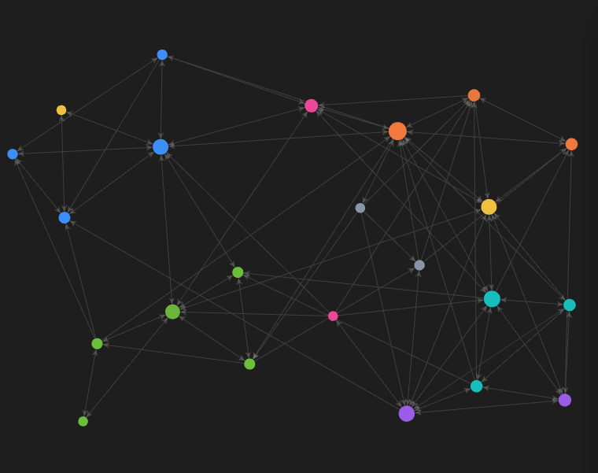

# Master AIDA — Appunti

Appunti di studio del **Master in AI & Digital Analytics** (Università di Milano-Bicocca) — modulo *Big Data Processing & Data Engineering*.

Coprono: database relazionali e SQL, NoSQL (MongoDB, Neo4j), big data (Hadoop, Spark), data engineering (web scraping, ETL, data quality), business intelligence, cloud (AWS) e machine learning.

🟡 Fondamentali · 🔵 Relazionali · 🟢 NoSQL · 🩵 Cloud · 🟣 Big data · 🟠 Data engineering · 🩷 Analytics · ⚪ Strumenti

## Come usarli

Note in Markdown pensate per **[Obsidian](https://obsidian.md)**: wiki-link `[[...]]`, diagrammi **Mermaid**, callout colorati. Apri la cartella come vault Obsidian per navigarle con la *graph view*.

**Punto di partenza:** [`Prontuario`](Prontuario.md) — quick-reference operativo (cosa usi quando, snippet pronti, lookup rapidi).

## Aree

Fondamentali · Relazionali/SQL · NoSQL · Big data · Data engineering · Analytics & ML · Cloud.

## Per chi li usa

Sono i **miei** appunti, aggiornati ~ogni settimana mentre va avanti il corso. Per riceverli aggiornati: **`git pull`** (se hai clonato) o riscarica lo ZIP.

> [!tip] Vuoi annotare la tua copia?
> Tieni le tue note in **file separati** (una tua cartella/nota), senza modificare questi file: così i miei aggiornamenti settimanali arrivano **senza conflitti** e le tue cose restano intatte. Un `git pull` non sovrascrive mai in silenzio — ma tenendo le note separate il problema non si pone.

Come sono costruiti (cattura → l'AI smista e formatta): vedi [`METODO`](METODO.md).

---

*Appunti aggiornati man mano che avanza il corso. Una versione in inglese è in lavorazione.*
