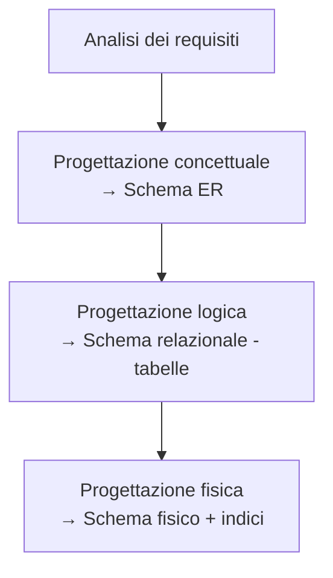
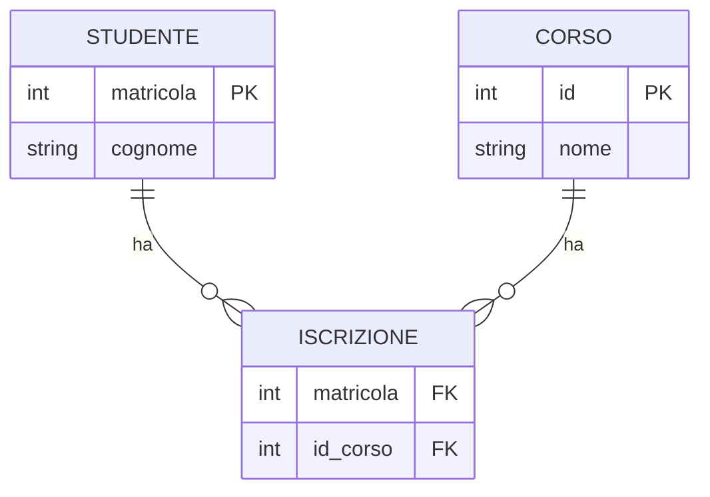

# Modello ER — Entità-Relazione

La progettazione concettuale di un [[Database relazionali|database relazionale]]. L'output è uno **schema ER**: una descrizione *formale e indipendente dalla tecnologia*, che fotografa i concetti (non i dettagli implementativi) e dà una visione d'insieme dei dati.

## Dove sta nel ciclo di vita

Progettare un DB è progettare una struttura dati, dentro il più ampio ciclo di vita di un sistema informativo (modello a cascata: fattibilità → requisiti → progettazione → implementazione → collaudo → funzionamento). La progettazione passa per tre livelli:

> [!warning]
> **Attenzione ai termini.** Il modello **ER** è il modello *concettuale*; il modello **Relazionale** (le tabelle) è il modello *logico*. Per non confondere le "relazioni" dei due mondi, in questo corso: **relazione** = legame del modello ER, **tabella** = tabella del modello Relazionale.

## I costrutti

- **Entità** — una **classe di oggetti** con proprietà comuni ed esistenza autonoma: `STUDENTE`, `CORSO`. La singola occorrenza (lo studente Rossi) è un'*istanza*. I nomi si scrivono al singolare.
- **Attributo** — una proprietà elementare di un'entità o di una relazione: `matricola`, `cognome`. Ogni attributo pesca i valori da un **dominio**, cioè l'insieme dei valori ammissibili (per `voto`: gli interi da 18 a 30).
- **Identificatore** — l'attributo, o il gruppo di attributi, che **distingue univocamente** ogni istanza: due studenti non possono avere la stessa `matricola`. Si preferiscono identificatori **semplici** (un solo attributo). Di norma è **interno**, fatto di attributi propri dell'entità; il caso in cui parte della chiave arriva da *un'altra* entità è l'identificatore **esterno** → [[#Entità deboli|entità deboli]], più sotto.
- **Relazione** (associazione) — un legame logico significativo tra due o più entità: `STUDENTE` *frequenta* `CORSO`. Può avere attributi propri (es. `data_iscrizione`).
- **Cardinalità** — la coppia `(minima, massima)`: dice **con quante** istanze dell'altra entità partecipa una istanza → [[#Cardinalità|sezione dedicata]].
- **Generalizzazione** — una gerarchia padre/figlie con ereditarietà: `DIPENDENTE` con figlie `OPERAIO` e `IMPIEGATO` → [[#Generalizzazione|sezione dedicata]].

> [!important]
> Nello schema ER **non** si indicano le chiavi esterne: l'ER dice *che esiste* una relazione, è la progettazione logica a decidere *come* implementarla.

## Cardinalità

Si scrive `(min, max)`. Minimo tipico: 0 o 1; massimo tipico: 1 o N. Le minime spesso si omettono, lasciando le tre famiglie:

| Notazione | Sintesi | Esempio |
|---|---|---|
| `(_,1):(_,1)` | **1:1** | Persona ↔ Coniuge |
| `(_,1):(_,N)` | **1:N** | Autobus → Linea (un bus su una linea, una linea molti bus) |
| `(_,N):(_,N)` | **N:N** | Studente ↔ Corso |

## Traduzione ER → modello relazionale

Il modello logico relazionale non ha "relazioni": le implementa con chiavi esterne e, dove serve, tabelle ponte.

**N:N → tabella ponte.** La relazione diventa una tabella che contiene le chiavi esterne delle due entità (che insieme formano la sua chiave primaria) più gli eventuali attributi della relazione.

→ `STUDENTE(matricola, cognome, nome)` · `CORSO(id, nome)` · `ISCRIZIONE(matricola, id_corso)` ponte.

**1:N → chiave esterna sul lato "1".** L'entità dal lato `(1,1)` riceve la chiave dell'altra.
→ `LINEA(id, origine, destinazione)` · `AUTOBUS(targa, n_posti, id_linea)` con `id_linea` come FK. *(Una 1:N si può sempre tradurre anche come N:N con tabella ponte.)*

**1:1 → fusione o FK.** Le due entità si possono accorpare in una tabella; una delle due chiavi si elimina.

**Auto-relazione** (entità in relazione con sé stessa, es. `PERSONA` *vicino di casa*): tabella ponte con due FK verso la stessa entità (`id_p1, id_p2`).

**Relazione n-aria** (k entità): tabella ponte con una FK per ciascuna entità coinvolta.

## Generalizzazione

Legame logico tra un'entità **padre** E e le sue **figlie** E1…En (specializzazioni). Ogni istanza di una figlia è anche istanza del padre; le figlie **ereditano** attributi, relazioni e identificatori del padre. Due assi di classificazione:

- **Totale / Parziale** — totale: ogni istanza del padre è in *almeno* una figlia; parziale: può non esserlo.
- **Esclusiva / Overlapping** — esclusiva: un'istanza sta in *al più una* figlia; overlapping: può stare in più figlie.

Esempio: `DIPENDENTE` padre, con figlie `OPERAIO` e `IMPIEGATO`.

## Entità deboli

Un'**entità debole** ha tra i suoi attributi-chiave un **identificatore esterno** (parte della PK proviene da un'altra entità). Esiste solo se esiste l'entità "forte" da cui dipende: cancellata la forte, vanno cancellate le deboli collegate (altrimenti la FK punterebbe a un record inesistente). Si usano raramente — **suggerimento: parti dal presupposto che un'entità sia forte**, a meno di ragioni forti per il contrario.

## Progettazione logica: ristrutturazione dello schema

Nessun DBMS lavora direttamente su uno schema ER: va tradotto. Prima della traduzione lo schema ER si **ristruttura** in quattro passi:

1. **Analisi delle ridondanze** — una ridondanza è un dato ricavabile da altri dati (es. `num_corsi_frequentati` calcolabile dalle relazioni). Tenerla riduce il calcolo ma costa storage e complica gli aggiornamenti. Decisione caso per caso.
2. **Eliminazione delle generalizzazioni** — il modello relazionale non le rappresenta. Tre approcci: *(a)* sostituirle con relazioni padre↔figlie; *(b)* accorpare le figlie nel padre (con un attributo "tipo" e attributi a `NULL`); *(c)* accorpare il padre nelle figlie.
3. **Partizionamento / accorpamento** di entità e relazioni — principio guida: **ridurre gli accessi ai dati**. Si raggruppano attributi toccati dalle stesse operazioni, si separano attributi dello stesso concetto toccati da operazioni diverse.
4. **Scelta degli identificatori principali** — no identificatori con `NULL`; pochi attributi meglio di molti; interno meglio di esterno (si evitano entità deboli); se più candidati, si preferisce il più usato (es. `student_id` vs codice fiscale); se nessuno esiste, se ne crea uno numerico.

L'output è lo schema relazionale: insieme di tabelle, con i vincoli di integrità che diventano le regole di [[SQL|DDL]]. La verifica di qualità di quelle tabelle è la [[Normalizzazione]].

## Da tenere in tasca

- Strutture dati diverse possono mappare sullo **stesso** schema ER: è uno strumento di sintesi.
- Esistono più **formalismi grafici** per gli schemi ER (Chen, "a zampa di gallina"/crow's foot, ecc.): in alcuni le cardinalità si leggono **invertite** — controlla sempre la convenzione.
- ER (concettuale) → progettazione logica → schema logico relazionale → [[SQL|implementazione SQL]].

## Vedi anche

[[Database relazionali]] · [[Normalizzazione]] · [[SQL]]
