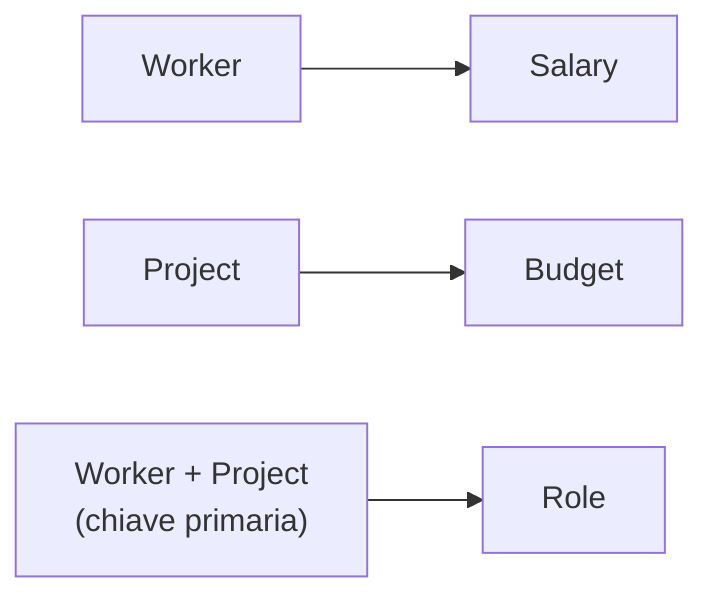

# Normalizzazione

Lo strumento di **verifica** della qualità di uno schema [[Database relazionali|relazionale]] — l'output della [[Modello ER#Progettazione logica: ristrutturazione dello schema|progettazione logica]]. Le forme normali sono proprietà delle tabelle: rispettarle è una certificazione di qualità; violarle apre la porta ad anomalie e ridondanze. La normalizzazione è il processo che trasforma tabelle non conformi in tabelle conformi **senza perdita di informazione**. È definita in termini di **dipendenze funzionali**.

## Il problema: la ridondanza

Tabella unica `(Worker, Salary, Project, Budget, Role)`: lo stesso `Salary` e lo stesso `Budget` si ripetono su molte righe. Da qui tre tipi di anomalia:

- **Update** — cambiare uno stipendio o un budget richiede di aggiornare più righe; se ne sbaglio una, i dati divergono.
- **Delete** — cancellando l'ultimo worker di un progetto, perdo anche i dati del progetto.
- **Insert** — non posso inserire un progetto senza un worker associato (e viceversa).

## Dipendenze funzionali

Data una tabella, esiste una **dipendenza funzionale** `X → Y` se per ogni coppia di tuple con lo stesso valore di `X`, anche `Y` è uguale. "X determina Y."

- **Triviale** — `X → Y` con attributi condivisi tra i due lati (es. `Worker, Project → Project`).
- **Minimalità** — se valgono `A,B → C` e `A → C`, si tiene solo la seconda.
- Tra la **chiave primaria** e gli altri attributi c'è *sempre* una dipendenza funzionale.

**Quali dipendenze fanno danni?** Data `X → Y`: se i valori di `X` si ripetono nella tabella, per via di `X → Y` si ripetono anche quelli di `Y` → anomalie. Quindi:

- Se `X` **è** la chiave primaria (o un suo superinsieme) → nessuna ripetizione di `X` → **nessun problema**.
- Se `X` **non** contiene la chiave (o solo un suo sottoinsieme) → duplicati di `X` ammessi → **problematica**.

Nell'esempio: `Worker → Salary` e `Project → Budget` sono problematiche (lato sinistro non è chiave); `Worker, Project → Role` no (è l'intera chiave).

## La catena delle chiavi

- **Superkey** — sottoinsieme di attributi su cui non si ammettono ripetizioni di valore (un "superinsieme della chiave").
- **Minimal superkey** — superkey da cui, togliendo un qualsiasi attributo, smette di essere superkey.
- **Candidate key** — le (eventuali) più minimal superkey disponibili; ognuna *potrebbe* diventare chiave primaria (es. `Student_ID` e codice fiscale).
- **Primary key** — la candidate key che scelgo (arbitrariamente) come chiave.

## Le forme normali

| Forma | Condizione | In una riga |
|---|---|---|
| **1NF** | tutti gli attributi sono **atomici** (niente attributi composti, es. *Indirizzo* → Via, Numero, Città separati) | un valore per cella |
| **2NF** | è in 1NF **e** ogni attributo non-chiave dipende dall'**intera** chiave primaria (no dipendenze *parziali* da un sottoinsieme della chiave) | con chiave a un solo attributo è automatica |
| **BCNF** *(qui detta 4NF)* | è in 2NF **e** per ogni dipendenza non triviale `X → Y`, `X` è una **superkey** (rimuove le dipendenze transitive) | nessuna dipendenza da non-chiavi |
| **3NF** | è in 2NF **e** per ogni `X → Y` non triviale: `X` è superkey **oppure** ogni attributo di `Y` fa parte di una candidate key | versione *rilassata* della BCNF |

Le prime due sono meccaniche; le condizioni di **BCNF** e **3NF**, compresse in tabella, vanno sciolte:

- **BCNF**, in parole: **solo la chiave può determinare qualcosa**. Per ogni dipendenza non triviale `X → Y`, `X` dev'essere una superkey. Se a determinare un attributo è qualcosa che chiave non è — come `Worker → Salary` nella tabella unica dell'esempio — quella dipendenza va spostata in una tabella sua (`WORKER(Worker, Salary)`).
- **3NF**: come la BCNF, ma con una via d'uscita in più. La dipendenza `X → Y` è tollerata anche se `X` non è superkey, **purché** ogni attributo di `Y` faccia parte di una candidate key. Esiste proprio per i casi in cui la BCNF non è raggiungibile senza perdere informazione (l'esempio qui sotto).

> [!info]
> **Nota sulla numerazione (mia precisazione).** Le slide presentano la **Boyce-Codd** prima della 3NF e la chiamano "4NF": è la forma *forte* (X dev'essere superkey sempre), mentre la 3NF la rilassa per i casi in cui la BCNF non è raggiungibile senza perdere informazione. Nella terminologia standard questa forma forte si chiama **BCNF**; la "vera" 4NF riguarda invece le *dipendenze multivalore* — qui non trattata. Tieni la sostanza: **chiave minima → ogni attributo dipende dall'intera chiave → niente dipendenze transitive.**

Non sempre si può decomporre in BCNF senza perdita di informazione (es. `Project, Location → Manager` con `Manager → Location`): per questo esiste la 3NF, più permissiva.

## Decomposizione

Normalizzare = sostituire una tabella con più tabelle equivalenti (nessuna perdita di informazione) che soddisfano le forme normali. Una tabella che mescola concetti indipendenti si spezza, **una tabella per concetto** — e la decomposizione può essere guidata dalle dipendenze funzionali (una tabella per dipendenza). L'esempio `Worker/Salary/Project/Budget/Role` si decompone in:

- `WORKER(Worker, Salary)` ← `Worker → Salary`
- `PROJECT(Project, Budget)` ← `Project → Budget`
- `ASSIGNMENT(Worker, Project, Role)` ← `Worker, Project → Role`

## Quando NON normalizzare

La normalizzazione è importante per i DB **transazionali** ([[Database relazionali|OLTP]]), dove limita l'impatto delle modifiche. Nei DB **analitici** ([[Database relazionali|OLAP]], [[BI Architecture]]) è poco rilevante o controproducente:

- gli analisti lavorano in **sola lettura**; gli update sono rari (per lo più *append* di nuovi dati storici), le delete rarissime → le anomalie non mordono;
- la **ridondanza aggiunge valore**: velocizza le operazioni analitiche;
- gli analisti preferiscono l'approccio "**dati in un'unica tabella**" (es. `customer_id, customer_name, …, store_name, store_sales`), e dimensioni denormalizzate come la *date dimension* (`date, month, quarter, year` tutto su una riga).

Perché allora un analista deve conoscerla? Perché i DB analitici **provengono** da quelli transazionali (normalizzati): la normalizzazione ha plasmato la struttura — e quindi i dati — con cui lavora.

## Da tenere in tasca (i tre comandamenti)

1. In ogni relazione scegli una chiave col **minimo numero di attributi** (se possibile uno solo).
2. Ogni attributo non-chiave dev'essere dipendente funzionalmente dalla chiave — dall'**intera** chiave.
3. **Evita le dipendenze transitive** dentro la stessa relazione.

## Vedi anche

[[Database relazionali]] · [[Modello ER]] · [[SQL]]
