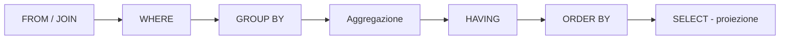

# SQL — Structured Query Language

Il linguaggio dei [[Database relazionali|database relazionali]], traduzione operativa dell'[[Database relazionali#Algebra relazionale|algebra relazionale]]. Si divide in due famiglie:

- **DML** (Data Manipulation Language) — manipola i *dati*: `SELECT`, `INSERT`, `UPDATE`, `DELETE`.
- **DDL** (Data Definition Language) — definisce lo *schema*: `CREATE`, `DROP`, `ALTER`.

> [!info]
> Riferimento del corso: **MySQL** (SQLite ha supporto SQL incompleto e non gestisce scritture concorrenti). Il linguaggio è **case-insensitive** su nomi e parole chiave; le **stringhe** vanno tra apici (`'Rossi'`), i **numeri** no; ogni comando termina con **`;`**.

## SELECT — l'interrogazione di base

```sql
SELECT Attributo1, Attributo2   -- * = tutti gli attributi
FROM   Tabella1, Tabella2
WHERE  condizione;
```

La `WHERE` contiene un'**espressione booleana** ([[Logica booleana]]) valutata **su una tupla per volta**: se è vera, la tupla entra nel risultato. Non può quindi contenere funzioni su *gruppi* di tuple (es. `Prezzo > media(tutti i prezzi)` è scorretto qui — serve `GROUP BY`/subquery).

**Operatori di confronto:** `=`, `<>` (diverso), `>`, `<`, `>=`, `<=`. **Logici:** `AND`, `OR`, `NOT`. Es. `(eta > 18) AND (eta < 25)`.

**Regole sui nomi:** non iniziano con una cifra (`tab2` sì, `2tab` no); niente nomi duplicati nella stessa tabella; niente parole riservate (`SELECT`, `FROM`…).

### AS — alias
Crea pseudonimi brevi per tabelle e attributi (utile per disambiguare e per accorciare):
```sql
SELECT titolo
FROM film AS f, regista AS r
WHERE f.codice_regista = r.codice_regista AND cognome = 'Spielberg';
```

### ORDER BY
```sql
SELECT * FROM tab ORDER BY eta ASC, cognome DESC;
```
`ASC` è il default. Gli attributi in `ORDER BY` devono comparire anche nella `SELECT`.

## JOIN

Un join è [[Database relazionali#Algebra relazionale|prodotto cartesiano + selezione]]. La condizione nella `WHERE` ha due anime: le condizioni di **collegamento** (join) e quelle di **selezione** vera e propria.

**Sintassi implicita** (tabelle nella `FROM`, collegamento nella `WHERE`):
```sql
SELECT datafornitura, qt, nomepezzo
FROM   fornitura, pezzi, fornitori
WHERE  fornitura.codicepezzo = pezzi.codicepezzo
  AND  pezzi.codicefornitore = fornitori.codicefornitore   -- collegamento
  AND  fornitori.nomefornitore = 'giani';                  -- selezione
```

**Sintassi esplicita** (operatore `JOIN … ON`, separa le due anime):
```sql
SELECT datafornitura, qt, nomepezzo
FROM   fornitura JOIN pezzi JOIN fornitori
       ON (pezzi.codicepezzo = fornitura.codicepezzo
       AND fornitura.codicefornitore = fornitori.codicefornitore)
WHERE  fornitori.nomefornitore = 'giani';
```

### Outer join

Dato `A LEFT JOIN B ON (A.key = B.key)`:

| Join | Cosa entra nel risultato |
|---|---|
| **INNER** (`JOIN`) | solo le tuple di A e B che soddisfano la condizione |
| **LEFT (outer)** | le tuple in comune **+ tutte le tuple di A** (campi di B a `NULL` se manca il match) |
| **RIGHT (outer)** | le tuple in comune **+ tutte le tuple di B** |
| **FULL OUTER** | le tuple in comune **+ tutte le A + tutte le B** |
| **LEFT excluding** | `LEFT JOIN … WHERE B.key IS NULL` → solo le A **senza** match |

```
Proprietari        Auto              LEFT JOIN proprietari–auto
ID Cogn.           ID  Targa         ID Cogn.  ID   Targa
1  Rossi           1   555-921       1  Rossi  1    555-921
2  Verdi           2   555-764       2  Verdi  2    555-764
3  Bruni                             3  Bruni  NULL NULL
4  Mori                              4  Mori   NULL NULL
```

`FULL OUTER JOIN` non è ammesso in SQLite/MySQL: si emula con `UNION` (che unisce due query con output compatibile — stesso numero di attributi — ed elimina i duplicati):
```sql
SELECT * FROM A LEFT  JOIN B ON A.key = B.key
UNION
SELECT * FROM A RIGHT JOIN B ON A.key = B.key;
```

## GROUP BY e aggregazione

`SUM()`, `COUNT()`, `AVG()`… insieme a `GROUP BY` collassano le righe per gruppo. Gli attributi della `GROUP BY` fungono da chiave nella tabella risultato (un record per combinazione di valori).

```sql
SELECT store, data, SUM(importo) AS tot
FROM   tab_vendite
GROUP BY store, data;        -- granularità (store, data)
```

- **Granularità** — l'insieme delle chiavi associate a un'unità di informazione. Determinata dagli attributi-chiave (senza aggregazione) o da quelli della `GROUP BY`.
- **Livello di dettaglio** — l'inverso della granularità. `GROUP BY store` → granularità *alta*, dettaglio *basso*.

### Il problema del join "prima" dell'aggregazione

L'ordine di esecuzione di una query è fisso, e **il join avviene prima dell'aggregazione**:



Per questo un indicatore come `fatturato / ore_lavorate` (con `importo` a granularità `store,data,cliente` e `ore` a granularità `store,data,dipendente`) **non** si calcola con un join diretto: il join su `store,data` moltiplica le righe e conta più volte la stessa vendita. Va **uniformata la granularità aggregando prima**, poi si collegano i risultati. Tre modi:

| Soluzione | Come | Problemi |
|---|---|---|
| **Materializzazione** | `CREATE TABLE f SELECT … GROUP BY …` poi join tra le tabelle materializzate | spazio occupato, disallineamenti agli aggiornamenti |
| **Vista** | `CREATE VIEW v AS SELECT …` — tabella *virtuale*, la query si riesegue ad ogni uso | onerosa per il DBMS; conviene solo se usata più volte |
| **Query annidata** | la subquery nella `FROM` | la più pulita per il caso una-tantum |

### Query annidate
Una sotto-query può stare nella `FROM` come se fosse una tabella. Le **parentesi sono obbligatorie** e l'**alias `AS` è obbligatorio** (serve a riferirsi alla subquery altrove):
```sql
SELECT f.data, f.store, f.tot_fat / h.tot_ore
FROM ( SELECT store, data, SUM(importo)      AS tot_fat
       FROM tab_vendite      GROUP BY store, data ) AS f,
     ( SELECT store, data, SUM(ore_lavorate) AS tot_ore
       FROM tab_ore_lavorate GROUP BY store, data ) AS h
WHERE f.store = h.store AND f.data = h.data;
```

## DDL — definire lo schema

```sql
CREATE DATABASE nomeDB;
USE nomeDB;                      -- su quale DB lavoro

CREATE TABLE OrarioTreni (
    codicetreno  INTEGER PRIMARY KEY,
    partenza     VARCHAR(75) NOT NULL,
    destinazione VARCHAR(75),
    capienza     INTEGER DEFAULT 0
);                              -- niente virgola dopo l'ultimo campo
```
Tipi MySQL (la maggiore fonte di differenze tra DBMS): `INTEGER`, `DECIMAL(tot, dec)`, `DATE` (`AAAA-MM-GG`), `TIME` (`HH:MM:SS`), `CHAR(n)` (fissa), `VARCHAR(n)` (variabile).

- `CREATE TABLE nuova LIKE esistente;` — copia la *struttura*.
- `CREATE TABLE nuova SELECT * FROM altra;` — copia struttura **e** contenuto (un solo `;`, comando unico). Con `id INTEGER PRIMARY KEY AUTO_INCREMENT` aggiungo un id auto-generato.
- `DROP TABLE nome;` / `DROP DATABASE nome;` — **non invertibili, niente undo.** Attenzione.
- `ALTER TABLE t ADD COLUMN c VARCHAR(20);` · `DROP COLUMN c;` · `CHANGE COLUMN vecchio nuovo nuovoTipo;`

## DML — manipolare i dati

```sql
INSERT INTO Persone (nome, cognome, data_nascita)
VALUES ('Mario','Rossi','2013-10-16'), ('Marco','Bianchi','2013-10-16');
```
- L'ordine degli attributi nelle prime `()` determina come vengono letti i valori; gli attributi non specificati prendono il default (`NULL`).
- Variante **insert-select**: `INSERT INTO t (…) SELECT … FROM altra WHERE …;` — riversa i dati estratti da un'altra tabella (conta il tipo compatibile, non il nome).

```sql
UPDATE listino SET prezzo = prezzo * 1.2 WHERE prezzo <= 100;   -- +20% sotto i 100
DELETE FROM Persone WHERE eta > 140;
```
`UPDATE` e `DELETE` possono lavorare su più tabelle (le tabelle dopo `FROM` servono a costruire la condizione; la modifica colpisce solo quelle indicate prima).

## Oggetti del DB (lato server)

- **View (vista)** — tabella *virtuale* definita da una query (`CREATE VIEW v AS SELECT …`): non memorizza dati, la query si riesegue a ogni accesso. Usi: **astrazione** (nascondi join e complessità dietro un nome), **sicurezza** (esponi solo certe colonne/righe a un utente), riuso di logica. La **materialized view** invece *salva* il risultato (più veloce in lettura, ma va aggiornata) — la materializzazione di cui sopra.
- **Index** — struttura dati che velocizza l'accesso (come l'indice di un vocabolario), aggiornata in automatico. **Pro:** velocizza JOIN e query su grandi DB. **Contro:** rallenta gli `INSERT`, occupa spazio. Si crea a livello di attributo (spesso su PK e FK). La **progettazione fisica** del DB consiste quasi tutta nello scegliere gli indici, analizzando le query più frequenti.
- **Stored procedure** — insieme di comandi SQL salvato sul server e richiamabile (`CALL`). Funge da **API** riusabile tra applicazioni/linguaggi; gira server-side, quindi una disconnessione non interrompe il calcolo. Ortogonale alle transazioni (può usarle o no).
- **Vincoli di integrità (constraint)** — regole che il DBMS fa rispettare. Trade-off: più regole = più qualità, ma rigidità eccessiva *peggiora* la qualità (`NULL`, dati finti inseriti per aggirare il vincolo).
  - **Intra-relazionali** (una tabella): di dominio (`NOT NULL`, `DEFAULT`, dominio dei valori), di chiave (`PRIMARY KEY` — niente `NULL`, niente duplicati).
  - **Inter-relazionali**: **integrità referenziale** (`FOREIGN KEY (owner) REFERENCES student(id)`). Con reazioni `ON UPDATE CASCADE` / `ON DELETE CASCADE` per propagare modifiche e cancellazioni e preservare l'integrità.
- **Trigger** — azione eseguita automaticamente, modello **event-condition-action**: al verificarsi di un evento, se la condizione è vera, parte l'azione (es. `BEFORE INSERT … IF NEW.age < 0 THEN SET NEW.age = 0`). **Pericolo:** sono *effetti collaterali* invisibili nel codice — facili da dimenticare; due trigger incrociati (A→Acopy e Acopy→A) creano un **loop infinito**.

## Da tenere in tasca

- `N` tabelle in join → `N-1` condizioni di collegamento.
- La `WHERE` filtra **righe** *prima* dell'aggregazione; per filtrare **gruppi** *dopo* l'aggregazione serve `HAVING`.
- Materializzazione vs vista: la vista risolve spazio e disallineamento, ma se la rileggi spesso conviene materializzare.
- I **dialetti** SQL divergono soprattutto su tipi di dato e sintassi dei join: controlla il manuale del DBMS.

## Vedi anche

[[Database relazionali]] · [[Modello ER]] · [[Logica booleana]]
