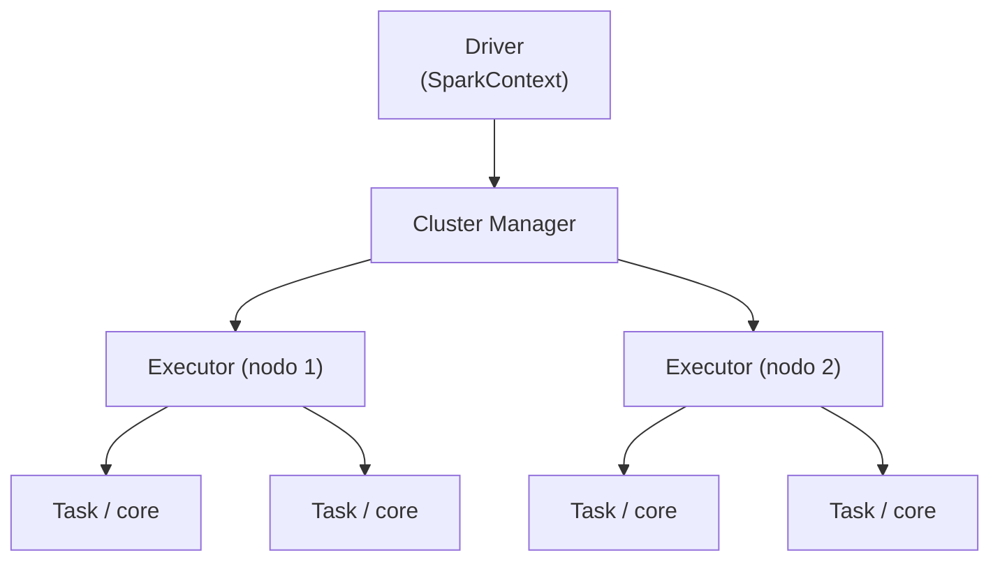

# Spark

Motore di **elaborazione dati distribuita** su grandi volumi, con velocità e semplicità. Sviluppato a UC Berkeley (2010), scritto in **Scala**, compatibile con [[Hadoop]], con API per Java, Scala, **Python** e R (al Master soprattutto Python + qualche query SQL). Estende il modello [[Hadoop#MapReduce — il modello di calcolo|MapReduce]] supportando query interattive e streaming. È il *de-facto standard* per il processing big data.

## Perché Spark e non solo MapReduce

| Caratteristica | Conseguenza |
|---|---|
| **Pattern generalizzati** | un solo framework per molti casi d'uso (ETL, ML, BI, streaming) |
| **Valutazione lazy** | meno wait states, miglior *pipelining* |
| **Programmazione funzionale** | applicazioni complesse più facili da scrivere e mantenere |
| **In-memory caching** | molto più veloce di MapReduce, che scrive su disco tra le fasi |

Lo stack: **Spark Core** alla base (sopra Hadoop/YARN o standalone), e sopra le librerie **Spark SQL**, **Spark Streaming**, **MLlib** (machine learning), **GraphX** (grafi).

## Architettura di esecuzione

Il codice di Spark Core viene distribuito su [[Hadoop|Hadoop/YARN]] e gira su un cluster di nodi:



- **Driver** — il processo che guida l'applicazione; inizializza lo **SparkContext**, il punto d'ingresso delle API (configurazione, accesso al cluster, parametri di connessione al data warehouse).
- **Cluster Manager** — decide quale cluster usare (`sc.master`, es. `local[*]`); tiene la storia dei job.
- **Executor** — processo su un nodo che esegue i **task** sui suoi core/thread.
- Catena delle risorse: `distribuzione risorse → partizioni → job → stages → task`.
- Un **job** è descritto da un **DAG** (grafo diretto aciclico) di operatori parallelizzabili.

> [!example]
> **L'analogia degli M&M.** Svuotare 100 sacchetti e togliere gli M&M marroni in 60 secondi: dai un sacchetto (partizione) a ogni worker (executor), con un'istruzione ("togli i marroni, ammucchia il resto"). Chi finisce prima riceve un nuovo task. Esattamente il modello di Spark: dataset → partizioni → task distribuiti.

## RDD — Resilient Distributed Dataset

La base dell'elaborazione di Spark: una collezione **immutabile** di elementi processabili in parallelo, partizionata sui nodi.

- **Resilient** — se una partizione si perde, può sempre essere **ricostruita** (Spark conosce le trasformazioni che l'hanno generata).
- **Distributed** — sparso sull'intero cluster.
- **Dataset** — i dati provengono da file, data warehouse, ecc.

Su un RDD due tipi di operazione:

- **Trasformazioni** (`map`, `filter`, `groupBy`, `join`, `sort`, `union`…) — costruiscono un nuovo RDD. Sono tutte **lazy**: non calcolano subito, accumulano il piano.
- **Azioni** (`count`, `collect`, `reduce`, `first`, `take`, `saveAsTextFile`…) — innescano il calcolo e producono un valore/output.

### Lazy evaluation — perché, e il legame con l'output

(La domanda che avevo lasciato aperta.) Le trasformazioni non vengono eseguite finché **un'azione** non le richiede. Questo permette a Spark di guardare il piano "dall'alto" e **non fare lavoro inutile**.

```python
input      = sc.textFile("myfile.txt")
apples     = input.filter(lambda x: "apple" in x)
oranges    = input.filter(lambda x: "orange" in x)
union_rdd  = apples.union(oranges)
first5     = union_rdd.take(5)   # AZIONE → solo qui parte il calcolo
```

Se Spark fosse *eager*, calcolerebbe l'intera `union` dei due dataset e poi prenderebbe 5 righe. Essendo **lazy**, prepara **solo** i primi 5 elementi e si ferma. Il piano lazy si **materializza nel momento esatto in cui chiami un'azione** — ecco il legame: l'azione è il trigger, e Spark esegue all'indietro solo le trasformazioni necessarie a produrne l'output. Trucco pratico per forzare l'esecuzione: chiamare `count()`.

## DataFrame e Dataset

Astrazioni di livello più alto, costruite sul motore **Spark SQL** (ottimizzatore **Catalyst** → piani logici/fisici ottimizzati). Entrambi convertibili in RDD.

- **DataFrame** — dati in **colonne con nome**, come una tabella relazionale; impone una struttura alla collezione distribuita.
- **Dataset** — estensione del DataFrame con interfaccia **type-safe** (errori a compile-time). Usa il framework **Tungsten** (encoding in-memory) per più performance.

**Spark SQL**: query relazionali in Spark (interfaccia SQL-like su Hive), fino a **100×** più veloce in-memory. `sql()` restituisce un DataFrame; si possono mischiare metodi DataFrame e query SQL nello stesso codice.

## Databricks

Piattaforma analitica **collaborativa basata su Apache Spark**, che rimuove la complessità di creare e gestire un cluster Spark (installazioni e setting con un click). Include tutti i moduli (SparkSQL, Streaming, ML, GraphX), notebook stile Jupyter (Python/Scala/SQL nello stesso notebook, sessione `spark` già globale), integrazione con GitHub e con AWS/Azure. → vedi [[Cloud computing]] e il **Delta Lake** (lakehouse con ACID su Spark).

## In pratica (PySpark)

> [!info] Dal notebook del corso (*PySpark_Basic*)
> Su **Databricks/Colab** la sessione `spark` è già globale. Forza dell'API: ogni operazione ha il suo **equivalente pandas** (tabella sotto).

```python
from pyspark.sql.functions import col, sum, avg, count, explode, array, collect_list

# DataFrame da una lista di dict (le chiavi diventano le colonne)
df = spark.createDataFrame([{"animal": "cat", "count": 1}, {"animal": "dog", "count": 2}])
df.show()           # AZIONE: innesca il calcolo — pandas: df
df.limit(2).show()  # pandas: df.head(2)
```

**PySpark ↔ pandas** — stessa logica, motore diverso:

| Operazione | PySpark | pandas |
|---|---|---|
| nuova colonna (map) | `df.select((col("v")+2).alias("nv"))` | `df["v"] + 2` |
| filtro | `df.filter((col("age").isNotNull()) & (col("age")>31))` | `df[df.age.notna() & (df.age>31)]` |
| group by + somma | `df.groupBy("animal").sum("count")` | `df.groupby("animal")["count"].sum()` |
| group → lista | `df.groupBy("a").agg(collect_list("c"))` | `df.groupby("a")["c"].agg(list)` |
| join | `people.join(age, "id", "left")` | `pd.merge(people, age, on="id", how="left")` |
| array → righe | `df.select(explode(col("arr")))` | `df.explode("arr")` |
| count / media | `df.count()` · `df.agg(avg("age")).collect()[0][0]` | `len(df)` · `df["age"].mean()` |

Catena **lazy** (niente gira finché non c'è un'azione):
```python
(df.select((col("value")+2).alias("step1"))
   .filter(col("step1") > 3)
   .select((col("step1")+2).alias("step2"))
   .filter(col("step2") > 3)).show()        # solo qui parte il calcolo
```

**Ponte pandas → Spark** (per caricare dati reali, es. il dataset TEDx del lab):
```python
import requests, pandas as pd
from io import StringIO
pdf   = pd.read_csv(StringIO(requests.get(url).text))   # scarico + parso in pandas
talks = spark.createDataFrame(pdf)                       # pandas → Spark distribuito
```

**Spark SQL** (stessa cosa, in SQL → [[SQL]]):
```python
talks.createOrReplaceTempView("talks")                  # registra la vista interrogabile
spark.sql("SELECT * FROM talks WHERE title IS NOT NULL").dropDuplicates().count()
```

> [!warning] Cosa NON si può / gotcha
> - **Lazy**: select/filter/groupBy non calcolano nulla finché non chiami un'**azione** (`show`, `count`, `collect`, `write`). → [[#RDD — Resilient Distributed Dataset|sopra]].
> - `collect()` e `toPandas()` portano **tutto sul driver** → su big data = *OutOfMemory*. Per uno scalare: `df.agg(avg("x")).collect()[0][0]`.
> - Ogni condizione va tra **parentesi**, con `&`/`|` (non `and`/`or`); i DataFrame sono **immutabili** (riassegna).

> [!tip] Piccoli trucchi
> - Su **Databricks** usa `display(df)` invece di `df.show()`: tabella interattiva, ordinabile, con grafici.
> - `explode` (array → righe) è il cugino del `melt` di pandas (da *wide* a *long*).
> - Lo stile di PySpark eredita da **Scala**: verboso rispetto a pandas (parentesi, `col(...)`, `\` di continuazione). Più "a scala" — ci si abitua.

## Su AWS — EMR (il lab)

Far girare Spark (e il classificatore [[Machine Learning|ML]]) su cloud: si crea un cluster **EMR**, lo si collega a **EMR Studio**, si lavora da notebook. → infrastruttura in [[Cloud computing]].

> [!info] Dalle slide del corso (setup EMR)
> I valori sono quelli del lab; **VPC, subnet e ruoli dipendono dall'account**.

1. **Dataset su S3** — carica il CSV in un bucket; nel lab il path è `s3://aida-job-posting/eu_postings/EU_postings.csv` (prendi l'URI con *Copia URI S3*).
2. **Crea il cluster EMR** — release **emr-7.8.0**, bundle **Spark Interactive** (Spark + Hadoop + Livy).
3. **Istanze** — tipo **m5.xlarge** (4 vCore, 16 GiB) per Primary e Core; **Core ×2**, **Task ×1**, on-demand.
4. **Network** — scegli **VPC** e **subnet** e *annotale* (servono per EMR Studio).
5. **Ruoli** — servizio **EMR_DefaultRole**, profilo istanza EC2 **EMR_EC2_DefaultRole**.
6. **EMR Studio** — *Crea Studio* → opzione **Personalizzato**, storage workspace su S3 (*select existing location*, stesso bucket), service role **LabRole** → *create studio*.
7. **Notebook** — apri un workspace, **collega il cluster**, kernel **PySpark** → giri il codice (`spark` è già pronto).

> [!info] Perché queste scelte
> - **emr-7.8.0 + Spark Interactive** — bundle con Spark/Hadoop/**Livy** già pronti; Livy fa parlare il notebook col cluster *in modo interattivo* (non a job batch).
> - **m5.xlarge** — istanza *general-purpose* (CPU/RAM bilanciate): basta per ~20k righe + pipeline NLP senza spendere troppo.
> - **Core ×2, Task ×1** — il **Primary** coordina e basta; i **Core** tengono i dati (HDFS) *e* calcolano (ne serve ≥1, due danno parallelismo e resilienza); i **Task** fanno *solo* calcolo, sono elastici e *spot-abili* (qui 1, compute extra senza storage).
> - **On-demand, non spot** — in un lab interattivo conta la **stabilità**: lo spot può essere interrotto a metà sessione.
> - **Ruoli di default** (EMR_DefaultRole, EMR_EC2_DefaultRole, **LabRole**) — danno a EMR e ai nodi i permessi (incluso leggere S3) senza scrivere policy IAM a mano.
> - **VPC/subnet** — il cluster vive nella tua rete; EMR Studio dev'essere nella **stessa** VPC per raggiungerlo.

> [!warning] Spegni il cluster
> EMR si paga a tempo: a fine sessione **termina il cluster** (*Terminate*), altrimenti continua a costare.

## Vedi anche

- [[Hadoop]] — l'infrastruttura sottostante (HDFS, YARN).
- [[Machine Learning]] — MLlib: classificazione, NLP, TF-IDF su Spark.
- [[Python]] · [[Dati]] · [[Cloud computing]] — la pipeline del lab gira come job PySpark su AWS Glue.
