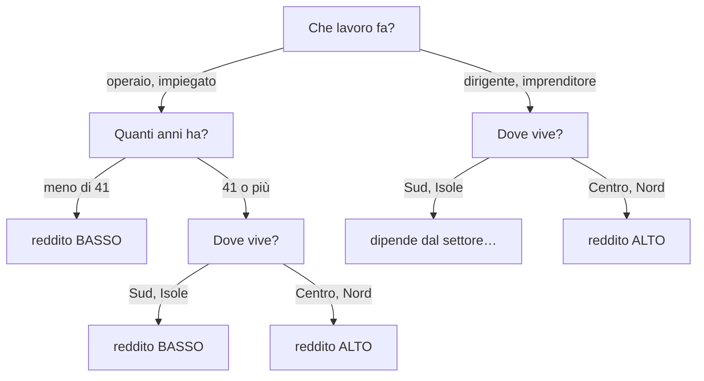
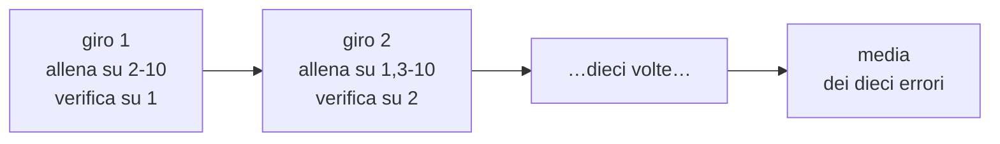

# Alberi decisionali

**In una riga:** una sequenza di domande sì/no che ti porta a una risposta.

> [!example] È *Indovina chi?*
> Nel gioco fai domande a eliminazione: *"porta gli occhiali?"*, *"ha i capelli scuri?"*. Ogni risposta abbatte metà dei personaggi, e dopo cinque o sei domande resta una faccia sola.
>
> Un albero decisionale fa esattamente questo sui dati. La differenza è che **le domande se le sceglie da solo**, guardando quali funzionano meglio.

E si legge senza saper leggere la matematica, che è la sua qualità più rara:



Parti dall'alto, rispondi alle domande, arrivi in fondo. Quello è il verdetto del modello.

---

## Le parole

| parola | cos'è | nel disegno |
|---|---|---|
| **radice** (*root*) | la prima domanda, quella in cima | "che lavoro fa?" |
| **nodo** | ogni punto in cui si fa una domanda | "quanti anni ha?" |
| **ramo** | una delle risposte possibili | "meno di 41" |
| **foglia** (*leaf*) | la casella finale, dove c'è la risposta | "reddito BASSO" |
| **split** | l'atto di spaccare un gruppo in due | |
| **profondità** | quante domande fai al massimo prima di arrivare a una foglia | qui: 4 |

> [!info] Perché si chiama albero se cresce in giù
> Perché è disegnato capovolto: la radice sta in cima e le foglie in fondo. Informatica, non botanica.

---

## Come sceglie le domande

Qui c'è tutto il meccanismo, ed è una sola idea:

> **Una buona domanda è quella che separa meglio i due gruppi.**

L'albero prova **tutte** le domande possibili — ogni variabile, e per le variabili numeriche ogni soglia — e tiene quella che separa meglio. Poi ripete dentro ciascun pezzo ottenuto. E ancora, e ancora.

### Purezza

Un gruppo è **puro** se dentro c'è una classe sola.

```
100 persone, tutte "no"        →  purissimo, non hai più dubbi
50 "sì" e 50 "no"              →  massima confusione, non sai che dire
90 "no" e 10 "sì"              →  abbastanza puro
```

L'albero cerca le domande che aumentano la purezza. Serve però un numero per misurarla, altrimenti "meglio" resta un'opinione.

### L'indice di Gini

```
Gini = 1 − (quota classe A)² − (quota classe B)²
```

Provalo sui tre casi di sopra:

| il gruppo | conto | Gini |
|---|---|---|
| 100 "no", 0 "sì" | `1 − 1² − 0²` | **0** ← puro |
| 50 e 50 | `1 − 0,5² − 0,5²` | **0,5** ← il massimo del casino |
| 90 "no", 10 "sì" | `1 − 0,9² − 0,1²` | **0,18** |

**Gini basso = gruppo pulito. Gini alto = gruppo confuso.** L'obiettivo è abbassarlo.

### Un conto vero

Cento clienti di una banca, dieci accettano un prestito. Il gruppo di partenza:

```
Gini = 1 − 0,9² − 0,1² = 0,18
```

**Domanda 1 — "il reddito è sopra 98?"**

| gruppo | quanti | accettano | Gini |
|---|---|---|---|
| reddito ≤ 98 | 70 | 1 | `1 − 0,986² − 0,014²` = **0,028** |
| reddito > 98 | 30 | 9 | `1 − 0,7² − 0,3²` = **0,42** |

I due Gini si mediano **pesandoli per quanta gente contengono**:

```
(70/100) × 0,028  +  (30/100) × 0,42  =  0,020 + 0,126  =  0,146
```

Guadagno: `0,18 − 0,146 = 0,034`. **Il gruppo è più pulito di prima.**

**Domanda 2 — "ha la carta di credito?"**

| gruppo | quanti | accettano | Gini |
|---|---|---|---|
| sì | 60 | 6 | `1 − 0,9² − 0,1²` = **0,18** |
| no | 40 | 4 | `1 − 0,9² − 0,1²` = **0,18** |

Media pesata: **0,18**. Guadagno: **zero**.

> [!important] Ecco la differenza
> La prima domanda ha isolato un gruppo quasi tutto "no" (70 persone, un solo sì) e uno molto più ricco di sì. **Ha imparato qualcosa.**
>
> La seconda ha spaccato il gruppo in due metà **identiche a quella di partenza**: 10% di sì di qua, 10% di sì di là. Sapere se hanno la carta di credito non cambia niente.
>
> L'albero sceglie la prima. E ripete lo stesso confronto per ogni domanda possibile, a ogni nodo.

> [!info] Gini o entropia?
> C'è un secondo modo di misurare la confusione, **l'entropia**, che usa i logaritmi invece dei quadrati.
>
> Danno quasi sempre lo stesso albero. Gini è il default perché è più veloce da calcolare — niente logaritmi. Non è una scelta su cui perdere tempo.

---

## Il problema: se lo lasci correre, impara a memoria

L'albero può continuare a spaccare finché ogni foglia contiene **una persona sola**. A quel punto sbaglia zero sui dati che ha visto.

È un disastro.

> [!warning] Overfitting, e come lo riconosci
> Un albero cresciuto senza freni non ha imparato una regola: ha **memorizzato l'elenco**. Su gente nuova sbaglia come e più di prima.
>
> Il modo di accorgersene è confrontare due errori:
>
> | | albero piccolo | albero medio | albero gigante |
> |---|---|---|---|
> | errore sui dati **già visti** | alto | medio | **zero** |
> | errore su dati **nuovi** | alto | **minimo** | alto |
>
> Il primo scende sempre. Il secondo scende, tocca il fondo, e **poi risale**. Quel punto di risalita è la dimensione giusta dell'albero.
>
> Il concetto generale sta in [[Machine Learning#Il flusso]].

### Come si misura l'errore su "dati nuovi"

Con la **cross-validation**, ed è un'idea semplice.

Dividi i dati in **10 fette**. Addestri su 9 e verifichi sulla decima. Poi ripeti cambiando quale fetta fa da verifica, dieci volte. Alla fine fai la media.



Così ogni osservazione fa da "dato nuovo" esattamente una volta, e non sprechi niente.

---

## La potatura

Cresciuto l'albero, si taglia. Si chiama **pruning**, potatura.

Il parametro che comanda è **`cp`**, *complexity parameter*: una **tassa su ogni nuovo split**.

| `cp` | effetto |
|---|---|
| **0** | nessuna tassa → albero enorme, memorizza tutto |
| **basso** | albero grande |
| **alto** | albero piccolo, a volte solo la radice |

Uno split viene tenuto solo se **migliora la purezza più di quanto costa**.

### La tabella da leggere

Il comando `printcp()` stampa una tabella con quattro colonne che contano:

| colonna | cosa dice |
|---|---|
| `CP` | la tassa a quel livello |
| `nsplit` | quanti tagli. Le foglie sono `nsplit + 1` |
| `rel error` | errore sui dati **già visti**. Scende sempre |
| `xerror` | errore in **cross-validation**. È questo che conta |
| `xstd` | quanto è incerto `xerror` |

> [!important] La regola base
> **Scegli la riga con `xerror` più basso, e pota a quel `cp`.**
>
> `rel error` non si guarda mai per decidere: scende anche quando il modello sta peggiorando davvero.

### La regola a una deviazione standard

C'è una variante più prudente, e nei corsi viene chiesta spesso.

`xerror` è una stima, quindi ha la sua incertezza — la colonna `xstd`. Alberi con `xerror` leggermente diverso sono in pratica equivalenti.

> [!tip] Come funziona, in tre passi
> 1. trova l'albero con `xerror` minimo. Diciamo `xerror = 0,168` e `xstd = 0,024`
> 2. somma i due: `0,168 + 0,024 = 0,192`. Questa è la soglia
> 3. fra tutti gli alberi con `xerror` sotto 0,192, prendi **il più piccolo**
>
> Nell'esempio l'albero migliore aveva 21 tagli, ma ce n'è uno da **7 tagli** che sta comunque sotto soglia. Si tiene quello.
>
> **Perché:** a parità di prestazioni vince l'albero più semplice. Meno rami significa più leggibile, più stabile e meno appeso al caso di questo campione.

---

## Pregi e difetti

| ✓ | ✗ |
|---|---|
| **si legge**: lo capisce anche chi non sa di statistica | **instabile**: cambia poche osservazioni e l'albero viene diverso |
| niente preparazione dei dati: non serve standardizzare | tende a **sbilanciarsi** sulle variabili con tanti valori distinti |
| gestisce insieme numeri e categorie | i confini sono **a scalini**, quindi una diagonale la approssima male |
| trova da solo le **interazioni** fra variabili | da solo è spesso meno preciso di altri metodi |
| regge i valori mancanti | cresciuto senza freni **memorizza** |

> [!info] Albero o [[Regressione logistica|logistica]]?
> - La **logistica** dà un numero per ogni variabile, valido ovunque: "ogni chilo in più vale +3% di odds". Assume che l'effetto sia sempre lo stesso
> - L'**albero** non assume niente: l'età può contare tantissimo per gli operai e per niente per i dirigenti. Le interazioni le trova da solo
>
> Quando serve una spiegazione numerica pulita, la logistica. Quando i legami sono a gradini o cambiano da gruppo a gruppo, l'albero.

---

## Random forest

Il difetto grosso dell'albero è l'instabilità. La cura è **non fidarsi di un albero solo**.

> [!example] Il pubblico in studio
> Un singolo esperto può sbagliare di brutto. Cento persone che votano indipendentemente sbagliano di meno, perché gli errori individuali si annullano a vicenda.

Il **random forest** fa così:

1. costruisce **centinaia di alberi**, ciascuno su un campione diverso dei dati (estratto con reimmissione)
2. a ogni nodo **non offre tutte le variabili**, ma solo un sottoinsieme estratto a caso
3. per prevedere, **li fa votare** e vince la maggioranza

> [!info] Perché nascondere apposta delle variabili
> È il passaggio che sembra assurdo e invece è il cuore del metodo.
>
> Se tutti gli alberi vedessero tutte le variabili, sceglierebbero tutti la stessa domanda in cima e verrebbero quasi identici. Votare fra cloni non serve a niente.
>
> Costringendoli a scegliere fra poche variabili estratte a caso, gli alberi diventano **diversi fra loro** — ed è dalla diversità che nasce il guadagno.
>
> Quante variabili offrire a ogni nodo si chiama **`mtry`**, ed è la manopola principale da regolare.

Il prezzo è che **perdi il disegno**: non c'è più un albero da guardare. Resta l'**importanza delle variabili**, cioè la classifica di quanto ciascuna ha contribuito.

---

## In R

```r
library(rpart)

# 1. l'albero. method="class" perche' la risposta e' una categoria
t <- rpart(target ~ ., data = train, method = "class")

# 2. guardarlo
print(t)                  # in forma di testo
plot(t); text(t)          # disegnato, spartano ma senza installare niente

# 3. la tabella della complessita'
printcp(t)
plotcp(t)                 # xerror al variare di cp: cerca il minimo

# 4. potare al cp migliore
cp_best <- t$cptable[which.min(t$cptable[, "xerror"]), "CP"]
t_pot <- prune(t, cp = cp_best)

# 5. prevedere
predict(t_pot, newdata = test, type = "class")   # la classe
predict(t_pot, newdata = test, type = "prob")    # le probabilita'
```

Due opzioni che richiedono un'installazione:

```r
library(rpart.plot)       # install.packages("rpart.plot")
rpart.plot(t_pot)         # il disegno leggibile

library(randomForest)     # install.packages("randomForest")
rf <- randomForest(target ~ ., data = train, mtry = 3)
importance(rf)            # la classifica delle variabili
```

> [!warning] Il target dev'essere un `factor`
> Se la colonna è fatta di 0 e 1 **numerici**, `rpart` costruisce un albero di regressione invece che di classificazione, e i risultati non hanno senso.
>
> Si sistema prima: `dati$target <- as.factor(dati$target)`.

> [!tip] Albero anche per una `y` numerica
> Con `method = "anova"` l'albero prevede un numero invece di una classe: in ogni foglia risponde la **media** di chi ci è finito. Si chiama albero di regressione.
>
> Da qui l'acronimo **CART**, *Classification And Regression Tree*: stesso meccanismo, due usi.

---

## Da tenere in tasca

| domanda | risposta rapida |
|---|---|
| Cos'è un albero? | una **sequenza di domande** sì/no che porta a una risposta |
| Come sceglie le domande? | quella che **separa meglio** le classi |
| Come si misura "meglio"? | con il **Gini**: basso = gruppo pulito |
| Gini di un gruppo puro? | **0**. Di uno 50/50: **0,5** |
| Qual è il rischio? | crescere troppo e **memorizzare** (overfitting) |
| Come me ne accorgo? | l'errore in **cross-validation** smette di scendere e risale |
| Cos'è `cp`? | la **tassa su ogni split**. Alto = albero piccolo |
| Quale colonna guardo? | **`xerror`**, mai `rel error` |
| Regola a 1 SD? | fra gli alberi dentro `xerror_min + xstd`, prendi **il più piccolo** |
| Cos'è il random forest? | **tanti alberi diversi che votano** |
| A cosa serve `mtry`? | quante variabili offrire a ogni nodo. Li tiene **diversi** fra loro |
| Comando R? | `rpart(y ~ ., data = d, method = "class")` |

## Vedi anche

[[Regressione logistica]] · [[Classificatore di Bayes]] · [[Machine Learning]] · [[R]] · [[Test statistici]]
