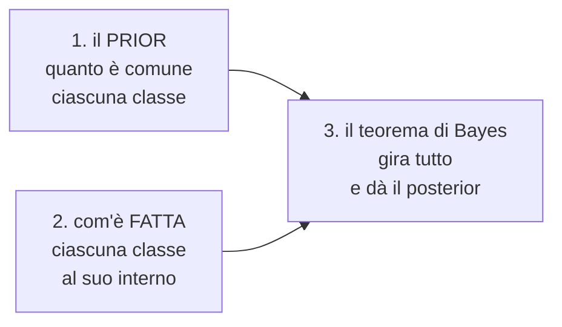

# Analisi discriminante

**In una riga:** descrivi **com'è fatto il cliente tipico** di ciascuna classe, poi guarda a quale tipo somiglia di più quello nuovo.

È il secondo membro della famiglia dei **modelli generativi**, insieme al [[Classificatore di Bayes#Naive Bayes|Naive Bayes]]. Stessa ricetta, ingrediente diverso.

> [!example] Le due nuvole
> Metti su un grafico tutti i clienti: età in orizzontale, reddito in verticale.
>
> Chi ha fatto un sinistro forma **una nuvola**. Chi non l'ha fatto ne forma **un'altra**, centrata da un'altra parte. Le due nuvole si sovrappongono in mezzo, ma hanno centri diversi.
>
> Arriva un cliente nuovo: è un punto sul grafico. **A quale delle due nuvole appartiene più plausibilmente?**
>
> Questa è l'analisi discriminante. *Discriminare* qui vuol dire semplicemente **distinguere**.

---

## La ricetta generativa

Tutti i modelli generativi fanno gli stessi tre passi:



Cambia solo il passo 2, cioè come descrivi l'interno di una classe:

| metodo | come descrive una classe |
|---|---|
| **Naive Bayes** | con **tabelle di frequenza**, una variabile alla volta, fingendo che siano indipendenti |
| **Analisi discriminante** | con una **nuvola a campana**: un centro e una forma, tenendo conto di come le variabili si muovono insieme |

> [!info] La differenza che conta
> Il Naive Bayes guarda le variabili **una per una** e poi moltiplica. Per costruzione non può accorgersi che età e reddito viaggiano insieme.
>
> L'analisi discriminante guarda le variabili **tutte insieme**: la forma della nuvola contiene anche le correlazioni. Paga però un prezzo — vuole variabili **numeriche** e vuole che le nuvole siano davvero a campana.

---

## LDA — analisi discriminante lineare

La **L** sta per *lineare*, e viene da un'assunzione precisa:

> **Tutte le classi hanno nuvole della stessa forma.** Cambia dove sono, non come sono fatte.

Stessa larghezza, stesso allungamento, stessa inclinazione. Solo il centro è diverso.

> [!important] Perché da lì esce una retta
> Se due nuvole hanno **forma identica**, il posto dove diventano ugualmente plausibili è esattamente **a metà strada** fra i due centri.
>
> L'insieme dei punti equidistanti da due centri è una **retta** — la perpendicolare al segmento che li unisce, come l'asse di un segmento in geometria.
>
> Da un lato della retta vince una classe, dall'altro l'altra. Ecco perché il confine è lineare: **discende dall'assunzione, non è una scelta**.
>
> Con più di due variabili la retta diventa un piano, e con molte variabili un iperpiano. Il ragionamento non cambia.

Il prior entra a spostare la retta: se una classe è molto più comune dell'altra, il confine si sposta **verso la classe rara**, e ci vogliono prove più forti per assegnarci qualcuno.

---

## QDA — la versione quadratica

Togli l'assunzione: **ogni classe può avere la sua forma**. Una nuvola stretta e una larga, una inclinata e una tonda.

Il confine smette di essere una retta e diventa una **curva** — una parabola, un'ellisse, un'iperbole. Da lì la **Q** di *quadratica*.

| | **LDA** | **QDA** |
|---|---|---|
| forma delle nuvole | **la stessa** per tutte | **diversa** per ciascuna |
| confine | retta | curva |
| parametri da stimare | pochi | **molti di più** |
| dati necessari | pochi | tanti |
| rischio | rigida se l'assunzione è falsa | **overfitting** se i dati sono pochi |

> [!tip] Come scegliere
> - **poche osservazioni** → LDA. Stimare una forma sola è molto più stabile
> - **tante osservazioni e nuvole visibilmente diverse** → QDA
>
> In dubbio parti da LDA. È il caso in cui "più semplice" vince quasi sempre: meno cose da stimare significa meno cose da sbagliare.

---

## Cosa serve perché funzioni

> [!warning] Le tre condizioni
> - **variabili numeriche.** Le categorie non ci stanno: una nuvola di "città" non ha senso. Si aggirano trasformandole in variabili 0/1, ma l'assunzione di campana salta comunque
> - **nuvole a campana.** Se una variabile è molto storta — i redditi lo sono sempre — conviene trasformarla prima, per esempio con il logaritmo
> - **per LDA soltanto: stessa forma** per tutte le classi
>
> E in più: **è sensibile ai valori anomali**. Un solo punto lontanissimo sposta il centro e gonfia la forma della nuvola, e il confine si muove di conseguenza. Guarda i [[Variabilità#Il boxplot|boxplot]] prima di partire.

---

## Contro la regressione logistica

Portano allo stesso tipo di confine — LDA lo fa dritto, e la [[Regressione logistica#Il modello|logistica]] pure. Ma ci arrivano da due direzioni opposte.

| | **LDA** | **[[Regressione logistica]]** |
|---|---|---|
| famiglia | generativo | discriminativo |
| cosa modella | com'è fatta ogni classe | il confine, direttamente |
| assume la campana | **sì** | **no** |
| con le categorie | va in difficoltà | nessun problema |
| con gli outlier | soffre | regge meglio |
| se le assunzioni valgono | leggermente **più efficiente** | leggermente meno |
| con classi molto sbilanciate | più stabile | può diventare instabile |

> [!info] La regola pratica
> **Se le variabili sono tutte numeriche e ragionevolmente a campana, LDA. Altrimenti logistica.**
>
> Nella pratica la logistica si usa molto più spesso, perché i dati reali sono quasi sempre un misto di numeri e categorie e le assunzioni di LDA raramente reggono. LDA resta preferibile quando il campione è piccolo o una classe è rara: proprio le situazioni in cui la logistica traballa.

---

## In R

```r
library(MASS)     # arriva insieme a R, non serve installarla

m <- lda(classe ~ eta + reddito + anzianita, data = train)

m$prior     # il prior: quanto pesa ciascuna classe
m$means     # i CENTRI delle nuvole, una riga per classe
```

`m$means` è la tabella più utile: mette a confronto il profilo medio delle classi, variabile per variabile.

```
      ETA   ACONTRIB   ETALAV
no  47,34      20,49    22,20
si  53,16      26,34    22,64
```

Si legge subito: chi finisce nella classe `si` è in media **sei anni più vecchio** e ha **sei anni di contributi in più**, mentre l'età di ingresso nel lavoro è praticamente identica. Quella terza variabile, da sola, non discrimina niente.

```r
p <- predict(m, newdata = test)

p$class        # la classe prevista
p$posterior    # le probabilita' di ciascuna classe
p$x            # le coordinate sulle direzioni discriminanti

table(p$class, test$classe)    # matrice di confusione

qda(classe ~ eta + reddito, data = train)   # la versione quadratica
```

> [!warning] `lda` butta le righe incomplete
> Le osservazioni con valori mancanti vengono scartate in silenzio, e `p$class` risulta **più corto** dei dati di partenza. Confrontarli direttamente produce un avviso e un risultato sbagliato.
>
> Si sistema prima:
> ```r
> d <- d[complete.cases(d[, c("classe","eta","reddito")]), ]
> ```

> [!tip] Serve anche a ridurre le dimensioni
> `p$x` contiene le **direzioni discriminanti**: le combinazioni di variabili che separano meglio le classi.
>
> Con dieci variabili e tre classi bastano due direzioni per disegnare tutto su un grafico piano, con le classi il più separate possibile. È l'idea della PCA, ma orientata a distinguere le classi invece che a conservare la variabilità.

---

## Da tenere in tasca

| domanda | risposta rapida |
|---|---|
| Cosa fa? | descrive **ogni classe come una nuvola**, poi assegna alla più plausibile |
| Che famiglia è? | **generativa**, come il [[Classificatore di Bayes\|Naive Bayes]] |
| Differenza dal Naive Bayes? | guarda le variabili **insieme**, non una per una |
| Cosa vuol dire la **L**? | **lineare**: il confine è una retta |
| Da dove viene la retta? | dall'assunzione che le nuvole abbiano **la stessa forma** |
| Cosa cambia in **QDA**? | ogni classe ha la sua forma → confine **curvo** |
| Quando LDA e quando QDA? | **LDA se hai pochi dati**, QDA se ne hai tanti |
| Le condizioni? | variabili **numeriche**, nuvole a **campana**, stessa forma (LDA) |
| Punto debole? | **outlier** e variabili storte |
| LDA o logistica? | numeriche e a campana → LDA. Altrimenti **logistica** |
| Comando R? | `lda(classe ~ ., data = d)` del pacchetto `MASS` |
| Tabella da guardare? | `m$means`: i **centri** delle classi a confronto |

## Vedi anche

[[Classificatore di Bayes]] · [[Regressione logistica]] · [[Probabilità e distribuzioni]] · [[Variabilità]] · [[Machine Learning]] · [[R]]
