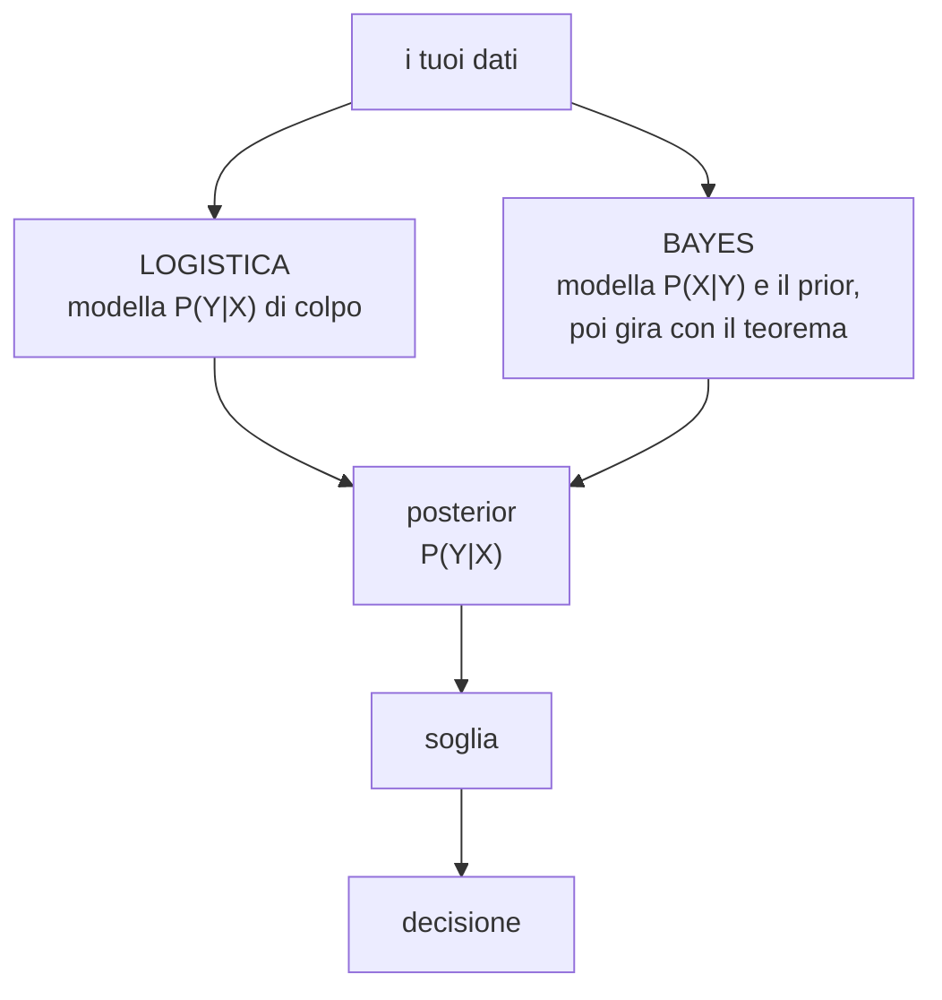

# Classificatore di Bayes

**In una riga:** aggiorna quello che credevi **prima** con l'indizio che hai **appena visto**.

> [!warning] Teorema di Bayes ≠ statistica bayesiana
> Due cose diverse con lo stesso nome, ed è la confusione più comune.
>
> - Il **teorema di Bayes** è una formula di probabilità. Si dimostra in due righe, nessuno la discute, la usano tutti.
> - La **statistica bayesiana** è un modo particolare di fare inferenza. È una scelta metodologica, e in questo corso **non c'è**.
>
> Questa nota parla del **teorema**.

---

## Prior e posterior

Due parole che tornano ovunque, e vogliono dire una cosa semplicissima.

| | nome | cos'è |
|---|---|---|
| **prima** di guardare gli indizi | **prior** (a priori) | quello che credi in partenza |
| **dopo** aver guardato gli indizi | **posterior** (a posteriori) | quello che credi adesso |

> [!example] Il mal di testa
> Un tuo amico ha mal di testa. Ha un tumore al cervello?
>
> **Prior:** i tumori al cervello sono rarissimi. Diciamo 1 persona su 10.000. Quindi parti da **0,01%**.
>
> **Indizio:** ha mal di testa. È vero che quasi tutti i malati hanno mal di testa — ma ce l'hanno anche milioni di persone sane, perché hanno dormito male o sono stressate.
>
> **Posterior:** il numero sale un pochino. Resta **piccolissimo**.
>
> Il prior contava più dell'indizio. È il motivo per cui cercare i sintomi su internet fa venire l'ansia: i siti ti mostrano tutte le malattie compatibili e **si dimenticano di dirti quanto sono rare in partenza**.

---

## Il teorema

```
                 P(X | Y) · P(Y)
   P(Y | X)  =  ─────────────────
                      P(X)
```

Prima il significato dei simboli, che è l'unico ostacolo vero:

| scrittura | si legge | in italiano |
|---|---|---|
| `P(Y)` | pi di ipsilon | probabilità che succeda Y |
| `P(Y \| X)` | pi di ipsilon **dato** ics | probabilità di Y **sapendo che** X è successo |

Quella barra verticale `|` si legge sempre **"dato che"** o **"sapendo che"**. È l'unico simbolo nuovo.

> [!important] A cosa serve il teorema, in una frase
> **Serve a girare la domanda.**
>
> Quella che ti interessa è: *"questo cliente non pagherà, visto il suo profilo?"* → `P(insolvente | profilo)`. E non la puoi contare: dovresti avere migliaia di clienti con **quel profilo esatto**.
>
> La domanda girata invece si conta benissimo: *"fra quelli che non hanno pagato, quanti erano in affitto?"* → `P(affitto | insolvente)`. Basta prendere gli insolventi e contare.
>
> **Il teorema di Bayes trasforma la seconda nella prima.** Tutto qui.

### Un conto vero, tutto intero

Due squadre di calcio. Dalle partite passate sai che:

```
Team 0 vince il 65% delle volte    →  P(Y=0) = 0,65   ← prior
Team 1 vince il 35% delle volte    →  P(Y=1) = 0,35   ← prior

delle vittorie di Team 1, il 75% è arrivato giocando in casa   →  P(casa | Team 1) = 0,75
delle vittorie di Team 0, il 30% è arrivato sul campo di Team 1 →  P(casa | Team 0) = 0,30
```

**La prossima partita si gioca in casa di Team 1. Chi vince?**

```
                        0,75 × 0,35                 0,2625
P(Team 1 | casa)  =  ───────────────────────────  =  ────────  =  0,574
                     0,75×0,35  +  0,30×0,65        0,4575
```

Guarda il movimento, è tutto lì:

```
prior       35%   →  scommetti su Team 0
posterior   57%   →  scommetti su Team 1
```

**L'indizio "gioca in casa" ha ribaltato la previsione.** Questo è il teorema di Bayes che lavora.

> [!info] Il denominatore fa solo le somme
> Quel numero sotto è semplicemente la **somma di tutti i numeratori possibili** — il caso "vince Team 1" più il caso "vince Team 0".
>
> Serve a far tornare i conti a 100%: `0,574 + 0,426 = 1`.
>
> E per questo nel classificatore **si può ignorare**: se devi solo decidere chi vince, confronti i numeratori. Il denominatore è identico per entrambi e non cambia la classifica.

---

## I quattro pezzi e i loro nomi

| pezzo | come lo chiamano | dove lo prendi |
|---|---|---|
| `P(Y)` | **prior** | conti quante volte esce ogni classe nei dati |
| `P(X\|Y)` | **class-conditional**, *verosimiglianza* | conti dentro ciascuna classe |
| `P(X)` | **evidence** | la somma dei numeratori. Si semplifica |
| `P(Y\|X)` | **posterior** | il risultato. È questo che decide |

> [!tip] Verosimiglianza: è la stessa parola di ieri
> `P(X|Y)` si chiama **verosimiglianza**, come nella [[Regressione logistica#Come fa il computer a trovare a e b|regressione logistica]].
>
> Non è un caso: il concetto è identico — *"quanto sono probabili i dati che ho visto, data un'ipotesi"*. Cambia solo cosa fa da ipotesi. Lì erano i coefficienti, qui è la classe.

---

## La regola di decisione

> **Vince la classe con il posterior più alto.**

Si dice *max posterior*, e con due classi diventa una cosa che conosci già:

```
P(sì | profilo) = 0,67        P(no | profilo) = 0,33     → dici SÌ
P(sì | profilo) = 0,31        P(no | profilo) = 0,69     → dici NO
```

Le due probabilità sommano sempre a 1, quindi "il più alto dei due" significa **"sopra 0,5"**.

> [!important] Soglia 0,5 e max posterior sono la stessa regola
> Non sono due criteri diversi da ricordare. Sono lo stesso criterio detto in due modi.

---

## Naive Bayes

C'è un problema pratico con `P(X|Y)`.

Con **una** variabile va tutto bene: conti quanti insolventi erano in affitto. Con **dieci** variabili dovresti contare quanti insolventi erano *in affitto E sposati E under 30 E con reddito medio E…* — e di persone così, nei tuoi dati, ce ne sono zero.

Il **Naive Bayes** taglia il nodo con un'assunzione:

> **Fai finta che le variabili non c'entrino niente l'una con l'altra**, dentro ciascuna classe.

Così invece di contare le combinazioni, conti **una variabile alla volta** e moltiplichi i risultati.

```
P(affitto E sposato E under30 | insolvente)
   ≈  P(affitto|insolvente) × P(sposato|insolvente) × P(under30|insolvente)
```

> [!info] Perché si chiama "naive"
> *Naive* in inglese vuol dire **ingenuo**. E lo è: l'assunzione è quasi sempre falsa. Reddito ed età sono legatissimi, "in affitto" e "giovane" pure.
>
> Il bello è che **funziona lo stesso**. Per decidere chi vince non serve che le probabilità siano giuste in valore assoluto: basta che l'ordine fra le classi sia giusto. E l'ordine, di solito, regge.
>
> È il classico modello sbagliato ma utile. Velocissimo da addestrare, ottimo sul testo (→ [[Machine Learning#MLlib — la libreria]]).

> [!tip] L'alternativa all'assunzione ingenua
> Se le variabili sono tutte numeriche, esiste un altro modo di descrivere una classe: non con tante tabelle separate, ma con **una nuvola sola** che tiene già dentro il modo in cui le variabili si muovono insieme. È l'[[Analisi discriminante|analisi discriminante]], e non ha bisogno di fingere l'indipendenza.

### Un Naive Bayes svolto per intero

Cento clienti di un'assicurazione. **Venti hanno fatto un sinistro**, ottanta no. Di ciascuno sai tre cose: dove abita, se aveva già avuto sinistri, che tipo di casa ha.

**Passo 1 — il prior.** Si conta e basta.

```
P(sinistro) = 20/100 = 0,20          P(niente) = 80/100 = 0,80
```

**Passo 2 — le tabelle, una variabile alla volta.** Dentro ciascuna classe si contano le quote. Sono queste le tabelle che il metodo costruisce, e sono tutto il suo "addestramento".

| | fra i **20 con sinistro** | fra gli **80 senza** |
|---|---|---|
| zona = città | 14 → **0,70** | 32 → **0,40** |
| zona = provincia | 6 → 0,30 | 48 → 0,60 |
| precedenti = sì | 12 → **0,60** | 8 → **0,10** |
| precedenti = no | 8 → 0,40 | 72 → 0,90 |
| casa = villetta | 8 → 0,40 | 40 → 0,50 |
| casa = appartamento | 12 → **0,60** | 40 → **0,50** |

**Passo 3 — arriva un cliente nuovo:** città, precedenti sì, appartamento.

Si moltiplica il prior per le tre quote corrispondenti, una classe alla volta:

```
sinistro:   0,20 × 0,70 × 0,60 × 0,60  =  0,0504
niente:     0,80 × 0,40 × 0,10 × 0,50  =  0,0160
```

**Passo 4 — si normalizza**, cioè si divide ciascuno per la somma dei due, così tornano a fare 100%:

```
somma = 0,0504 + 0,0160 = 0,0664

P(sinistro | questo cliente) = 0,0504 / 0,0664 = 0,76
P(niente   | questo cliente) = 0,0160 / 0,0664 = 0,24
```

> [!important] Cosa è appena successo
> ```
> prior       20%   →   posterior   76%
> ```
>
> Il cliente medio ha il 20% di probabilità di fare un sinistro. **Questo** cliente ha il 76%.
>
> A muovere il numero è soprattutto "precedenti sì": **0,60 contro 0,10**, sei volte più frequente fra chi poi ha avuto un sinistro. Le altre due variabili spingono appena.
>
> E la decisione segue dalla regola solita: 0,76 batte 0,24, quindi la classe prevista è **sinistro**.

> [!warning] Il problema della frequenza zero
> Se una categoria **non compare mai** dentro una classe, la sua quota è 0. E quello zero, moltiplicato, **azzera tutto il prodotto**: qualunque cosa dicano le altre variabili, il verdetto è deciso.
>
> Un solo caso mai osservato nel training può così cancellare tutte le altre informazioni.
>
> Il rimedio si chiama **correzione di Laplace**: si aggiunge 1 a ogni conteggio, così nessuna quota è mai esattamente zero. In [[R]] è l'argomento `laplace = 1`.

### E se una variabile è un numero?

Le tabelle funzionano sulle categorie. Con l'età o il reddito i valori sono tutti diversi e non c'è niente da contare. Due strade:

- **fare le classi** — trasformare l'età in fasce (18-30, 31-45, …) e tornare al caso di sopra. Semplice, ma butti via informazione
- **assumere una campana** — dentro ciascuna classe si calcolano media e deviazione standard della variabile, e si usa la [[Probabilità e distribuzioni#La distribuzione Normale|Normale]] per ottenere il valore da moltiplicare

La seconda versione si chiama **Naive Bayes gaussiano** ed è quella che i software usano di default sui numeri. Il costo è un'assunzione in più: che dentro ogni classe quella variabile sia distribuita a campana.

---

## Bayes error rate

Immagina di conoscere i posterior **veri**, quelli esatti, senza doverli stimare. Il classificatore che li usa si chiama **classificatore di Bayes**, ed è **il migliore possibile**: nessun metodo al mondo può fare meglio.

Eppure sbaglia lo stesso. Quell'errore residuo è il **Bayes error rate**.

> [!example] Perché anche il migliore sbaglia
> Vuoi indovinare se una persona alta 175 cm è un uomo o una donna.
>
> A 175 cm ci sono **sia uomini che donne**. Il modello perfetto risponde "uomo", perché a quell'altezza gli uomini sono di più — e sbaglia tutte le donne alte 175.
>
> Non è colpa del modello. È che **l'altezza da sola non basta** a distinguere, e nessuna matematica può inventare un'informazione che nei dati non c'è.

Il Bayes error rate è il **pavimento**: il metro contro cui si misurano tutti gli altri classificatori. Se il tuo modello sbaglia il 12% e il pavimento è all'11%, hai finito — non c'è più niente da spremere.

---

## Scegliere la soglia

Qui il prior torna a mordere, ed è la parte che serve davvero in pratica.

### Problema 1 — l'evento è raro

Se gli insolventi sono il 5%, quasi nessun posterior arriverà mai sopra 0,5. Il modello risponde **"paga"** a tutti, sembra accuratissimo e **non ne becca uno**.

La soluzione è abbassare la soglia. Ma a quanto?

### La soglia si calcola dai costi

Non è una scelta di gusto: dipende da **quanto costa ciascuno dei due errori**.

> [!example] La banca
> - dire **no** a un cliente buono → perdi il guadagno del prestito, diciamo **100 €**
> - dire **sì** a un cliente cattivo → perdi il capitale, diciamo **500 €**
>
> Il secondo errore costa **cinque volte** il primo. Quindi conviene essere più diffidenti di quanto suggerisca lo 0,5, e la soglia si sposta di conseguenza.
>
> In [[SAS]] si traduce in una riga come `if p_GOOD > 0.83333 then decision='Accept'` — una soglia all'83%, non al 50%, ricavata proprio dal rapporto fra i costi.

### Problema 2 — i dati di training sono bilanciati, la realtà no

Questa è una trappola classica, e va conosciuta.

Per addestrare meglio il modello, spesso si costruisce un dataset **bilanciato**: si tengono tutti gli insolventi e solo una parte dei clienti buoni, arrivando a un 30% di insolventi.

> [!warning] Il modello impara il prior sbagliato
> Nella realtà gli insolventi sono il **5%**. Nei dati di training sono il **30%**.
>
> Il modello impara a essere **sei volte più sospettoso** di quanto dovrebbe, e i posterior che produce sono tutti gonfiati.
>
> Vanno **corretti** con il prior vero. In SAS si scrive `pevent=0.95` e `priorevent=0.95`: è questo che stai dicendo alla macchina.

---

## Il legame con la regressione logistica

Sono **due strade per lo stesso posterior**.



| | [[Regressione logistica]] | Classificatore di Bayes |
|---|---|---|
| come lo chiamano | **discriminativo** | **generativo** |
| cosa modella | il posterior, direttamente | come sono fatti i dati dentro ogni classe |
| la domanda che si fa | "dove sta il confine fra le classi?" | "che aspetto ha un tipico insolvente?" |

Arrivano a un numero dello stesso tipo, e da lì in poi fanno esattamente le stesse cose: soglia, decisione, matrice di confusione.

---

## Il confine di decisione

Ogni classificatore, qualunque sia, fa la stessa cosa: **divide lo spazio delle variabili in regioni**, una per classe.

> [!example] Su un foglio
> Due variabili: età in orizzontale, reddito in verticale. Ogni cliente è un punto.
>
> Il classificatore colora il foglio: una zona blu ("paga"), una zona arancione ("non paga"). Un cliente nuovo prende il colore della zona in cui cade.
>
> La linea che separa i colori è il **confine di decisione** (*decision boundary*). I punti blu finiti nella zona arancione, e viceversa, sono gli **errori**.

I modelli si distinguono soprattutto per **che forma può avere il confine**:

| modello | forma del confine |
|---|---|
| [[Regressione logistica]] · [[Analisi discriminante\|LDA]] | una **retta** |
| logistica con i quadrati delle variabili · [[Analisi discriminante#QDA — la versione quadratica\|QDA]] | una **curva** |
| [[Alberi decisionali]] | a **scalini**: rettangoli affiancati |
| [[kNN]] · [[Reti neurali]] | **qualsiasi** forma |

> [!tip] Quale scegliere, se intuisci la forma
> - confine **lineare** → LDA o logistica. LDA è migliore se le variabili sono davvero normali, altrimenti la logistica
> - confine **moderatamente curvo** → QDA o alberi. QDA se regge la normalità, altrimenti alberi
> - confine **complicato** → kNN, alberi, reti neurali, Naive Bayes

### Dai punteggi alle probabilità: softmax

Non tutti i modelli producono probabilità. Alcuni producono **punteggi**: un numero per ogni classe, e vince il più alto. Si chiamano **punteggi discriminanti**.

La regola è la stessa del max posterior: *"assegna alla classe con il punteggio più alto"*. Ma un punteggio può essere negativo, e i punteggi di una persona non sommano a 1. Succede con LDA e con le reti neurali.

Per trasformarli in qualcosa che si legge come una probabilità si usa la **softmax**:

```
                 e^(punteggio della classe j)
p(classe j)  =  ─────────────────────────────────
                somma di e^(punteggio) su tutte le classi
```

L'esponenziale rende tutto **positivo**. La divisione per la somma fa sommare tutto a **1**.

> [!example] Tre classi
> Punteggi: 2, 1, 0.
>
> - `e²` = 7,39 · `e¹` = 2,72 · `e⁰` = 1. Somma: 11,11
> - probabilità: `7,39 / 11,11` = **0,67** · `2,72 / 11,11` = **0,24** · `1 / 11,11` = **0,09**
>
> L'ordine resta lo stesso: vince sempre la prima classe. Ma ora i numeri si leggono come probabilità.

Con due classi la softmax diventa la curva della [[Regressione logistica#Il modello|logistica]]: `e^g / (1 + e^g)`.

---

## Da tenere in tasca

| domanda | risposta rapida |
|---|---|
| È statistica bayesiana? | **no**. È il **teorema**, che usano tutti |
| Cos'è il **prior**? | quello che credi **prima** di vedere gli indizi |
| Cos'è il **posterior**? | quello che credi **dopo** |
| A cosa serve il teorema? | a **girare** la domanda: da `P(X\|Y)` a `P(Y\|X)` |
| Come si legge `P(Y\|X)`? | "probabilità di Y **sapendo che** è successo X" |
| Il denominatore? | fa tornare i conti a 1. Nel confronto si ignora |
| Regola di decisione? | **vince il posterior più alto** = soglia 0,5 |
| Perché "naive"? | finge che le variabili siano **indipendenti**. È falso e funziona |
| **Bayes error rate**? | l'errore del modello perfetto. Il **pavimento** |
| Quando la soglia non è 0,5? | eventi rari, o errori che costano diverso |
| Dati bilanciati? | correggi i posterior col **prior vero** |
| **Confine di decisione**? | la linea che separa le zone delle classi |
| Che forma ha? | retta (logistica, LDA) · curva (QDA) · scalini (alberi) · qualsiasi (kNN, reti) |
| **Softmax**? | trasforma punteggi qualsiasi in numeri **positivi che sommano a 1** |

## Vedi anche

[[Analisi discriminante]] · [[Regressione logistica]] · [[kNN]] · [[Valutare un classificatore]] · [[Inferenza]] · [[Probabilità e distribuzioni]] · [[Machine Learning]] · [[R]] · [[SAS]]
