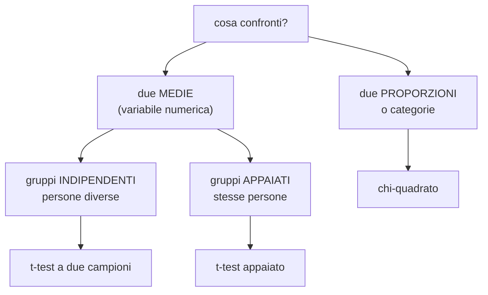

# Confronto fra gruppi

**In una riga:** due gruppi sono davvero diversi, o è solo il caso?

È la domanda più frequente della statistica applicata. *Il farmaco funziona meglio del placebo? Gli uomini guadagnano più delle donne? La versione B del sito converte più della A?*

Il meccanismo è sempre quello di [[Test statistici]]: parti da **H0 = "sono uguali"** e guardi se i dati sono compatibili con quell'ipotesi. Qui cambia solo **quale test** usare, e dipende da due cose:



---

## t-test a due campioni

**Due gruppi di persone diverse, una variabile numerica.**

> Gli stipendi degli uomini sono diversi da quelli delle donne?

H0: le due medie nella popolazione sono uguali. La differenza che vedi nel campione è solo rumore.

### Come ragiona

La logica è quella della [[Test statistici#La statistica test e la regione di rifiuto|statistica test]]: prendi la differenza osservata e la dividi per quanto è incerta.

```
        media A  −  media B
 t  =  ──────────────────────
        l'incertezza di quella differenza
```

E l'incertezza dipende da due cose che già conosci: quanto sono **sparpagliati** i dati dentro ciascun gruppo, e quanto sono **grandi** i gruppi.

> [!important] Perché non basta guardare la differenza fra le medie
> Due aziende, differenza di stipendio medio uomo-donna: **200 euro** in entrambe.
>
> - **Azienda A** — dentro ogni gruppo gli stipendi vanno da 1.900 a 2.100. I due gruppi sono compatti e separati: **quei 200 euro sono reali**
> - **Azienda B** — dentro ogni gruppo si va da 800 a 4.000. I due gruppi sono completamente mescolati: **quei 200 euro sono rumore**
>
> Stessa differenza, conclusioni opposte. Ecco perché la differenza va sempre **divisa** per la dispersione. È lo stesso ragionamento dell'[[Modelli lineari#ANOVA|ANOVA]]: variabilità **tra** i gruppi contro variabilità **dentro**.

### Cosa serve perché funzioni

- i due gruppi sono **indipendenti**: persone diverse, non le stesse
- dentro ciascun gruppo la variabile è ragionevolmente a **campana** (con `n` grande il [[Inferenza#Il teorema del limite centrale|teorema del limite centrale]] copre lo strappo)
- niente outlier mostruosi: la media ne risente, e il test con lei

```r
t.test(stipendio ~ genere, data = dati)
```

> [!info] "Varianze uguali" — l'opzione che non devi toccare
> Esistono due versioni del test, a seconda che i due gruppi abbiano la stessa dispersione oppure no.
>
> R usa di default la versione **che non lo assume** (Welch). È la scelta prudente, e va bene quasi sempre: lasciala così.

---

## t-test appaiato

**Le stesse persone, misurate due volte.**

> Il corso di formazione ha migliorato i punteggi? Misuri **gli stessi dipendenti** prima e dopo.

Qui i due gruppi non sono indipendenti: sono le stesse persone. E questo, invece di essere un problema, è un **vantaggio**.

> [!important] Il trucco: si guardano le differenze, non i gruppi
> Invece di confrontare "la media prima" con "la media dopo", si calcola **per ogni persona** quanto è cambiata, e si testa se quelle differenze hanno media zero.
>
> | persona | prima | dopo | differenza |
> |---|---|---|---|
> | Anna | 62 | 70 | **+8** |
> | Marco | 45 | 49 | **+4** |
> | Sara | 80 | 85 | **+5** |
>
> H0: la media delle differenze è **zero**.
>
> Il guadagno è grosso: ogni persona **fa da controllo a se stessa**. Sara parte da 80 e Marco da 45, ma non importa più — guardi solo di quanto sono cambiati. Tutta la variabilità fra le persone sparisce dal conto, e il test diventa molto più sensibile.

```r
t.test(dopo, prima, paired = TRUE)
```

> [!warning] Usare il test sbagliato costa
> Se hai dati appaiati e usi il test a due campioni, **butti via la struttura** e rischi di non vedere un effetto che c'è.
>
> La domanda da farsi è una sola: **le righe dei due gruppi corrispondono una a una?** Se sì, appaiato.

---

## Chi-quadrato

**Nessuna media da confrontare: solo conteggi.**

> Il titolo di studio è legato al fatto di fumare?

Non puoi fare la media di un titolo di studio. Hai due variabili **qualitative**, e i dati stanno in una **tabella di contingenza**:

| | fuma | non fuma | **totale** |
|---|---|---|---|
| diploma | 45 | 105 | 150 |
| laurea | 20 | 130 | 150 |
| **totale** | **65** | **235** | **300** |

H0: le due variabili sono **indipendenti**, cioè sapere il titolo di studio non cambia la probabilità di fumare.

### Come funziona

> [!important] Confronta osservati e attesi
> **Passo 1 — cosa ti aspetteresti se H0 fosse vera.** In tutto fuma il 65 su 300, cioè il 21,7%. Se il titolo non c'entrasse niente, quella quota varrebbe in **entrambe** le righe:
>
> ```
> attesi fra i diplomati:  150 × 0,217 = 32,5
> attesi fra i laureati:   150 × 0,217 = 32,5
> ```
>
> **Passo 2 — confronta con quello che hai visto davvero.**
>
> | | osservati | attesi | scarto |
> |---|---|---|---|
> | diploma / fuma | 45 | 32,5 | **+12,5** |
> | laurea / fuma | 20 | 32,5 | **−12,5** |
>
> **Passo 3 — riassumi tutti gli scarti in un numero.** Si elevano al quadrato (perché altrimenti si annullano, come sempre) e si rapportano all'atteso. Quel numero è il **chi-quadrato**.
>
> **Scarti grandi → chi-quadrato grande → H0 si rifiuta.**

```r
tabella <- table(dati$studio, dati$fumo)
tabella
chisq.test(tabella)
```

### Le condizioni, e l'unica che conta davvero

> [!warning] Le caselle non devono essere quasi vuote
> Il test funziona male quando i **conteggi attesi** sono piccoli: la regola pratica è che **nessuna casella attesa scenda sotto 5**.
>
> Succede sempre quando hai tante categorie e pochi dati — per esempio una variabile "provincia" con cento livelli.
>
> Rimedi: **accorpare** le categorie rare in un "altro", oppure usare il test esatto di Fisher, che non ha questo limite.
>
> R ti avvisa da solo: `Chi-squared approximation may be incorrect`. Quel messaggio va letto, non ignorato.

> [!info] Serve anche a confrontare proporzioni
> "La versione A del sito converte più della B?" è una tabella 2×2: versione contro convertito sì/no. Stesso test.
>
> E funziona anche con più di due gruppi: tre versioni del sito, tabella 3×2.

> [!warning] Dice che c'è un legame, non quale
> Un chi-quadrato significativo ti dice che le due variabili **non sono indipendenti**. Non dice in che direzione né quanto forte.
>
> Per capirlo guarda gli scarti fra osservati e attesi, casella per casella: quelli grandi ti dicono dove sta l'associazione. `chisq.test(tabella)$residuals` te li dà già pronti.

---

## Quale test, in una tabella

| confronti | i gruppi sono | usa | in R |
|---|---|---|---|
| due medie | persone **diverse** | t-test a due campioni | `t.test(y ~ gruppo)` |
| due medie | le **stesse** persone | t-test **appaiato** | `t.test(a, b, paired = TRUE)` |
| **più di due** medie | diverse | [[Modelli lineari#ANOVA\|ANOVA]] | `anova(lm(y ~ gruppo))` |
| due categorie | — | chi-quadrato | `chisq.test(table(a, b))` |
| due categorie, pochi dati | — | test di Fisher | `fisher.test(table(a, b))` |

> [!tip] Guarda sempre il grafico prima del test
> Un `boxplot(y ~ gruppo)` mostra in un colpo se i gruppi si sovrappongono, se ci sono outlier e se le dispersioni sono simili. Spesso si capisce già lì come andrà a finire il test — e soprattutto si scoprono i problemi che il p-value da solo nasconde.

> [!warning] E ricorda cosa il p-value non dice
> Significativo vuol dire "non è un caso", **non** "è importante". Con diecimila osservazioni diventa significativa anche una differenza di stipendio di tre euro.
>
> Riporta sempre anche **quanto è grande** la differenza (→ [[Test statistici#Come si legge un test, in quattro passi]]).

---

## Da tenere in tasca

| domanda | risposta rapida |
|---|---|
| Qual è H0? | **i gruppi sono uguali** |
| Due medie, persone diverse? | **t-test a due campioni** |
| Due medie, stesse persone? | **t-test appaiato** |
| Perché l'appaiato è più forte? | ogni persona **fa da controllo a se stessa** |
| Più di due gruppi? | **ANOVA** |
| Due variabili categoriali? | **chi-quadrato** |
| Cosa confronta il chi-quadrato? | conteggi **osservati** contro **attesi** sotto H0 |
| Il limite del chi-quadrato? | nessuna casella attesa **sotto 5** |
| Basta guardare la differenza fra le medie? | **no**: va divisa per la dispersione |
| Prima del test? | il **boxplot** |

## Vedi anche

[[Test statistici]] · [[Modelli lineari]] · [[Inferenza]] · [[Variabilità]] · [[R]]
