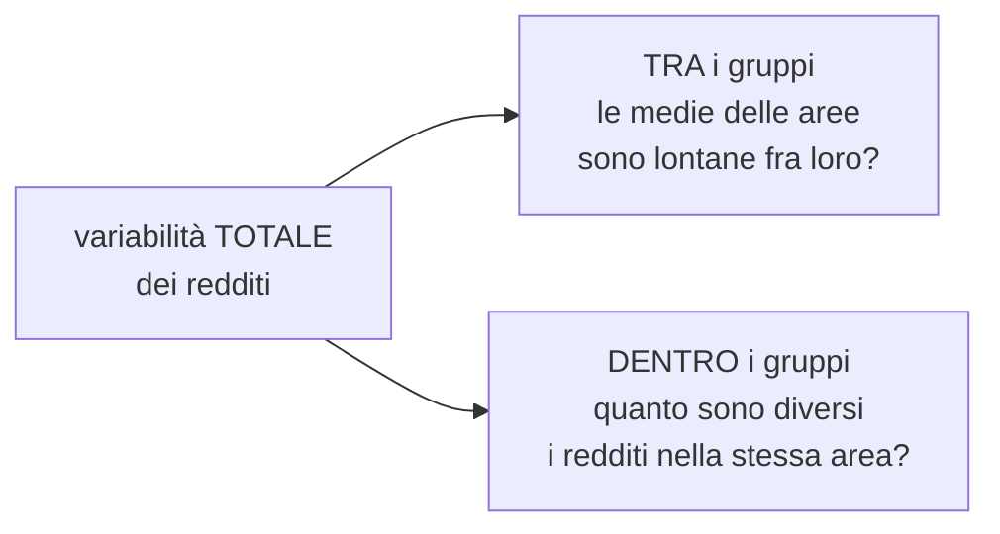

# Modelli lineari

**In una riga:** prevedere **un numero** a partire da altri numeri, tirando una **retta** in mezzo ai dati.

Sotto questo nome stanno tre cose che sembrano diverse e sono la stessa macchina:

| nome | la variabile che usi per prevedere (`x`) | esempio |
|---|---|---|
| **Regressione** | numeri | prezzo di casa ← metri quadri |
| **ANOVA** | categorie | reddito ← area geografica |
| **ANCOVA** | tutte e due insieme | reddito ← area geografica **e** anni di studio |

In tutti e tre i casi la cosa da prevedere (`y`) è **un numero**. Se fosse un sì/no serve la [[Regressione logistica]].

---

## Regressione lineare

### L'idea

Hai le case di una città. Per ognuna sai **quanti metri quadri** ha e **quanto è stata venduta**.

Disegni un puntino per ogni casa: metri quadri in orizzontale, prezzo in verticale. I puntini non stanno su una riga perfetta — fanno una nuvola che sale.

**La regressione cerca la retta che passa meglio in mezzo a quella nuvola.**

```
y = a + b · x
```

- **`y`** è quello che vuoi prevedere — il prezzo. Si chiama **variabile dipendente**
- **`x`** è quello che usi per prevederlo — i metri quadri. **Variabile indipendente**, o predittore
- **`a`** è l'**intercetta**: da dove parte la retta, cioè quanto vale `y` se `x` è zero
- **`b`** è il **coefficiente**: **di quanto sale `y` se `x` aumenta di 1**

> [!example] Leggere i due numeri
> Il computer stima `a = 20.000` e `b = 2.500`. Quindi:
>
> ```
> prezzo = 20.000 + 2.500 × metri quadri
> ```
>
> - **b = 2.500** → ogni metro quadro in più vale **2.500 € in più**. Questo è il numero che ti interessa
> - **a = 20.000** → il prezzo di una casa da zero metri quadri. Non esiste: serve solo a posizionare la retta all'altezza giusta
>
> Casa da 80 m²: `20.000 + 2.500 × 80 = 220.000 €`

### Come si sceglie "la retta migliore"

Di rette che passano in mezzo alla nuvola ce ne sono infinite. Ne serve una definizione precisa.

Per ogni casa c'è una distanza fra il **prezzo vero** e quello che dice la retta. Quella distanza si chiama **residuo**: è **quanto il modello ha sbagliato** su quella casa.

> **Si sceglie la retta che rende più piccola possibile la somma dei residui al quadrato.**

Si chiama **metodo dei minimi quadrati**.

> [!info] Perché al quadrato
> Due motivi, tutti e due pratici.
>
> **1. I segni non devono annullarsi.** Se su una casa sbagli di +10.000 e su un'altra di −10.000, sommando fa zero: sembrerebbe perfetto. Al quadrato diventano entrambi positivi e l'errore si vede.
>
> **2. Gli errori grossi devono pesare di più.** Sbagliare di 10 al quadrato fa 100. Sbagliare di 100 al quadrato fa **10.000** — cento volte tanto, non dieci. Così la retta è costretta a non lasciare indietro nessuno di brutto.

### R² — quanto è buono il modello

L'**R quadro** è il voto del modello. Va da **0 a 1**.

| R² | significa |
|---|---|
| **0** | il modello non spiega niente: tanto vale rispondere sempre la media |
| **0,4** | spiega il 40% di quello che succede. Il resto dipende da altro |
| **1** | la retta passa **esattamente** per tutti i punti |

Letto per bene: **quanta parte della variabilità di `y` il modello riesce a spiegare**.

Il prezzo delle case dipende dai metri quadri, certo. Ma anche dal quartiere, dal piano, dall'anno. Se con i soli metri quadri ottieni R² = 0,6, hai spiegato il 60% — e il restante 40% è roba che non hai messo nel modello.

> [!warning] R² alto non vuol dire modello giusto
> Aggiungendo variabili a caso l'R² **sale sempre**, anche se quelle variabili non c'entrano niente. Su questo si costruisce l'illusione di un buon modello (→ *overfitting* in [[Machine Learning]]).
>
> Per questo esiste l'**R² aggiustato**, che penalizza le variabili inutili. Con più di un predittore, guarda quello.

### I residui vanno guardati

I residui non servono solo a costruire la retta: **guardarli dice se la retta era la forma giusta**.

Si disegnano i residui e si controlla che siano **sparsi a caso**, senza disegni.

> [!warning] Tre disegni che significano guai
> - **I residui formano una curva** → la relazione non era una retta. Forse va curvata
> - **I residui si allargano a ventaglio** → l'errore cresce con `y`. Sulle case succede spesso: sulle ville si sbaglia molto di più che sui monolocali
> - **Un punto lontanissimo da tutti** → un *outlier*. Controlla che non sia un errore di battitura prima di buttarlo

---

## Regressione multipla

Nella realtà `y` non dipende mai da una cosa sola. Si aggiungono predittori:

```
prezzo = a + b₁·metri + b₂·piano + b₃·anno
```

Geometricamente non è più una retta ma un **piano** — e con tante variabili un *iperpiano*, che non si può disegnare e funziona identico.

> [!important] Il pezzo che cambia l'interpretazione
> Con più variabili, ogni coefficiente si legge **tenendo ferme tutte le altre**.
>
> `b₂ = 5.000` sul piano significa: *"a parità di metri quadri e di anno di costruzione, ogni piano in più vale 5.000 € in più"*.
>
> Quel **"a parità di"** è tutto. Senza, confronteresti un attico grande con un seminterrato piccolo e non capiresti più chi fa cosa.

> [!warning] Variabili che dicono la stessa cosa
> Se metti insieme metri quadri e numero di stanze, il modello non sa a chi dare il merito e divide il credito a caso. I coefficienti diventano instabili.
>
> Si chiama **multicollinearità**, si misura con il **VIF** (sopra 5 sospetto, sopra 10 conclamato) e si cura togliendo una delle due → [[Preprocessing#2. Variabili collineari]].

### Le variabili categoriali: le dummy

Il modello fa conti su numeri. Una variabile come `zona`, che vale *nord*, *centro* o *sud*, va tradotta — e non assegnandole 1, 2, 3, che direbbe che il sud vale il triplo del nord.

Si creano **colonne 0/1**, una per categoria meno una:

| zona | `zona_centro` | `zona_sud` |
|---|---|---|
| nord | 0 | 0 | ← il **riferimento** |
| centro | 1 | 0 |
| sud | 0 | 1 |

Con `k` categorie se ne creano `k − 1`. Quella mancante — qui il nord — si riconosce dal fatto che tutte le altre valgono zero, e si chiama **categoria di riferimento**.

> [!important] Le dummy si leggono sempre rispetto al riferimento
> Se `zona_sud = −18.000`, significa: *"a parità di tutto il resto, una casa al sud costa 18.000 € in meno di una **al nord**"*.
>
> Cambiando il riferimento cambiano tutti i numeri, pur descrivendo la stessa realtà. Per questo va **scelto** — di solito la categoria più numerosa, o il termine di paragone naturale:
>
> ```r
> dati$zona <- relevel(dati$zona, ref = "nord")
> ```

> [!warning] Mai mettere tutte e `k` le colonne
> Se aggiungi anche `zona_nord`, le tre sommano sempre a 1 e una è ricostruibile dalle altre: **collinearità perfetta**. Il modello non gira, o restituisce `NA` su un coefficiente.
>
> In [[R]] il problema non si pone: dichiarando la variabile come `factor`, le dummy le costruisce `lm()` da solo nel modo giusto.

### Quali variabili tenere

Con venti predittori disponibili, quali metti nel modello?

| criterio | cosa guarda |
|---|---|
| **R² aggiustato** | come l'R², ma penalizza le variabili inutili |
| **AIC** | bilancia adattamento e complessità. Vince il **più basso** |
| **BIC** | come l'AIC, ma **punisce di più** → modelli più corti |
| stelline di `summary()` | i test sui singoli coefficienti |

> [!warning] L'R² normale non serve a scegliere
> **Sale sempre** quando aggiungi una variabile, anche se è il numero di scarpe. Non potrà mai suggerirti di toglierne una.
>
> L'**R² aggiustato** invece può scendere: sale solo se la variabile nuova porta più di quanto costa. Con più di un predittore, guarda quello.

La selezione automatica esiste ed è comoda:

```r
step(lm(prezzo ~ ., data = case))     # aggiunge e toglie, minimizzando l'AIC
```

> [!warning] Ma non è una scorciatoia innocente
> Provando decine di combinazioni, qualcosa di "significativo" salta fuori **per forza**, anche in dati casuali. È lo stesso problema dei confronti multipli.
>
> I p-value del modello finale sono **troppo ottimistici**: non tengono conto di tutte le combinazioni scartate lungo la strada.
>
> Alternative più solide: scegliere con la conoscenza del dominio, oppure il [[Regolarizzazione#Ridge e lasso|lasso]], che fa selezione in modo controllato.

### Le interazioni

A volte l'effetto di una variabile **dipende da un'altra**.

> [!example] Il balcone
> Un balcone aggiunge parecchio valore a un appartamento in città, e quasi niente a una villetta in campagna.
>
> L'effetto del balcone **cambia** a seconda del tipo di casa. Un modello che gli dà un solo coefficiente valido ovunque non può coglierlo.

Si aggiunge un termine di **interazione**:

```r
lm(prezzo ~ balcone * tipo_casa, data = case)
```

L'asterisco mette nel modello le due variabili **e** il loro effetto combinato. Il coefficiente dell'interazione dice di quanto cambia l'effetto della prima al variare della seconda.

> [!tip] Gli [[Alberi decisionali|alberi]] le trovano da soli
> Un albero che spacca prima su `tipo_casa` e poi, dentro un solo ramo, su `balcone`, sta già modellando quell'interazione senza che nessuno gliel'abbia chiesta.
>
> È il loro vantaggio principale sulla regressione: in un modello lineare le interazioni vanno **previste e scritte a mano**, una per una.

---

## ANOVA

**ANOVA** sta per *ANalysis Of VAriance*, analisi della varianza.

Serve quando `x` non è un numero ma una **categoria**:

> Il reddito da lavoro cambia fra Nord, Centro, Sud, Isole e Estero?

Non puoi tracciare una retta sulle aree geografiche: non c'è un ordine, non puoi fare "un'area in più". Hai **cinque gruppi** e cinque medie, e vuoi sapere se sono davvero diverse o se è il caso.

### L'idea: due varianze a confronto

L'ANOVA spacca la variabilità totale dei redditi in **due pezzi**:



E poi confronta i due pezzi:

> **Se la differenza TRA le aree è grande rispetto alla confusione DENTRO ciascuna area, allora l'area conta davvero.**

> [!example] Perché serve il confronto e non basta guardare le medie
> **Caso A** — Nord 2.000 €, Sud 1.500 €. Ma dentro il Nord si va da 1.900 a 2.100, e dentro il Sud da 1.400 a 1.600. I due gruppi sono **compatti e separati**: l'area conta.
>
> **Caso B** — stesse medie, 2.000 e 1.500. Ma dentro ogni area si va da 500 a 4.000. I due gruppi sono **mescolati**: sapere l'area non ti dice quasi niente.
>
> Stesse medie, conclusioni opposte. Ecco perché guardare solo le medie non basta mai.

### La statistica F

Il rapporto fra i due pezzi si chiama **F** (dal matematico Fisher):

```
      variabilità TRA i gruppi
F = ────────────────────────────
     variabilità DENTRO i gruppi
```

**F grande → i gruppi sono davvero diversi.** E come sempre il verdetto lo dà il **p-value** (→ [[Test statistici#Il p-value]]).

Ecco come si presenta l'output, con l'esempio del reddito per area:

| Source | DF | Somma dei quadrati | Media quadratica | F Value | Pr > F |
|---|---|---|---|---|---|
| **Modello** | 4 | 40.395 | 10.098 | **100,63** | **<0,0001** |
| **Errore** | 973 | 97.644 | 100,35 | | |
| **Totale** | 977 | 138.039 | | | |

- **Modello** = la parte spiegata da X, cioè quella **tra** i gruppi
- **Errore** = la parte non spiegata, quella **dentro** i gruppi
- **DF** = gradi di libertà. Con 5 aree: `5 − 1 = 4`
- **F = 100,63**, con p < 0,0001 → **rifiuto H0**: il reddito varia con l'area geografica

> [!info] Con due soli gruppi l'ANOVA è il t-test
> Se le categorie sono due (uomo/donna), ANOVA e t-test danno lo stesso identico risultato. Non sono tecniche diverse: il t-test è il caso particolare con J = 2.

### Non è finita: i contrasti

L'ANOVA ti dice **che almeno due aree sono diverse**. Non ti dice **quali**.

Per scoprirlo si confrontano le medie **a coppie** — Nord contro Sud, Nord contro Centro, e così via. Si chiamano **contrasti a posteriori**.

> [!warning] Perché non si fanno tanti t-test e via
> Ogni test ha il 5% di dare un falso allarme. Se ne fai dieci, la probabilità di prendere **almeno una** cantonata non è più il 5%: è circa il **40%**.
>
> Fai abbastanza confronti e qualcosa di "significativo" salta fuori per forza, anche in dati totalmente casuali.
>
> La **correzione di Bonferroni** rimedia nel modo più semplice possibile: se fai `r` confronti, stringe la soglia di ciascuno da `α` a **`α/r`**. Dieci confronti → ognuno deve passare 0,005 invece di 0,05.

---

## Correlazione

Prima di costruire un modello si guarda se le variabili **si muovono insieme**. L'indice è **r**, e va da **−1 a +1**.

| r | significa | esempio |
|---|---|---|
| **+1** | quando uno sale, l'altro sale sempre | altezza e lunghezza delle gambe |
| **0** | non c'entrano niente | numero di scarpe e voto in matematica |
| **−1** | quando uno sale, l'altro scende sempre | età di ingresso al lavoro e anni di contributi |

Anche su `r` si fa un test. H0: nella popolazione `r` è zero, cioè non c'è nessun legame.

> [!example] Un caso reale
> `r = −0,392` fra età di ingresso nel mondo del lavoro e anni di contributi, con p < 0,0001.
>
> Si legge in due tempi:
> - **p < 0,0001** → il legame **esiste**, non è un caso
> - **r = −0,392** → ma è **un legame medio-debole**. Negativo, quindi chi entra tardi ha meno contributi. Come ci si aspetta
>
> Significativo e forte sono due cose diverse: con tanti dati diventa significativo anche un `r` piccolissimo.

> [!warning] Correlazione non è causa
> Gelati e annegamenti salgono insieme. Il colpevole è **l'estate**, che muove entrambi. Prima di dire "A causa B", cerca chi è l'estate (→ [[Test statistici#Test di correlazione — due variabili numeriche]]).

---

## In R

```r
# regressione semplice
m <- lm(prezzo ~ metri, data = case)
summary(m)

# regressione multipla: le variabili si sommano con +
m2 <- lm(prezzo ~ metri + piano + anno, data = case)
summary(m2)

# ANOVA: basta che x sia un factor
m3 <- lm(reddito ~ area, data = dati)
anova(m3)

# i residui: quattro grafici diagnostici
plot(m)

# correlazione
cor(dati$eta, dati$contributi)
cor.test(dati$eta, dati$contributi)
```

`lm` sta per *linear model*. La tilde `~` si legge **"spiegato da"**: `prezzo ~ metri` è *"prezzo spiegato dai metri quadri"* (→ [[R#La formula con la tilde]]).

Nell'output di `summary(m)` guardi le stesse cose della [[Regressione logistica#Leggere il risultato in R|logistica]]: `Estimate` per i coefficienti, `Pr(>|t|)` per il p-value, le stelline per la significatività. In più, in fondo, l'**R²**.

> [!info] `lm` o `glm`?
> - `lm` → quando `y` è **un numero** (prezzo, reddito, altezza)
> - `glm(..., family = "binomial")` → quando `y` è **sì/no**
>
> La `g` di `glm` sta per *generalized*: è la versione allargata che copre anche i casi dove la retta da sola non basta.

---

## Da tenere in tasca

| domanda | risposta rapida |
|---|---|
| A cosa serve? | prevedere **un numero** da altri numeri |
| Cosa fa `b`? | di quanto sale `y` se `x` aumenta di **1** |
| Come si sceglie la retta? | **minimi quadrati**: minima somma dei residui al quadrato |
| Perché al quadrato? | i segni non si annullano, e gli errori grossi pesano di più |
| Cos'è l'**R²**? | quanta variabilità spieghi. Da 0 a 1 |
| Con più variabili? | ogni coefficiente vale **"a parità delle altre"** |
| Quando **ANOVA**? | quando `x` è una **categoria** |
| Cosa confronta l'ANOVA? | variabilità **tra** i gruppi contro variabilità **dentro** |
| ANOVA con due gruppi? | è esattamente il **t-test** |
| Perché Bonferroni? | tanti confronti = falsi allarmi garantiti. Stringe la soglia a `α/r` |
| Comandi R | `lm(y ~ x)`, `anova(m)`, `cor.test()` |

## Vedi anche

[[Inferenza]] · [[Test statistici]] · [[Confronto fra gruppi]] · [[Regressione logistica]] · [[Preprocessing]] · [[R]]
