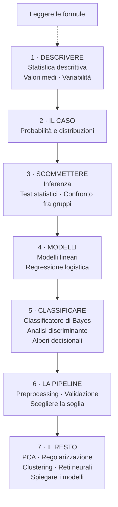

# Percorso di studio

**In una riga:** in che ordine leggere le note, e cosa serve sapere prima di cosa.

Le note sono scritte per essere lette **in sequenza**: ognuna dà per noto quello che viene prima. Se una sembra oscura, il buco è quasi sempre in una nota precedente, non in quella che stai leggendo.

---

## La mappa

---

## Le sette tappe

### 0 · Il decodificatore

[[Leggere le formule]] — Σ, ∏, i pedici, il cappello, le lettere greche.

Non è una tappa, è un **dizionario da tenere aperto**. Leggila una volta all'inizio e tornaci ogni volta che una formula ti blocca.

### 1 · Descrivere quello che hai

| nota | cosa ti lascia |
|---|---|
| [[Statistica descrittiva]] | i tipi di variabile, le frequenze, quale grafico usare |
| [[Valori medi]] | media, mediana, quantili, moda — e quando usare quale |
| [[Variabilità]] | varianza, deviazione standard, IQR, boxplot |

**Nessuna scommessa qui**: descrivi solo i dati che hai in mano. È la parte più facile, ed è il vocabolario di tutto il resto.

### 2 · Misurare il caso

[[Probabilità e distribuzioni]] — probabilità, variabili casuali, Bernoulli e binomiale, la Normale, la standardizzazione.

È il **ponte**. Serve la regola **68–95–99,7** per capire da dove escono gli intervalli di confidenza, e la Bernoulli per capire la verosimiglianza più avanti.

### 3 · Scommettere su quello che non hai

| nota | cosa ti lascia |
|---|---|
| [[Inferenza]] | popolazione e campione, errore standard, intervalli di confidenza |
| [[Test statistici]] | H0, p-value, statistica test, i due tipi di errore |
| [[Confronto fra gruppi]] | t-test, t-test appaiato, chi-quadrato |

Qui si comincia a rischiare: parli di sessanta milioni di persone avendone viste mille.

### 4 · Costruire modelli

| nota | cosa ti lascia |
|---|---|
| [[Modelli lineari]] | la retta, minimi quadrati, R², ANOVA, regressione multipla |
| [[Regressione logistica]] | odds, logit, odds ratio, massima verosimiglianza |

**La logistica è il cardine di tutto il corso.** Se ne capisci una sola, che sia questa: odds e verosimiglianza tornano in tutto quello che viene dopo, reti neurali comprese.

### 5 · Classificare

| nota | l'idea in una riga |
|---|---|
| [[Classificatore di Bayes]] | aggiorna il prior con l'indizio |
| [[Analisi discriminante]] | ogni classe è una nuvola, scegli la più vicina |
| [[Alberi decisionali]] | una sequenza di domande sì/no |

Tre modi diversi di rispondere alla stessa domanda. Il confronto fra **generativi** (i primi due) e **discriminativi** (la logistica) è materia d'esame.

### 6 · Far funzionare le cose sul serio

| nota | cosa ti lascia |
|---|---|
| [[Preprocessing]] | mancanti, collinearità, varianza zero, scaling |
| [[Validazione]] | train/validation/test, cross-validation, bootstrap |
| [[Scegliere la soglia]] | sensibilità e specificità, ROC, AUC, soglia dai costi |

**È la parte che nei corsi si salta e nel lavoro è il 90% del tempo.** Senza queste tre, gli algoritmi delle altre note danno numeri che sembrano buoni e non lo sono.

### 7 · Il resto del programma

| nota | quando serve |
|---|---|
| [[PCA]] | tante variabili ridondanti |
| [[Regolarizzazione]] | tante variabili e sospetti che poche contino |
| [[Clustering]] | nessuna etichetta, cerchi gruppi |
| [[Reti neurali]] | relazioni molto non lineari |
| [[Spiegare i modelli]] | devi giustificare le decisioni |

---

## Quale metodo per quale problema

La domanda da farsi è sempre la stessa: **che forma ha la cosa che vuoi prevedere?**

| vuoi prevedere… | i predittori sono… | usa |
|---|---|---|
| un **numero** | numeri | [[Modelli lineari\|regressione lineare]] |
| un **numero** | categorie | [[Modelli lineari#ANOVA\|ANOVA]] |
| un **numero** | misti | [[Modelli lineari#Regressione multipla\|regressione multipla]] |
| **sì / no** | qualsiasi | [[Regressione logistica]] |
| una **classe** | categorie | [[Classificatore di Bayes\|Naive Bayes]] |
| una **classe** | tutti numerici | [[Analisi discriminante\|LDA]] |
| una **classe** | misti, con interazioni | [[Alberi decisionali]] |
| una **classe**, e vuoi solo precisione | qualsiasi | [[Alberi decisionali#Random forest\|random forest]] |
| **niente** — cerchi gruppi | qualsiasi | [[Clustering\|k-means]] |

E i problemi che vengono prima del metodo:

| il problema | la nota |
|---|---|
| ci sono buchi nei dati | [[Preprocessing#1. Dati mancanti]] |
| due variabili dicono la stessa cosa | [[Preprocessing#2. Variabili collineari]] |
| troppe variabili | [[PCA]] · [[Regolarizzazione]] |
| il modello va benissimo sui dati visti | [[Validazione]] |
| l'evento è raro e il modello non lo trova mai | [[Scegliere la soglia]] |
| funziona ma non so spiegarlo | [[Spiegare i modelli]] |

---

## Gli strumenti

[[R]] — il linguaggio del corso. Leggila appena serve scrivere qualcosa, non prima.
[[SAS]] — quello delle aziende. Serve a leggere gli output, più che a scrivere codice.

> [!tip] Come usare queste note mentre studi
> Ogni nota chiude con una tabella **"Da tenere in tasca"**: quelle, lette di fila, sono il ripasso dell'ultimo giorno.
>
> E ogni volta che un termine ti blocca, cercalo: quasi sempre è spiegato in una nota precedente, con l'esempio accanto.

## Vedi anche

[[Prontuario]] · [[Leggere le formule]] · [[Machine Learning]] · [[R]]
