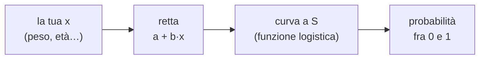

# Regressione logistica

**In una riga:** serve a prevedere un **sì o no** — e invece di rispondere "sì", risponde *"secondo me c'è il 73% di probabilità che sia sì"*.

Esempi di domande da regressione logistica:

- questo studente **fuma**? (sì / no)
- questo cliente **restituirà il prestito**? (sì / no)
- questa email **è spam**? (sì / no)

La cosa da prevedere ha **due sole risposte possibili**. Si chiama variabile **binaria** (*binario* = a due valori, come acceso/spento).

> [!info] Perché non basta la regressione lineare
> La [[Modelli lineari|regressione lineare]] prevede un **numero qualsiasi**: un prezzo, un'altezza, uno stipendio. Se provi a usarla per un sì/no, ti risponde cose come **1,4** oppure **−0,2**.
>
> E tu non sai che farci. "Fuma 1,4" non vuol dire niente. Serve un modello che risponda sempre con un numero **fra 0 e 1**, cioè con una probabilità.

---

## Le tre scale: probabilità, odds, logit

Questa è la parte che sembra difficile e non lo è. Sono **tre modi di dire la stessa cosa**, come dire la temperatura in gradi Celsius o Fahrenheit.

Partiamo da un fatto: in una classe di **100 studenti, 25 fumano**.

### 1. Probabilità

> Quanti fumano **sul totale**.

```
p = 25 / 100 = 0,25
```

La probabilità vive **fra 0 e 1**. Zero = non succede mai. Uno = succede sempre. Non può uscire da lì.

### 2. Odds

> Quanti fumano **contro** quanti non fumano.

```
odds = 25 / 75 = 0,33
```

Occhio al cambio: sotto non c'è più il totale, ci sono **gli altri**.

Sono le quote delle scommesse: "uno a tre" vuol dire un fumatore ogni tre non fumatori.

Gli odds partono da 0 e salgono **all'infinito**. Il tetto è sparito.

### 3. Logit

> Il **logaritmo** degli odds.

```
logit = ln(0,33) = −1,10
```

Il logit va da **meno infinito a più infinito**. È sparito anche il pavimento.

> [!tip] Che cos'è il logaritmo, in due righe
> Il logaritmo è un tasto della calcolatrice che **schiaccia i numeri grandi e stira i numeri piccoli**.
>
> Serve a questo: gli odds sono sbilanciati. "Il doppio della propensione" fa 2, "la metà" fa 0,5. Sono la stessa distanza dal centro, ma 2 sembra lontanissimo da 1 e 0,5 sembra vicino.
>
> Il logaritmo li rimette in simmetria: ln(2) = +0,69, ln(0,5) = −0,69. Stessa distanza da zero, uno da una parte e uno dall'altra. Ora la scala è onesta.

### Le tre scale a confronto

| probabilità `p` | odds `p/(1−p)` | logit `ln(odds)` | come si legge |
|---|---|---|---|
| 0,01 | 0,01 | −4,6 | quasi mai |
| 0,10 | 0,11 | −2,2 | raro |
| 0,25 | 0,33 | −1,1 | uno su quattro |
| **0,50** | **1** | **0** | ← il centro esatto |
| 0,75 | 3 | +1,1 | tre su quattro |
| 0,90 | 9 | +2,2 | quasi sempre |
| 0,99 | 99 | +4,6 | quasi certo |

Guarda la riga in grassetto e tienila a mente, è il punto di riferimento:

```
p = 0,5     ⟷     odds = 1     ⟷     logit = 0
```

> [!important] Perché tutto questo giro
> Perché il **logit si comporta come un numero normale**, e sui numeri normali sai già tracciare una retta.
>
> Sulla probabilità no: se disegni una retta, prima o poi esce dal recinto 0–1 e dice sciocchezze. Sul logit la retta può salire e scendere quanto vuole senza combinare guai.

---

## Il modello

Tradotto sul logit, il modello è **una retta**. La stessa dei [[Modelli lineari|modelli lineari]]:

```
logit(p) = a + b · x
```

Due soli ingredienti:

- **a** si chiama **intercetta**. È il punto di partenza — quanto vale il logit quando la `x` è zero.
- **b** si chiama **coefficiente**. È l'**effetto**: di quanto si muove il logit se la `x` aumenta di 1.

> [!example] Un conto vero, tutto intero
> Prevediamo se uno studente fuma, a partire dal suo **peso**. Il computer ha stimato `a = −4,0` e `b = 0,03`.
>
> **Studente da 60 kg:**
> ```
> logit = −4,0 + 0,03 × 60 = −2,20
> odds  = 0,11
> p     = 0,10        →  10% di probabilità che fumi
> ```
>
> **Studente da 80 kg:**
> ```
> logit = −4,0 + 0,03 × 80 = −1,60
> odds  = 0,20
> p     = 0,17        →  17% di probabilità che fumi
> ```
>
> Il modello non dice "fuma" o "non fuma". Dice **quanto ci scommette**.

E per tornare dal logit alla probabilità si usa la **funzione logistica**, che è quella che dà il nome a tutto:

```
p = exp(logit) / (1 + exp(logit))
```

Disegnata, è una **S allungata**:



La S fa una cosa sola: prende qualunque numero, anche −900 o +4000, e lo **schiaccia dentro l'intervallo 0–1**. Numero molto negativo → quasi 0. Numero molto positivo → quasi 1. Numero zero → esattamente 0,5.

---

## Odds ratio: come si legge il risultato

Il computer ti restituisce i coefficienti `b`. Sono sulla **scala logit**, quindi illeggibili: nessuno sa cosa voglia dire "più 0,03 di logit".

La traduzione è un solo tasto: **`exp`**.

```
OR = exp(b)
```

`OR` sta per **odds ratio**, cioè *rapporto fra odds*. Ed è così che si legge:

> **L'odds ratio è il numero per cui si moltiplicano gli odds quando la x aumenta di 1.**

| `b` | `OR = exp(b)` | traduzione in italiano |
|---|---|---|
| −0,70 | 0,50 | **dimezza** la propensione |
| −0,10 | 0,90 | la riduce del 10% |
| **0** | **1** | **nessun effetto** |
| +0,03 | 1,03 | la aumenta del 3% |
| +0,70 | 2,01 | la **raddoppia** |
| +1,10 | 3,00 | la triplica |

> [!tip] Il numero magico è 1
> Con gli odds ratio lo zero non conta niente. Il confine è **1**.
> - OR **sopra 1** → la x fa aumentare le probabilità
> - OR **sotto 1** → le fa diminuire
> - OR **uguale a 1** → la x non serve a niente

> [!warning] L'errore che fanno tutti
> Un OR di 2 **non** significa "il doppio più probabile".
>
> Significa "il doppio più **propenso**", e non è la stessa cosa. Guarda cosa succede applicando lo stesso OR = 2 a persone che partono da situazioni diverse:
>
> | probabilità di partenza | probabilità dopo l'OR = 2 | quanto è cresciuta |
> |---|---|---|
> | 5% | 9,5% | +4,5 punti |
> | 50% | 66,7% | +16,7 punti |
> | 90% | 94,7% | +4,7 punti |
>
> Un solo odds ratio, tre effetti diversi sulla probabilità. Il 90% non può diventare 180%: non c'è spazio, il tetto è a 100.
>
> **Dillo così:** *"chi pesa un chilo in più è il 3% più propenso a fumare"*. Mai *"più probabile"*.

### L'intervallo di confidenza

Il computer stampa anche due numeri attorno a ogni OR, tipo `da 1,01 a 1,03`. Sono l'**intervallo di confidenza**: la fascia dentro cui sta ragionevolmente il valore vero (→ [[Inferenza#Intervallo di confidenza]]).

Serve per una regola sola, e chiedila sempre:

> [!important] La regola dell'1
> **Se l'intervallo contiene il numero 1, l'effetto non è significativo.**
>
> Perché? Perché OR = 1 significa "nessun effetto". Se quel valore è dentro la fascia dei risultati plausibili, allora fra le spiegazioni possibili c'è ancora *"questa variabile non conta"*. E non puoi escluderla.
>
> - `da 1,01 a 1,03` → non contiene 1 → **effetto reale** ✓
> - `da 0,80 a 1,40` → contiene 1 → **non ci puoi credere** ✗

---

## Come fa il computer a trovare a e b

Qui c'è la parola che spaventa: **massima verosimiglianza**. È molto più semplice di come suona.

**Verosimiglianza** vuol dire *"quanto è credibile"*. In inglese *likelihood*, e si abbrevia con la lettera **L**.

> [!example] Il gioco delle due manopole
> Immagina una macchina con due manopole: una per **a**, una per **b**.
>
> Tu hai i dati veri di tre studenti — sai già chi fuma. Giri le manopole a caso e guardi cosa dice il modello.
>
> **Prima posizione delle manopole:**
>
> | studente | fuma davvero? | il modello dice | ci ha preso? |
> |---|---|---|---|
> | Anna | **sì** | 70% che fumi | 0,70 ✓ bene |
> | Bruno | **no** | 10% che fumi | 0,90 ✓ benissimo |
> | Carla | **sì** | 30% che fumi | 0,30 ✗ male |
>
> Moltiplica l'ultima colonna:
> ```
> L = 0,70 × 0,90 × 0,30 = 0,19
> ```
>
> **Seconda posizione delle manopole:**
>
> | studente | fuma davvero? | il modello dice | ci ha preso? |
> |---|---|---|---|
> | Anna | **sì** | 90% che fumi | 0,90 |
> | Bruno | **no** | 5% che fumi | 0,95 |
> | Carla | **sì** | 60% che fumi | 0,60 |
>
> ```
> L = 0,90 × 0,95 × 0,60 = 0,51
> ```
>
> **0,51 batte 0,19.** La seconda posizione delle manopole è migliore.
>
> Il computer ripete questa mossa migliaia di volte e tiene **la posizione con la L più alta**. Quella è la **massima verosimiglianza**, e quei due valori finali sono i tuoi `a` e `b`.

Due dettagli per non restare spiazzato a lezione:

> [!info] Perché "se non fuma conta 1 − p"
> Nella tabella, per Bruno che **non** fuma, ho scritto 0,90 mentre il modello diceva 10%. Non è un errore.
>
> Il modello dice "10% che fumi", quindi sta dicendo anche "**90% che non fumi**". E siccome Bruno davvero non fuma, la parte che conta è quel 90%.
>
> Sulle slide questo si scrive `p^y · (1−p)^(1−y)`, che sembra terribile ed è solo un **interruttore**: se `y = 1` tiene `p`, se `y = 0` tiene `1 − p`. Una formula sola invece di scrivere "se… allora…".

> [!info] Perché si parla di **log**-verosimiglianza
> Con 500 studenti moltiplichi 500 numeri più piccoli di 1. Il risultato diventa ridicolmente piccolo — tipo `0,000…001` con centocinquanta zeri — e il computer lo arrotonda a zero, perdendo tutto.
>
> Il logaritmo trasforma le **moltiplicazioni in somme**, e i numeri restano maneggevoli. Il punto di massimo non si sposta di un millimetro.
>
> Per questo sulle slide vedi `ln L` invece di `L`. È lo stesso gioco, scritto in modo che il computer regga.

> [!info] Perché "iterativa, non analitica"
> Nella regressione lineare esiste una **formula** che ti dà la risposta subito, in un colpo solo.
>
> Qui quella formula non esiste. Il computer deve procedere **per tentativi**: parte da una posizione, guarda da che parte migliora, si sposta un po', riprova. *Iterativa* significa esattamente questo — a ripetizione.
>
> Nel risultato di [[R]] trovi scritto `Number of Fisher Scoring iterations: 4`. Sono i tentativi che gli sono serviti. Quattro è normalissimo. Se ne vedi 25 il modello è in difficoltà.

---

## Leggere il risultato in R

Il comando è `glm` — sta per *generalized linear model*, modello lineare generalizzato. Il pezzo che lo rende logistico è `family = "binomial"`.

```r
m <- glm(fumo ~ peso + eta + componenti + genere, data = dati, family = "binomial")
summary(m)
```

Ecco cosa ti stampa, con le frecce su cosa guardare:

```
Coefficients:
            Estimate Std. Error z value Pr(>|z|)
(Intercept) -2.24736    0.51168  -4.392 1.12e-05 ***
peso         0.01303    0.00527   2.471   0.0135 *      ← significativo
eta          0.02855    0.01175   2.429   0.0151 *      ← significativo
componenti  -0.04963    0.03933  -1.262   0.2069        ← NO, niente stelline
genere      -0.10835    0.12691  -0.854   0.3932        ← NO, niente stelline

    Null deviance: 3131.7  on 2758  degrees of freedom
Residual deviance: 3097.9  on 2754  degrees of freedom
AIC: 3107.9
```

| cosa vedi | cosa vuol dire |
|---|---|
| **Estimate** | il coefficiente `b`. Da solo non si legge: fai `exp()` |
| **Std. Error** | quanto è **incerta** quella stima. Piccolo = stima solida |
| **z value** | `Estimate / Std. Error`. È il **test di Wald**. Sopra 2 (o sotto −2) di solito va bene |
| **Pr(>\|z\|)** | il famoso **p-value**. Sotto 0,05 → l'effetto è reale (→ [[Test statistici]]) |
| `***` `**` `*` | le **stelline**: più ce ne sono, più l'effetto è solido. Nessuna stellina = la variabile non serve |
| **Null deviance** | quanto sbaglia il modello **senza nessuna variabile** |
| **Residual deviance** | quanto sbaglia **il tuo** modello. Più bassa della Null = hai guadagnato qualcosa |
| **AIC** | voto complessivo per **confrontare modelli**: vince il più **basso** |

E la traduzione in odds ratio, che è quella che poi scrivi nella relazione:

```r
exp(coef(m))                       # gli odds ratio
exp(cbind(OR = coef(m), confint(m)))   # con l'intervallo di confidenza
```

> [!tip] La deviance in una riga
> **Deviance = quanto il modello sbaglia.** Più bassa, meglio è.
>
> Ti danno sempre due numeri per confronto:
> - **Null deviance** = il modello scemo, quello che non guarda niente e risponde uguale a tutti
> - **Residual deviance** = il tuo
>
> La differenza fra i due è **quanto ti sono servite le variabili**. Da qui si ricava anche una specie di R²:
> ```
> R² = 1 − (Residual deviance / Null deviance)
> ```

---

## Il test LRT: serve davvero questa variabile?

Il test di Wald (le stelline) giudica **una variabile alla volta**. A volte vuoi giudicarne **un gruppo insieme** — per esempio tutte le voci di "tipo di diploma", che sono quattro righe di una sola variabile.

Per quello si usa il **LRT**, *Likelihood Ratio Test* — test del rapporto di verosimiglianza.

L'idea è semplicissima:

1. costruisci il modello **con** la variabile
2. costruisci il modello **senza**
3. guarda **di quanto peggiora** la deviance
4. se peggiora tanto, la variabile serviva. Se peggiora poco, buttala

```r
drop1(m, test = "LRT")    # prova a togliere una variabile alla volta
```

---

## Da probabilità a decisione

Il modello ti dà una probabilità, ma prima o poi devi **decidere**: accettiamo questo prestito, sì o no?

Serve una **soglia** (in inglese *threshold*):

```r
p <- predict(m, type = "response")     # le probabilità, una per persona
previsione <- ifelse(p > 0.5, 1, 0)    # la decisione
```

La soglia classica è **0,5**: sopra dici sì, sotto dici no.

> [!warning] 0,5 non è sacro
> Se l'evento è **raro** — frodi, malattie, insolvenze — quasi nessuno supererà mai 0,5, e il modello risponderà "no" a tutti. Sembra bravissimo e non trova niente.
>
> In quel caso la soglia si abbassa. Quanto? Dipende da **quale errore costa di più**: dire "sì" a un truffatore, o dire "no" a un cliente onesto.
>
> Il discorso completo sta in [[Classificatore di Bayes#Scegliere la soglia]].

Una volta decise le previsioni, si controlla quante ne hai azzeccate con la **matrice di confusione** (→ [[Machine Learning#Valutazione (classificazione)]]).

---

## Cose che vanno storte

> [!warning] Separazione perfetta
> Hai una variabile che **indovina sempre**: tutti quelli con `x > 10` fumano, nessuno degli altri fuma. Sembra una fortuna, è un disastro.
>
> Il modello cerca di dire "probabilità 100%", il coefficiente scappa verso l'infinito, e R ti stampa errori standard enormi tipo `Std. Error: 1457.2`. Numeri così sono la firma del problema.

> [!warning] Multicollinearità
> Due variabili che dicono **la stessa cosa** — peso in chili e peso in libbre, oppure altezza e taglia di scarpe.
>
> Il modello non sa a chi dare il merito e divide il credito a caso: i coefficienti diventano instabili e i p-value peggiorano, anche se insieme le due variabili funzionerebbero.
>
> Si misura con il **VIF** (`vif(m)`, pacchetto `car`): sopra 5 comincia a puzzare, sopra 10 è conclamato. Si risolve togliendone una.

> [!warning] Troppe categorie
> Una variabile categoriale con cinquanta livelli (tipo "città") crea cinquanta colonne, e su alcune ci finiscono tre osservazioni. Il modello non impara, memorizza. → *overfitting* in [[Machine Learning]].

---

## Da tenere in tasca

| domanda | risposta rapida |
|---|---|
| Che problema risolve? | prevedere un **sì/no**, rispondendo con una **probabilità** |
| Perché non la retta normale? | uscirebbe dall'intervallo 0–1 e direbbe sciocchezze |
| Cos'è il **logit**? | il logaritmo degli odds — la scala su cui la retta funziona |
| Cos'è l'**odds ratio**? | `exp(b)`. Per quanto si **moltiplicano** gli odds |
| Come leggo l'OR? | sopra 1 aumenta, sotto 1 diminuisce, **uguale a 1 non serve** |
| Quando un effetto è vero? | quando l'intervallo di confidenza **non contiene 1** |
| Cos'è la **verosimiglianza**? | quanto il modello è credibile sui dati veri. Si cerca la più alta |
| Comando R? | `glm(y ~ x, family = "binomial")` |
| Come leggo i coefficienti? | `exp(coef(m))` — sempre, prima di dire qualsiasi cosa |

## Vedi anche

[[Inferenza]] · [[Test statistici]] · [[Modelli lineari]] · [[Classificatore di Bayes]] · [[R]] · [[Machine Learning]]
