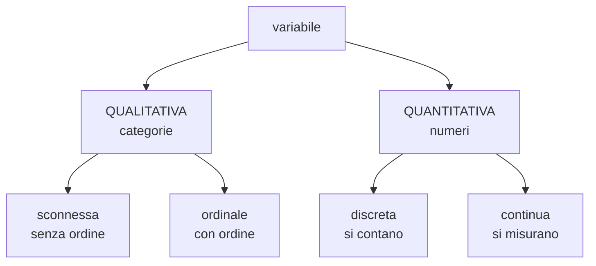

# Statistica descrittiva

**In una riga:** prendere un mucchio di numeri e **riordinarli** finché non si capisce cosa dicono.

Viene prima di tutto il resto. Prima di stimare, testare o costruire modelli, i dati vanno **guardati** — e per guardarli servono conteggi, tabelle e grafici.

> [!info] Descrittiva e inferenza: la differenza in una riga
> - **Descrittiva** — descrivo **i dati che ho**. Nessuna scommessa, nessun rischio di sbagliare: i miei 500 intervistati hanno un'età media di 34 anni, punto
> - **Inferenza** — dai 500 che ho provo a dire qualcosa sui **60 milioni che non ho**. Qui si scommette, e infatti c'è un margine d'errore → [[Inferenza]]

---

## Unità e variabili

Due parole che tornano ovunque.

| parola | cos'è | esempio |
|---|---|---|
| **unità statistica** | la singola cosa che misuri | uno studente |
| **popolazione** | tutte le unità che ti interessano | tutti gli studenti del corso |
| **variabile** | la caratteristica che misuri | l'altezza, il genere, il voto |

Se metti i dati in una tabella: **una riga per unità, una colonna per variabile**. È lo stesso `data.frame` di [[R]].

```
        altezza   genere   voto     ← le variabili
Marco      178       M       28
Anna       165       F       30
Luca       182       M       24
  ↑
le unità
```

---

## I tipi di variabile

Questa classificazione sembra pedanteria e invece **decide tutto**: quali conti puoi fare, quali grafici puoi usare, quale test applicare. Sbagliarla è il primo errore che si commette.



| tipo | cos'è | esempi | la media ha senso? |
|---|---|---|---|
| **qualitativa sconnessa** | etichette senza ordine | colore, città, settore | **no** |
| **qualitativa ordinale** | etichette con un ordine | titolo di studio, giudizio da pessimo a ottimo | **no**, ma la mediana sì |
| **quantitativa discreta** | numeri interi, si **contano** | figli, stanze, incidenti | sì |
| **quantitativa continua** | numeri con decimali, si **misurano** | altezza, peso, tempo | sì |

> [!warning] Numeri che non sono numeri
> Se codifichi il genere come `0 = uomo, 1 = donna`, il computer vede due numeri e calcolerà felicemente una media di **0,47**.
>
> Quel numero non significa niente. Sono etichette travestite da cifre.
>
> In [[R]] si evita dichiarandole per quel che sono: `as.factor()`. La stessa trappola torna dentro i modelli, dove una categoria trattata come numero produce coefficienti senza senso.

> [!tip] La prova del nove
> Chiediti: **"la differenza fra 1 e 2 vale quanto quella fra 2 e 3?"**
>
> Su un'altezza sì: un centimetro è un centimetro. Su un giudizio da 1 a 5 no: il salto da "pessimo" a "scarso" non è lo stesso da "buono" a "ottimo". Ordinale, non quantitativa.

---

## Dalla lista alla tabella

### Distribuzione unitaria

È **l'elenco grezzo**, un valore per ogni unità:

```
26,05   30,07   29,09   31,10   27,76   26,59   21,90   …   23,00
```

Con 55 pezzi lo leggi ancora. Con 5.000 non ci capisci niente. Serve riassumere.

### Distribuzione di frequenza

Invece di elencare tutti i valori, **conti quante volte esce ciascuno**:

| titolo di studio | **frequenza assoluta** | **frequenza relativa** | **percentuale** |
|---|---|---|---|
| diploma | 120 | 0,48 | 48% |
| laurea breve | 45 | 0,18 | 18% |
| laurea | 70 | 0,28 | 28% |
| master, dottorato | 15 | 0,06 | 6% |
| **totale** | **250** | **1,00** | **100%** |

- **assoluta** = quanti sono. Dipende da quanto è grande il campione
- **relativa** = la quota sul totale. Sta sempre fra 0 e 1, e le relative sommano a 1

> [!important] Usa sempre le relative per confrontare
> "120 diplomati qui e 300 là" non dice niente se il primo gruppo ha 250 persone e il secondo 3.000.
>
> 48% contro 10% invece si confronta subito. **Le frequenze assolute non si confrontano fra gruppi di dimensione diversa.**

### Cumulate

Servono a rispondere a domande del tipo *"quanti stanno sotto questa soglia?"*, e hanno senso solo se le categorie hanno un **ordine**.

| titolo | relativa | **cumulata** | si legge |
|---|---|---|---|
| diploma | 0,48 | 0,48 | il 48% ha al massimo il diploma |
| laurea breve | 0,18 | 0,66 | il 66% ha al massimo la laurea breve |
| laurea | 0,28 | 0,94 | il 94% ha al massimo la laurea |
| master | 0,06 | 1,00 | tutti |

Si sommano scendendo. L'ultima fa sempre 1.

La **retrocumulata** è la stessa cosa al contrario — *"quanti stanno sopra?"* — e si somma risalendo.

---

## Le classi

Con una variabile continua non puoi contare quante volte esce 26,05: probabilmente esce una volta sola. Si raggruppa in **classi**, cioè intervalli.

| classe | frequenza |
|---|---|
| 20 – 25 | 8 |
| 25 – 30 | 27 |
| 30 – 35 | 15 |
| 35 – 40 | 5 |

> [!warning] Quando le classi hanno ampiezza diversa
> Se una classe è larga il doppio, raccoglierà più roba **solo perché è più larga**. Confrontare le altezze delle barre diventa ingannevole.
>
> Si rimedia con la **densità di frequenza**:
> ```
> densità = frequenza della classe / ampiezza della classe
> ```
>
> Così l'altezza torna confrontabile, e in un istogramma quello che conta diventa **l'area** della barra, non la sua altezza.

Quante classi fare è un compromesso: poche classi nascondono i dettagli, troppe classi rendono il grafico frastagliato e illeggibile. Un punto di partenza ragionevole sono 5–10 classi, poi si guarda com'è venuto.

---

## Quale grafico

**Il tipo di variabile decide il grafico.** Non è una questione di gusto.

| hai… | usa | perché |
|---|---|---|
| qualitativa | **barre** | le categorie sono separate, e le barre restano separate |
| qualitativa, poche categorie | **torta** | si vedono le quote di un totale, ma solo con 3-4 fette |
| quantitativa | **istogramma** | le barre si toccano, perché i valori sono un continuo |
| quantitativa, la forma | **boxplot** | mediana, dispersione e valori anomali in un colpo → [[Variabilità#Il boxplot]] |
| due quantitative | **nuvola di punti** | si vede se si muovono insieme → [[Modelli lineari#Correlazione]] |
| nel tempo | **linea** | la continuità della linea suggerisce il passare del tempo |

> [!info] Barre o istogramma?
> Sembrano uguali e non lo sono.
>
> - **barre**: staccate. Fra "diploma" e "laurea" non c'è niente in mezzo
> - **istogramma**: attaccate. Fra 25 e 30 cm ci sono tutti i valori intermedi, e lo spazio vuoto sarebbe una bugia

> [!warning] Tre modi di mentire con un grafico onesto
> - **l'asse che non parte da zero** su un grafico a barre: una differenza dell'1% sembra un abisso
> - **la torta con dodici fette**: l'occhio non sa confrontare gli angoli, e diventa illeggibile
> - **le classi scelte ad arte**: cambiando dove tagli le classi, lo stesso istogramma può sembrare simmetrico o storto
>
> Il resto sta in [[Data Visualization]].

---

## In R

```r
str(dati)                    # che tipo e' ogni colonna: PRIMA COSA da fare
summary(dati)                # riassunto di tutte le variabili insieme

table(dati$studio)                      # frequenze assolute
prop.table(table(dati$studio))          # relative
cumsum(prop.table(table(dati$studio)))  # cumulate

table(dati$studio, dati$sesso)          # tabella a doppia entrata

barplot(table(dati$studio))   # qualitativa
hist(dati$eta)                # quantitativa
boxplot(eta ~ sesso, data = dati)
plot(dati$peso, dati$altezza) # due quantitative

dati$studio <- as.factor(dati$studio)   # dichiara le categorie come tali
```

---

## Da tenere in tasca

| domanda | risposta rapida |
|---|---|
| Descrittiva o inferenza? | descrivo **quello che ho** / stimo **quello che non ho** |
| Cos'è un'unità statistica? | la singola cosa che misuri. Una riga della tabella |
| I quattro tipi di variabile? | qualitativa **sconnessa** e **ordinale**, quantitativa **discreta** e **continua** |
| La media sul genere? | **mai**. È un'etichetta, anche se scritta 0/1 |
| Assoluta o relativa? | **relativa**, sempre, per confrontare gruppi diversi |
| A cosa serve la cumulata? | a rispondere "quanti stanno sotto?" |
| Quando serve la densità? | quando le **classi hanno ampiezza diversa** |
| Barre o istogramma? | barre = categorie (staccate) · istogramma = numeri (attaccate) |

## Vedi anche

[[Valori medi]] · [[Variabilità]] · [[Probabilità e distribuzioni]] · [[Inferenza]] · [[Data Visualization]] · [[R]]
