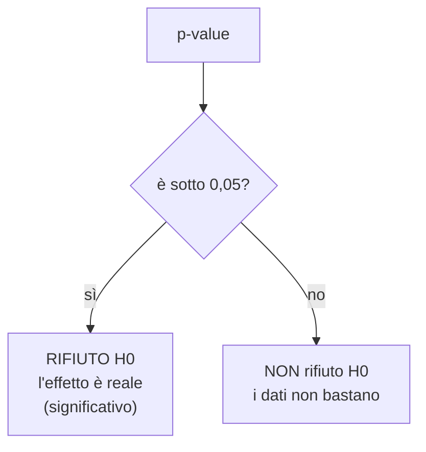
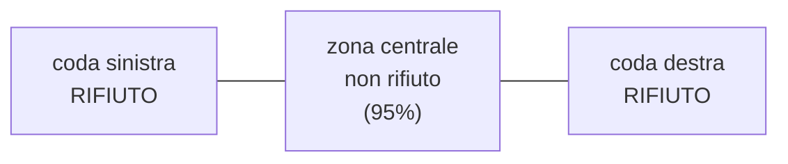

# Test statistici

**In una riga:** ho visto una differenza nei dati — è **reale**, o è solo **fortuna del campione**?

> [!example] La moneta truccata
> Un amico dice che la sua moneta è normale. La lanci **10 volte** ed esce **testa 7 volte**.
>
> Sospetto? Forse. Ma anche una moneta perfetta può fare 7 teste su 10: capita abbastanza spesso.
>
> La lanci **1.000 volte** ed esce testa **700 volte**. Adesso no. Una moneta onesta non fa una cosa del genere quasi mai.
>
> **Il test statistico è esattamente questo ragionamento, fatto con i numeri al posto della sensazione.**

---

## L'ipotesi nulla

Ogni test parte da un'ipotesi che si chiama **H0** (acca zero), o **ipotesi nulla**.

> **H0 è sempre la versione noiosa: "non succede niente di speciale".**

| la domanda | H0, la versione noiosa |
|---|---|
| la moneta è truccata? | è onesta, 50 e 50 |
| il farmaco funziona? | non fa niente |
| uomini e donne guadagnano diverso? | guadagnano uguale |
| il peso influisce sul fumo? | non c'entra nulla |

E poi c'è **H1**, l'ipotesi alternativa: il contrario di H0, cioè quello che di solito speri di dimostrare.

> [!important] Perché si parte dalla versione noiosa
> Perché il "niente di speciale" è l'unica cosa di cui si riescono a fare i conti.
>
> Se la moneta è onesta so calcolare esattamente quanto è probabile ogni risultato. Se è truccata... truccata **quanto**? 60-40? 90-10? Non si sa da dove cominciare.
>
> Quindi si fa il processo al contrario: **assumo che non succeda niente** e guardo se i dati che ho in mano sono compatibili con quell'assunzione. Se non lo sono, la butto.

> [!tip] È il processo in tribunale
> L'imputato è **innocente fino a prova contraria**. L'innocenza è H0.
>
> Non devi dimostrare l'innocenza: devi portare prove abbastanza forti da **escluderla**. Se le prove sono deboli, l'imputato esce — ma nessuno ha dimostrato che sia innocente, semplicemente non bastava per condannarlo.
>
> Un test funziona identico: **si rifiuta H0, oppure non la si rifiuta**. Non si "accetta" mai.
>
> Nell'uso comune si sente dire "accetto l'ipotesi nulla". È impreciso: la formula corretta è **"non la rifiuto"**, e all'esame conviene usare quella.

---

## Il p-value

È il numero che leggi in ogni output e che decide tutto.

> [!important] La definizione, in italiano
> Il **p-value** è la probabilità di vedere dati **strani almeno quanto i tuoi**, ammesso che H0 sia vera.
>
> Tradotto: **"se davvero non succedesse niente, quanto sarebbe raro quello che ho appena visto?"**

Sulla moneta:

- **7 teste su 10** → p-value ≈ 0,17. Cioè: se la moneta fosse onesta, un risultato così capiterebbe **17 volte su 100**. Succede spesso. Nessun sospetto.
- **700 teste su 1000** → p-value ≈ 0,0000000001. Se fosse onesta non capiterebbe **mai**. Quindi non è onesta.



### La soglia 0,05

Per convenzione il confine è **0,05**, cioè il 5%. Si chiama **alfa** (`α`) o **livello di significatività**.

- **p < 0,05** → *significativo*. L'effetto c'è
- **p ≥ 0,05** → non significativo. I dati non bastano a dirlo

> [!warning] Lo 0,05 è una convenzione, non una legge di natura
> Non c'è niente di magico nel 5%. `p = 0,049` e `p = 0,051` sono praticamente lo stesso risultato, eppure uno "passa" e l'altro no.
>
> Leggi il p-value come un **termometro**, non come un interruttore: 0,001 è una prova molto più forte di 0,048, anche se entrambi "passano".

> [!warning] Due errori da non fare
> **"p-value alto quindi H0 è vera"** — no. Assenza di prove non è prova di assenza. Magari il tuo campione era troppo piccolo per accorgersi della differenza.
>
> **"significativo quindi importante"** — no. Con un milione di osservazioni diventa significativa anche una differenza di stipendio di **3 euro l'anno**: reale, e del tutto irrilevante. *Significativo* in statistica vuol dire solo **"non è un caso"**, non **"conta molto"**.

> [!info] La seconda definizione di p-value
> La troverai detta anche così: il p-value è **il più piccolo alfa per cui rifiuteresti H0**.
>
> Sembra un'altra cosa e non lo è. Se il tuo p-value è 0,03, allora con `α = 0,05` rifiuti, con `α = 0,04` rifiuti, con `α = 0,02` non rifiuti più. Il punto esatto in cui cambia idea **è** 0,03.
>
> Serve a questo: invece di dirti solo "passa" o "non passa" rispetto a una soglia decisa prima, il p-value ti consegna **il numero**, e ognuno ci mette la soglia che preferisce.

---

## La statistica test e la regione di rifiuto

Il p-value non nasce dal nulla. Nasce da un conto intermedio che si chiama **statistica test**.

> **Statistica test = un numero che riassume quanto i tuoi dati sono lontani da H0.**

Funziona sempre allo stesso modo: prendi la differenza che hai misurato e la dividi per quanto è incerta.

```
          quello che hai visto  −  quello che dice H0
statistica test = ──────────────────────────────────
                        l'errore standard
```

Il risultato si legge come **"quante deviazioni standard sono lontano"**. Nei vari test cambia il nome — `z`, `t`, `F`, `chi quadro` — ma l'idea è sempre quella.

> [!example] Statura media in un paese
> La statura media nota in quel paese è 175 cm. Su 20 giovani si misura una media di **177,5 cm**, con errore standard 3,87.
>
> ```
> z = (177,5 − 175) / 3,87 = 0,645
> ```
>
> Sei a **0,645 deviazioni standard** dal valore di H0. Vicinissimo. Nessuna sorpresa, quindi p-value alto (0,26) e H0 non si rifiuta.

### Valore critico, accettazione, rifiuto

Sotto H0 sai che forma ha la campana dei risultati possibili. La dividi in due zone:

| zona | cosa contiene | cosa fai |
|---|---|---|
| **regione di accettazione** | i valori centrali, quelli normali | non rifiuti H0 |
| **regione di rifiuto** (o *critica*) | le code, i valori estremi | rifiuti H0 |

Il confine fra le due si chiama **valore critico**.



Con `α = 0,05` il 5% finisce nelle code. Se la tua statistica test casca lì, rifiuti.

> [!tip] È lo stesso verdetto, letto in due modi
> **Confrontare la statistica test col valore critico** e **confrontare il p-value con 0,05** danno sempre la stessa risposta. Sono la stessa decisione guardata da due lati: uno sull'asse orizzontale, l'altro sull'area sotto la curva.
>
> Prima dei computer si usava il valore critico, perché le aree si leggevano su tavole stampate. Oggi il software stampa il p-value e si guarda quello.

### Una coda o due?

Dipende da come formuli H1, ed è una scelta che fai **prima** di vedere i dati.

| tipo | H1 | quando | dove sta la regione di rifiuto |
|---|---|---|---|
| **bidirezionale** (a due code) | `μ ≠ 175` | *"è diverso"*, senza dire da che parte | **entrambe** le code, 2,5% per lato |
| **unidirezionale** (a una coda) | `μ > 175` | *"è più grande"*, hai una direzione in mente | **una sola** coda, tutto il 5% da quel lato |

> [!warning] Non si sceglie dopo aver guardato i dati
> Il test a una coda è più facile da superare: concentri tutto il 5% da una parte sola, quindi serve meno evidenza.
>
> Decidere la direzione **dopo** aver visto da che parte sono andati i dati è barare, e ha pure un nome in letteratura. La direzione deve venire dall'ipotesi di partenza, non dal risultato.

---

## I due modi di sbagliare

Il verdetto può essere sbagliato in due modi opposti. Ed è la stessa tabella dell'antispam (→ [[Machine Learning#Valutazione (classificazione)]]).

| | **H0 è vera davvero** | **H0 è falsa davvero** |
|---|---|---|
| **rifiuto H0** | ❌ **Errore di I tipo** — falso allarme | ✓ giusto |
| **non rifiuto H0** | ✓ giusto | ❌ **Errore di II tipo** — me lo sono perso |

- **Errore di I tipo** — gridi al lupo e il lupo non c'era. Condanni un innocente. La probabilità di farlo è proprio **alfa**, cioè 0,05: accetti in partenza di sbagliare così **5 volte su 100**.
- **Errore di II tipo** — il lupo c'era e non l'hai visto. Assolvi un colpevole.

> [!tip] Non puoi ridurli entrambi
> Abbassi alfa a 0,01 per evitare falsi allarmi? Diventi più esigente, e ti sfuggono più effetti veri. Gli errori di II tipo aumentano.
>
> L'unico modo per ridurre entrambi è **raccogliere più dati** (→ [[Inferenza#L'errore standard]]).

La **potenza** del test è la capacità di accorgersi di un effetto quando c'è davvero. Cresce con il campione.

---

## I test principali

Sono tutti la stessa macchina con ingressi diversi. Cambia cosa confronti.

### t-test — due medie

> Gli uomini guadagnano diverso dalle donne?

Confronta **due gruppi** su una variabile numerica. H0: le due medie sono uguali.

```r
t.test(stipendio ~ genere, data = dati)
```

### ANOVA — più di due medie

> Il reddito cambia fra Nord, Centro, Sud, Isole?

Stessa idea del t-test, ma con **tre o più gruppi**. Sta in [[Modelli lineari#ANOVA]].

> [!info] Con due soli gruppi, ANOVA e t-test danno lo stesso identico risultato
> Non sono due tecniche diverse: il t-test è il caso particolare dell'ANOVA quando i gruppi sono due.

### Chi quadro — due variabili categoriali

> Il tipo di diploma è legato al fatto di fumare?

Nessuna media da confrontare, solo conteggi in una tabella. H0: le due variabili sono **indipendenti**.

```r
chisq.test(table(dati$diploma, dati$fumo))
```

### Test di correlazione — due variabili numeriche

> Chi è entrato prima nel mondo del lavoro ha più anni di contributi?

Misura se due numeri **si muovono insieme**. L'indice si chiama **r** e va da −1 a +1:

| r | significa |
|---|---|
| **+1** | quando uno sale, l'altro sale sempre |
| **0** | non c'entrano niente l'uno con l'altro |
| **−1** | quando uno sale, l'altro scende sempre |

```r
cor.test(dati$eta, dati$contributi)
```

> [!warning] Correlazione non è causa
> Il consumo di gelati e gli annegamenti salgono insieme. Il gelato non annega nessuno: c'è sotto **l'estate**, che fa salire entrambi.
>
> Una variabile nascosta che muove le altre due si chiama **fattore confondente**. Prima di dire "A causa B", chiediti sempre chi è l'estate.

---

## Come si legge un test, in quattro passi

1. **Qual è H0?** — la versione noiosa
2. **Guarda il p-value**
3. **Sotto 0,05?** → rifiuti H0, l'effetto c'è
4. **Ma quanto è grande?** — significativo non vuol dire importante. Guarda sempre anche la **dimensione** della differenza

> [!example] Fatto per intero
> Output: `t = 4.32, p-value = 0.0002`. Media uomini 32.000 €, media donne 27.500 €.
>
> 1. H0: uomini e donne guadagnano uguale
> 2. p = 0,0002
> 3. Ampiamente sotto 0,05 → **rifiuto H0**
> 4. La differenza è **4.500 € l'anno**: grande anche in pratica, non solo statisticamente
>
> Conclusione: *"c'è una differenza salariale significativa, di circa 4.500 € l'anno"*.

---

## Da tenere in tasca

| domanda | risposta rapida |
|---|---|
| A cosa serve un test? | distinguere un effetto **reale** dal **caso** |
| Cos'è H0? | l'ipotesi noiosa: "non succede niente" |
| Cos'è il p-value? | quanto sarebbe raro il mio risultato **se H0 fosse vera** |
| Soglia? | **0,05** per convenzione. Sotto → significativo |
| Posso "accettare" H0? | **no**. O la rifiuti, o non la rifiuti |
| Cos'è la **statistica test**? | quante deviazioni standard sei lontano da H0 |
| **Regione di rifiuto**? | le code della campana. Se ci caschi, rifiuti |
| Una coda o due? | **due** se dici "diverso", **una** se dici "maggiore". Si decide prima |
| Errore di I tipo | falso allarme (condanno un innocente) |
| Errore di II tipo | me lo perdo (assolvo un colpevole) |
| Significativo = importante? | **no**. Guarda sempre quanto è grande l'effetto |
| Due gruppi / più gruppi | `t.test` / ANOVA |
| Due categorie / due numeri | `chisq.test` / `cor.test` |

## Vedi anche

[[Inferenza]] · [[Confronto fra gruppi]] · [[Probabilità e distribuzioni]] · [[Modelli lineari]] · [[R]]
