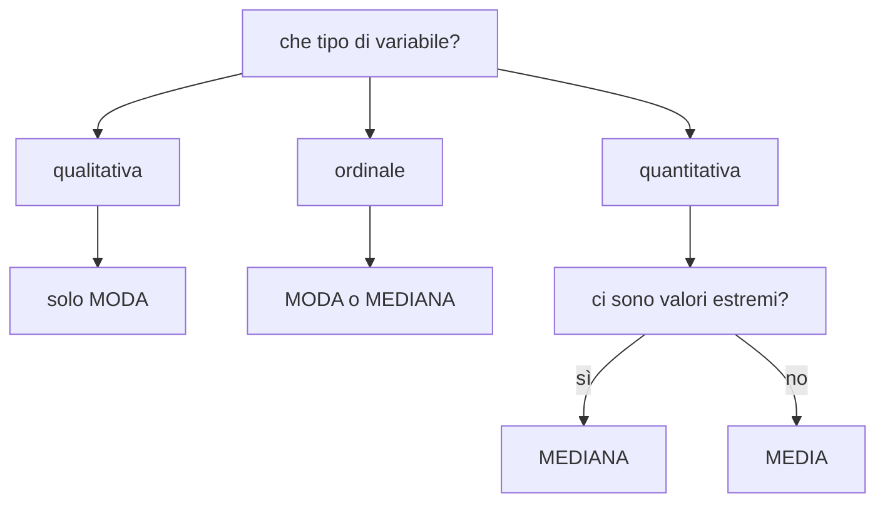

# Valori medi

**In una riga:** un numero solo che rappresenti tutti gli altri.

Si chiamano anche **misure di posizione** o **di tendenza centrale**: dicono **dov'è il centro** dei dati. Ce ne sono tre, e scegliere quella sbagliata è il modo più comune di raccontare una bugia con dati veri.

---

## Media aritmetica

Quella che conosci: sommi tutto e dividi per quanti sono.

```
media = (somma di tutti i valori) / (quanti sono)
```

Cinque stipendi: 1.200, 1.400, 1.500, 1.600, 1.800.

```
media = 7.500 / 5 = 1.500
```

> [!info] Come si scrive
> `x̄` (si legge "x segnato") per la media di un campione, `μ` (mu) per la media della popolazione. È la stessa distinzione di [[Inferenza#Popolazione e campione]].

### La proprietà che la definisce

La media è il **punto di equilibrio**. Se metti i dati su un'asse come pesi su un'altalena, il fulcro va esattamente lì.

Detta in numeri: **gli scarti dalla media si annullano sempre**.

```
(1.200−1.500) + (1.400−1.500) + (1.500−1.500) + (1.600−1.500) + (1.800−1.500)
    −300      +     −100      +       0       +      +100     +      +300      =  0
```

Somma zero. Sempre, con qualsiasi dato. È lo stesso motivo per cui nei [[Modelli lineari#Come si sceglie "la retta migliore"|minimi quadrati]] i residui vanno elevati al quadrato: altrimenti il più e il meno si mangiano a vicenda.

### Il difetto

> [!warning] La media si fa trascinare dagli estremi
> Stessi cinque stipendi di prima, ma il quinto è l'amministratore delegato:
>
> ```
> 1.200   1.400   1.500   1.600   50.000
>
> media = 55.700 / 5 = 11.140
> ```
>
> **Media: 11.140 euro.** Quattro persone su cinque guadagnano meno di un settimo di quella cifra.
>
> Il numero è calcolato giusto e descrive male la realtà. **Un solo valore estremo sposta la media dove vuole.**

Ecco perché quando senti "lo stipendio medio in azienda è X" la domanda giusta è: *e la mediana?*

---

## Mediana

**Il valore che sta in mezzo**, quando metti i dati in fila dal più piccolo al più grande.

```
1.200   1.400   [1.500]   1.600   50.000
                   ↑
              la mediana
```

Metà delle persone sta sotto, metà sopra. **Non importa quanto sia grande il valore più alto**: conta solo che sia l'ultimo della fila.

| | senza l'AD | con l'AD |
|---|---|---|
| media | 1.500 | **11.140** ← impazzita |
| mediana | 1.500 | **1.500** ← non si muove |

> [!tip] Come si calcola
> 1. metti i valori **in ordine**
> 2. se sono **dispari**, la mediana è quello centrale
> 3. se sono **pari**, non c'è un centro: si fa la media dei due di mezzo
>
> Con `1.200 1.400 1.500 1.600`: la mediana è `(1.400 + 1.500) / 2 = 1.450`.

La mediana è **robusta**: resiste ai valori estremi. È il motivo per cui i dati su redditi, prezzi delle case e tempi di attesa si raccontano quasi sempre con la mediana.

---

## Quantili

La mediana taglia i dati **a metà**. I quantili fanno la stessa cosa tagliando in punti diversi.

| nome | taglia in | esempio |
|---|---|---|
| **mediana** | 2 parti | il 50% sta sotto |
| **quartili** | 4 parti | Q1 = il 25% sta sotto · Q2 = la mediana · Q3 = il 75% sta sotto |
| **decili** | 10 parti | il primo decile: il 10% più basso |
| **percentili** | 100 parti | il 90° percentile: il 90% sta sotto |

> [!example] Li usi già senza saperlo
> Il pediatra dice che tuo nipote è "al 75° percentile per altezza". Significa: **su 100 bambini della sua età, 75 sono più bassi di lui**.
>
> Non è un voto, è una posizione in fila.

> [!important] Il 99° percentile — la domanda classica
> **È il valore sotto cui sta il 99% dei dati.** Sopra resta l'1%, cioè uno su cento.
>
> L'errore da non fare: **non è una quota, è una soglia**. Non è "il 99% dei dati", è **il numero** che separa il 99% dal restante 1%. Sta sull'asse orizzontale, non è una percentuale.
>
> A cosa serve davvero:
>
> - **tempi di risposta di un sito** — "il 99° percentile è 800 ms" significa che 99 richieste su 100 arrivano entro 800 ms. La media qui non serve a niente: è l'1% lento a far arrabbiare gli utenti
> - **redditi** — il 99° percentile è la soglia d'ingresso nell'"1%"
> - **valori anomali** — tutto quello che sta oltre è candidato a essere un caso da guardare uno per uno
>
> E vale in generale: il **k-esimo percentile** è il valore sotto cui sta il k% dei dati. La mediana è il 50°, Q1 è il 25°, Q3 è il 75°.

I tre quartili sono i più usati, perché da soli raccontano quasi tutta la distribuzione:

```
Q1 = 1.350        Q2 = 1.500        Q3 = 1.650
   ↑ il 25% sta sotto    ↑ la metà      ↑ il 75% sta sotto
```

E la distanza `Q3 − Q1` è una misura di dispersione → [[Variabilità#Range interquartile]].

---

## Moda

**Il valore più frequente.** Quello che capita più spesso.

```
S  M  M  L  M  XL  L  M  S      →  la moda è M
```

È l'unica delle tre che funziona anche sulle **variabili qualitative**. Su una lista di città non puoi fare né media né mediana, ma "la città più frequente" ha senso eccome.

> [!info] Può essere più di una, o nessuna
> - **due mode** (*bimodale*) → di solito significa che stai mescolando due gruppi diversi. Le altezze di uomini e donne insieme fanno due gobbe, e la media cade nella valle in mezzo, dove non c'è quasi nessuno
> - **nessuna moda** → se ogni valore esce una volta sola. Su variabili continue succede quasi sempre, e infatti lì la moda si calcola sulle classi

---

## Quale scegliere



| | media | mediana | moda |
|---|---|---|---|
| usa tutti i valori | ✓ | ✗ | ✗ |
| resiste agli estremi | ✗ | ✓ | ✓ |
| funziona sulle categorie | ✗ | solo ordinali | ✓ |
| si usa nei modelli | ✓ | raramente | ✗ |

> [!important] La regola pratica
> **Media e mediana molto diverse = la distribuzione è storta.**
>
> - media **maggiore** della mediana → coda a destra. Pochi valori molto alti tirano su la media. È il caso di redditi, prezzi, fatturati
> - media **minore** della mediana → coda a sinistra. Più raro
> - media ≈ mediana → distribuzione **simmetrica**, e la media è affidabile
>
> Calcolale sempre entrambe. La distanza fra le due è già un'informazione.

---

## In R

```r
mean(dati$stipendio)          # media
median(dati$stipendio)        # mediana
quantile(dati$stipendio)      # min, Q1, mediana, Q3, max
quantile(dati$stipendio, 0.9) # il 90esimo percentile

# la moda non ha una funzione pronta: si legge dai conteggi
sort(table(dati$taglia), decreasing = TRUE)[1]

summary(dati$stipendio)       # media e quartili in un colpo solo
```

> [!warning] `NA` manda tutto a monte
> Se anche un solo valore manca, `mean()` restituisce `NA`.
>
> ```r
> mean(dati$stipendio, na.rm = TRUE)   # na.rm = "togli i mancanti"
> ```
>
> Prima di aggiungere `na.rm` però **guarda quanti sono** i mancanti e chiediti perché: un dato assente è esso stesso un'informazione → [[Data Quality]].

---

## Da tenere in tasca

| domanda | risposta rapida |
|---|---|
| Cos'è la media? | somma diviso quanti sono. Il **punto di equilibrio** |
| Il difetto della media? | **un solo valore estremo la trascina** |
| Cos'è la mediana? | il valore **in mezzo**. Metà sotto, metà sopra |
| Perché la mediana sugli stipendi? | perché resiste ai pochi stipendi altissimi |
| Cosa sono i quartili? | tagliano i dati in **4 parti**: Q1, mediana, Q3 |
| 75° percentile? | il **75% sta sotto** |
| Cos'è la moda? | il valore **più frequente**. L'unica che va sulle categorie |
| Due mode? | stai probabilmente **mescolando due gruppi** |
| Media ≠ mediana? | la distribuzione è **storta**. Usa la mediana |

## Vedi anche

[[Variabilità]] · [[Statistica descrittiva]] · [[Probabilità e distribuzioni]] · [[Inferenza]] · [[R]]
