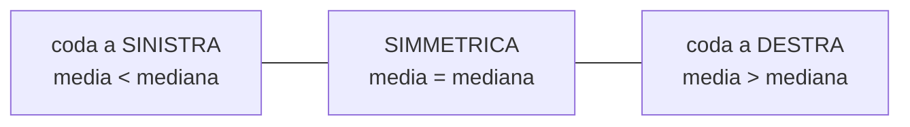

# Variabilità

**In una riga:** quanto i dati sono **sparpagliati**, invece che ammucchiati attorno al centro.

> [!example] Perché la media da sola non basta mai
> Due classi, stesso voto medio: **6**.
>
> | | voti | media |
> |---|---|---|
> | **Classe A** | 5, 6, 6, 6, 7 | 6 |
> | **Classe B** | 1, 3, 6, 9, 11 | 6 |
>
> Sono due situazioni completamente diverse. Nella prima sono tutti uguali, nella seconda c'è chi non ha capito niente e chi ha capito tutto.
>
> **La media dice dov'è il centro. La variabilità dice se quel centro rappresenta qualcuno.**

Per questo ogni volta che dai una media devi dare accanto una misura di dispersione. Da sola, una media è mezza informazione.

---

## Range

Il più semplice: **il massimo meno il minimo**.

```
Classe A:  7 − 5 = 2
Classe B: 11 − 1 = 10
```

Facile da calcolare e facile da spiegare. Ha però un difetto che lo rende quasi inutile:

> [!warning] Guarda solo due valori e butta via tutti gli altri
> Basta **una** persona anomala e il range esplode. Stipendi: 1.200, 1.400, 1.500, 1.600, 50.000 → range = 48.800.
>
> Quel numero descrive l'amministratore delegato, non l'azienda.

---

## Range interquartile

Il rimedio: invece di guardare gli estremi, si guardano i **quartili**.

```
IQR = Q3 − Q1
```

È **l'ampiezza della fascia in cui sta il 50% centrale** dei dati. Il 25% più basso e il 25% più alto vengono tagliati fuori — e con loro gli estremi.

```
  |----25%----|--------50% CENTRALE--------|----25%----|
  min        Q1                           Q3         max
              └──────────  IQR  ──────────┘
```

> [!tip] È l'equivalente della mediana, per la dispersione
> Come la [[Valori medi#Mediana|mediana]] è la media robusta, l'IQR è il range robusto. Vanno in coppia: se descrivi con la mediana, accompagnala con l'IQR.

L'IQR serve anche a **definire cos'è un valore anomalo**. La convenzione:

```
è un outlier se sta sotto  Q1 − 1,5 × IQR
                 o sopra   Q3 + 1,5 × IQR
```

Quell'1,5 è una convenzione, non una legge. Funziona bene abbastanza spesso da essere diventata lo standard.

---

## Varianza e deviazione standard

Le due che si usano davvero, e sono **lo stesso numero in due formati**.

L'idea: misurare quanto ogni valore si discosta dalla media, e farne una sintesi.

> [!info] Perché non si sommano gli scarti e basta
> Perché fanno **sempre zero**: è la proprietà della media, il più e il meno si annullano (→ [[Valori medi#La proprietà che la definisce]]).
>
> Si elevano al quadrato, così diventano tutti positivi e non si cancellano più.

### Varianza

```
varianza = media degli scarti dalla media, elevati al quadrato
```

Facciamola tutta sulla Classe B — voti 1, 3, 6, 9, 11, media 6:

| voto | scarto dalla media | scarto² |
|---|---|---|
| 1 | −5 | 25 |
| 3 | −3 | 9 |
| 6 | 0 | 0 |
| 9 | +3 | 9 |
| 11 | +5 | 25 |
| | **somma: 0** | **somma: 68** |

```
varianza = 68 / 5 = 13,6
```

Sulla Classe A (voti 5, 6, 6, 6, 7) gli scarti sono −1, 0, 0, 0, +1, la somma dei quadrati è 2, e la varianza è **0,4**. Trentaquattro volte più piccola.

### Deviazione standard

La varianza ha un problema di lettura: essendo fatta di quadrati, è in **unità al quadrato**. Su delle altezze verrebbe "centimetri quadrati", che non vuol dire niente.

Si fa la radice quadrata e si torna in unità normali:

```
deviazione standard = √varianza
```

```
Classe A:  √0,4  = 0,63
Classe B:  √13,6 = 3,69
```

> [!important] Come si legge la deviazione standard
> **"In media, quanto ci si discosta dal centro."**
>
> Classe B: voto medio 6, deviazione standard 3,7. Vuol dire che le persone stanno tipicamente **fra 2,3 e 9,7**. Una forbice enorme.
>
> Classe A: 6 con deviazione 0,6. Tutti fra 5,4 e 6,6.
>
> Nei discorsi si usa sempre la deviazione standard, mai la varianza. La varianza serve nei conti, la deviazione standard serve a capire.

> [!info] Perché a volte si divide per n−1
> Vedrai due formule: una divide per `n`, l'altra per `n−1`.
>
> - **`n`** quando i dati che hai **sono** tutta la popolazione
> - **`n−1`** quando i tuoi dati sono un **campione** e vuoi stimare la variabilità della popolazione
>
> Il motivo: usando la media calcolata sul campione si sottostima la dispersione vera, e dividere per un numero più piccolo compensa. Con `n` grande la differenza è irrilevante.
>
> In [[R]] `var()` e `sd()` usano `n−1`, perché nel 99% dei casi stai lavorando su un campione.

---

## Coefficiente di variazione

Domanda: **una deviazione standard di 5 è grande?**

Non si può rispondere. Dipende da 5 rispetto a cosa.

- altezza media 170 cm, deviazione 5 cm → le persone sono molto simili
- età media 8 anni, deviazione 5 anni → gruppo estremamente eterogeneo

Il **coefficiente di variazione** rende il confronto possibile, mettendo la deviazione in rapporto alla media:

```
CV = deviazione standard / media        (spesso in percentuale)
```

```
altezza:  5 / 170 = 0,029  →  2,9%
età:      5 / 8   = 0,625  →  62,5%
```

**Il CV è un numero puro**, senza unità di misura. Serve proprio a questo: confrontare la variabilità di cose che non si potrebbero confrontare — centimetri contro euro contro anni.

> [!warning] Non usarlo se la media è vicina a zero
> La media sta sotto la frazione: quando si avvicina a zero il CV schizza a valori assurdi. E se la variabile può essere negativa, il CV non ha nessun significato.

---

## La forma

Oltre a centro e dispersione, resta una domanda: **la distribuzione è simmetrica o pende da una parte?**

### Asimmetria



- **simmetrica** — le due metà si somigliano. La [[Probabilità e distribuzioni#La distribuzione Normale|campana]] è il caso perfetto
- **coda a destra** (asimmetria positiva) — tanti valori bassi, pochi altissimi che allungano la coda. **Redditi, prezzi, fatturati.** È di gran lunga il caso più comune nei dati reali
- **coda a sinistra** — il contrario, più raro. Età alla morte, punteggi di un test troppo facile

> [!tip] Lo riconosci senza calcolare niente
> Confronta media e mediana. **Media più alta della mediana → coda a destra.** È il segnale che la media non sta descrivendo bene i tuoi dati.

### Curtosi

Dice quanto sono **pesanti le code**, cioè quanto spesso capitano valori lontanissimi dal centro. Code pesanti significa che gli eventi estremi sono più frequenti di quanto una campana normale prevederebbe — cosa che in finanza costa cara.

Si incontra meno spesso dell'asimmetria. Sapere che esiste e cosa misura è sufficiente.

---

## Il boxplot

Il grafico che mostra **tutto insieme** quello che c'è in questa nota.

```
        ┌─────┬──────┐
   ├────┤     │      ├────┤        ∘
        └─────┴──────┘
   │    │     │      │    │        │
  baffo Q1  mediana Q3   baffo   outlier
```

| pezzo | cosa dice |
|---|---|
| la **scatola** | va da Q1 a Q3: dentro c'è il **50% centrale**. La sua larghezza **è l'IQR** |
| la **riga dentro** | la **mediana** |
| i **baffi** | arrivano fino a 1,5 × IQR oltre la scatola |
| i **punti isolati** | gli **outlier**, oltre i baffi |

Si legge in tre colpi d'occhio: **scatola larga** = dati sparpagliati · **mediana spostata** verso un lato della scatola = distribuzione asimmetrica · **tanti punti da un lato** = coda pesante.

E serve soprattutto a **confrontare gruppi**: cinque boxplot affiancati raccontano cinque distribuzioni in un grafico solo.

---

## In R

```r
range(dati$eta)                  # minimo e massimo
diff(range(dati$eta))            # il range vero e proprio
IQR(dati$eta)                    # range interquartile
quantile(dati$eta)               # i quartili

var(dati$eta)                    # varianza    (divide per n-1)
sd(dati$eta)                     # dev. standard (divide per n-1)
sd(dati$eta) / mean(dati$eta)    # coefficiente di variazione

summary(dati$eta)                # min, Q1, mediana, media, Q3, max

boxplot(eta ~ area, data = dati) # confronto fra gruppi
hist(dati$eta)                   # la forma
```

> [!tip] La coppia giusta
> - distribuzione **simmetrica** → media e deviazione standard
> - distribuzione **storta** o con outlier → mediana e IQR
>
> Non mischiare: "mediana 1.500 con deviazione standard 8.000" è una frase che non aiuta nessuno.

---

## Da tenere in tasca

| domanda | risposta rapida |
|---|---|
| Perché serve la variabilità? | perché **la media da sola non dice se rappresenta qualcuno** |
| Cos'è il range? | max − min. Facile e **fragile** |
| Cos'è l'IQR? | Q3 − Q1: la fascia del **50% centrale**. Robusto |
| Quando un valore è outlier? | oltre `Q1 − 1,5×IQR` o `Q3 + 1,5×IQR` |
| Perché gli scarti al quadrato? | perché sommati **farebbero sempre zero** |
| Varianza o deviazione standard? | stessa cosa. La **deviazione** si legge, perché è in unità normali |
| Come si legge la deviazione? | "in media ci si discosta di tanto dal centro" |
| `n` o `n−1`? | `n−1` sul **campione**. In R è il default |
| A cosa serve il CV? | a confrontare variabilità di **cose diverse**. È senza unità |
| Media > mediana? | **coda a destra**. Tipico di redditi e prezzi |
| Cosa mostra il boxplot? | mediana, quartili, dispersione e outlier **insieme** |

## Vedi anche

[[Valori medi]] · [[Statistica descrittiva]] · [[Probabilità e distribuzioni]] · [[Inferenza]] · [[R]]
