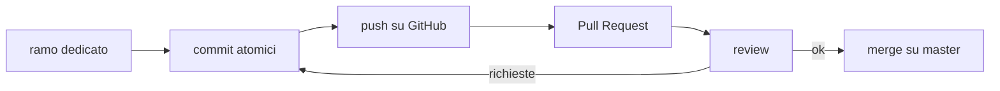

# Git e GitHub — versionare e collaborare

**Git** tiene la storia del codice: ogni **commit** è una fotografia del progetto, con un messaggio che spiega cosa cambia. **GitHub** aggiunge la collaborazione: rami condivisi, **Pull Request**, review, protezioni. Questa nota raccoglie le pratiche che rendono la storia leggibile — e tengono i segreti fuori dal repository.

## Commit atomici

Un commit = **una modifica con un solo scopo** (una feature, un fix, una nota). È la [[Principi#^srp|single responsibility]] applicata alla storia del codice.

Perché conviene:
- si **legge** — la storia racconta i passi uno alla volta;
- si **annulla** — `git revert` toglie *quella* modifica e nient'altro;
- si **rivede** — il reviewer capisce il commit in un colpo d'occhio.

In pratica: metti in stage solo i file che c'entrano (`git add <file>`, non `git add -A` alla cieca).

## Messaggi di commit

- **Imperativo presente**: "Aggiunge…", "Corregge…", "Rimuove…" (in inglese: *Add*, *Fix*, *Remove*).
- **Soggetto ≤ 50 caratteri**: cosa cambia, in una riga.
- Se serve contesto: riga vuota, poi un **corpo** che spiega il *perché* (il *cosa* si vede già dal diff).

```
Corregge il filtro della Dashboard

Le immagini comparivano tra le note perché il filtro
escludeva solo il tag meta. Ora richiede la property area.
```

## Il flusso: ramo → PR → review → merge



La **Pull Request** propone di portare i commit di un ramo (**compare/head**) dentro un altro (**base**, di solito `master`/`main`). Su GitHub: banner giallo *"Compare & pull request"* dopo il push, oppure tab *Pull requests* → *New*.

- **Draft PR** — lavoro in corso, non ancora pronto per la review.
- **Closing keywords** — "Closes #12" nella descrizione chiude l'issue al merge.
- **Reviewer** — puoi richiederli esplicitamente sulla PR.
- PR **piccole**, solo commit legati tra loro: 50 file cambiati non si riescono a rivedere.
- Prima di aprirla, porta dentro le novità del ramo base (merge di `master` nel tuo ramo): il conflitto lo risolvi tu, non chi rivede.

## Code review

Chi rivede controlla tre cose: la modifica **fa quel che promette**? è **leggibile**? rispetta **lo stile del progetto**? Su modifiche grandi conviene scaricare il ramo e provarlo, non fidarsi del solo diff.

Chi commenta propone, non ordina: "e se qui usassimo…?" con un esempio concreto funziona meglio di una correzione secca.

## Segreti: mai nel repository

Una **chiave committata è una chiave esposta**: la storia di git la conserva anche se la cancelli al commit dopo, e le piattaforme possono tenerne copie in cache. L'unico rimedio affidabile è **revocare e rigenerare** la credenziale — pulire la storia è opzionale, revocare no.

Due difese, in ordine:

1. **Prevenzione (locale)** — un **git hook** `pre-commit` scansiona i file in stage *prima* che il commit esista: tool come **gitleaks** o **trufflehog**, orchestrati dal framework `pre-commit`. Limite: gira sulla tua macchina e si aggira con `--no-verify` → da solo non basta.
2. **Rilevazione (GitHub)** — il **secret scanning** cerca token e chiavi note in tutta la storia, su tutti i rami (gratis sui repo pubblici; sui privati serve GitHub Secret Protection). La **push protection** blocca sul nascere il push che contiene un segreto riconosciuto.

> [!warning] La regola
> I segreti vivono in **variabili d'ambiente** o in file ignorati (`.gitignore`), mai nel codice → [[Data Ingestion#Scraping con AI generativa|es. API key nei notebook]].

## Vedi anche

[[Prontuario]] · [[Principi]] · [[Python]]

Fonti: [creating a pull request](https://docs.github.com/en/pull-requests/collaborating-with-pull-requests/proposing-changes-to-your-work-with-pull-requests/creating-a-pull-request) e [secret scanning](https://docs.github.com/en/code-security/concepts/secret-security/secret-scanning) (GitHub docs) · [git best practices](https://www.freecodecamp.org/news/git-best-practices-commits-and-code-reviews/) (freeCodeCamp) · [git hooks contro i segreti](https://orca.security/resources/blog/git-hooks-prevent-secrets/) (Orca)
