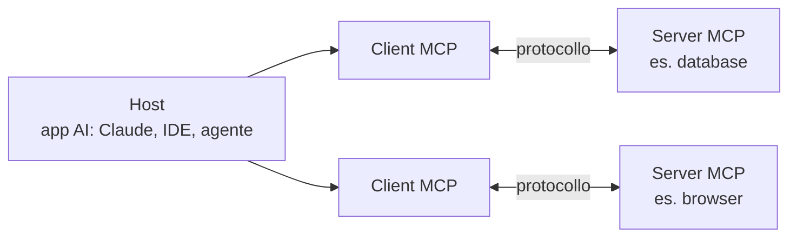

# MCP — Model Context Protocol

Protocollo aperto (creato da **Anthropic**, 2024) che standardizza come un'applicazione AI si collega a strumenti e dati esterni. L'idea: invece di un'integrazione su misura per ogni coppia app ↔ servizio, **un protocollo unico** — spesso descritto come "la porta USB-C dell'AI".

Un **server MCP** è un piccolo servizio che dà al modello accesso *strutturato* a strumenti, dati o azioni: un ponte tra l'app AI e il mondo esterno.

## Architettura

- **Host** — l'applicazione AI (Claude Desktop/Code, un IDE, un agente).
- **Client** — il connettore dentro l'host: uno per ogni server collegato.
- **Server** — il servizio che espone le capacità. Il flusso: il client chiede → il server esegue → il modello usa il risultato.

## Cosa espone un server

| Primitiva | Cos'è | Esempio |
|---|---|---|
| **Tools** | azioni che il modello può chiamare | query su un database, creare un ticket, guidare il browser |
| **Resources** | contesto strutturato in lettura | file, schemi DB, dati remoti |
| **Prompts** | istruzioni riusabili | template per usare bene il server |

**Trasporto:** locale (il server è un processo sulla tua macchina) oppure remoto (endpoint HTTP/SSE).

**Casi d'uso tipici:** automazione del browser, retrieval su documentazione, accesso a schemi di database con assistenza SQL, workflow che richiedono tool affidabili.

> [!warning] Permessi
> Un server MCP dà al modello le mani su sistemi veri: riduci i permessi al minimo necessario e provalo su dati non sensibili prima di dargli quelli veri.

## Vedi anche

[[Data Ingestion]] (LLM che estraggono dati) · [[Python]]

Fonte: [What is an MCP server](https://mcpservers.org/learn/what-is-an-mcp-server) (mcpservers.org)
