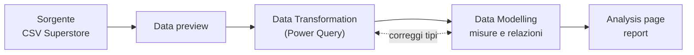

# Power BI

Tool di **business intelligence self-service** di Microsoft: colleghi una sorgente, modelli i dati e costruisci **report e dashboard** interattivi senza scrivere codice. Al lab si usa **Power BI Online** (browser, `app.powerbi.com`) sul dataset **Sample - Superstore** (da Kaggle). È lo strato *Application* dell'[[BI Architecture#I livelli dell'architettura|architettura BI]] — l'alternativa low-code al disegnare grafici in [[Data Visualization|matplotlib]].

## Il flusso — dalla sorgente al report



1. **Choose data source** → carichi il CSV, **data preview** per controllare.
2. **Data Transformation** (Power Query) — pulizia e tipi. *"Ci torniamo."*
3. Dai un **nome** all'analisi → **Analysis page**, dove componi il report.
4. Qualcosa non torna (es. il trend dell'*Order Date*) → torni indietro a sistemare.

> [!info] I due banchi di lavoro
> Ci si muove avanti e indietro tra due posti, ed è il concetto chiave:
> - **Data Transformation** (Power Query) — *com'è fatto* il dato: tipi, pulizia, colonne. Qui correggi il **data type**.
> - **Data Modelling** — *come si combina* il dato: relazioni tra tabelle e **misure** (le formule).

## Correggere il data type

Sintomo tipico: il **trend dell'Order Date sembra sbagliato** → la colonna data è stata importata come testo/numero, non come **Date**. Si torna in **Data Transformation** e si cambia il tipo. Regola generale: prima di analizzare, **i tipi devono essere giusti** — un asse temporale su una stringa produce grafici senza senso ([[Data Quality|garbage in, garbage out]]).

## Misure e DAX (il modello semantico)

Per **trasformare i dati in indicatori** apri il **modello semantico**; lì crei anche le **formule** (misure) che poi ritrovi tra i campi. Le misure si scrivono in **DAX**.

```dax
Profit Margin =
DIVIDE(
    SUM('Sample - Superstore 3'[Profit]),
    SUM('Sample - Superstore 3'[Sales])
)
```

> [!tip] Misura vs colonna, e perché `DIVIDE`
> - Una **misura** si ricalcola **nel contesto** del report (per regione, per anno, sul totale filtrato) — non è un valore fisso riga per riga come una colonna calcolata.
> - **`DIVIDE(a, b)`** invece di `a / b`: gestisce la **divisione per zero** restituendo vuoto (o un default) al posto di un errore.
> - Definita la misura, la trascini in una visualizzazione come qualsiasi campo.

## Fare grafici che dicono qualcosa

I [[Data Visualization#Principi del buon grafico|principi del buon grafico]] valgono identici qui: **ogni elemento deve avere un senso**, niente colori o etichette che non portano informazione **univoca**. Il tool rende facile aggiungere orpelli — la disciplina la metti tu.

## Vedi anche

[[Data Visualization]] · [[BI Architecture]] · [[KNIME]] · [[Data Quality]]
