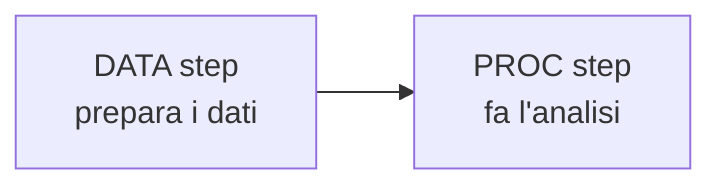

# SAS

**In una riga:** il software statistico delle **aziende grandi** — banche, assicurazioni, farmaceutiche.

È a pagamento, ha quarant'anni, e proprio per questo è dappertutto dove i dati contano sul serio: una banca che ha scritto i suoi modelli in SAS nel 1995 non li riscrive volentieri.

> [!info] Perché studiarlo se esiste [[R]]
> Due motivi pratici.
>
> **Lo trovi sul lavoro.** Nel credit scoring, nell'attuariale e nel farmaceutico è ancora lo standard, anche perché è **certificato** per le pratiche che finiscono davanti a un ente regolatore.
>
> **Ti costringe a capire cosa fai.** SAS stampa tutto, tabelle su tabelle. R è più silenzioso: ti dà quello che chiedi. Leggere un output SAS è un buon allenamento a riconoscere i numeri che contano.

| | [[R]] | SAS |
|---|---|---|
| costo | gratis | licenza cara |
| come impari | community, Stack Overflow | documentazione ufficiale, corsi |
| dove lo trovi | ricerca, startup, data science | banche, assicurazioni, farmaceutico |
| stile | scrivi solo quello che vuoi | stampa tutto per default |

---

## Come è fatto un programma SAS

Qui sta la differenza grossa con R. Un programma SAS è fatto di **blocchi**, e i blocchi sono di due tipi soli.



### Il DATA step — prepara

Crea o modifica tabelle. Una riga alla volta.

```sas
data studenti;           /* crea una tabella che si chiama studenti */
  set p.studenti;        /* partendo da questa               */
  bmi = peso / (altezza/100)**2;   /* aggiunge una colonna   */
  if eta > 30 then adulto = 1;     /* condizione              */
run;                     /* FINE del blocco                  */
```

### Il PROC step — analizza

`PROC` sta per **procedure**. Ogni analisi ha la sua, già pronta.

```sas
proc freq data=studenti;          /* conta le frequenze */
  tables fumo*genere;
run;

proc logistic data=studenti descending;   /* regressione logistica */
  model fumo = peso eta;
run;
```

> [!warning] Il `run;` non si dimentica
> **Ogni blocco finisce con `run;`** e ogni riga finisce con `;`.
>
> Se manca, SAS resta lì ad aspettare il resto del comando e non succede niente. È l'errore numero uno di chi comincia — l'equivalente della parentesi non chiusa in [[R]].

---

## Le PROC principali

| PROC | cosa fa | l'equivalente in R |
|---|---|---|
| `proc print` | stampa la tabella | `head()` |
| `proc contents` | che colonne ci sono, di che tipo | `str()` |
| `proc means` | media, minimo, massimo | `summary()` |
| `proc freq` | conteggi e tabelle incrociate | `table()` |
| `proc corr` | correlazioni | `cor()` |
| `proc reg` | regressione lineare | `lm()` |
| `proc logistic` | regressione logistica | `glm(family="binomial")` |
| `proc surveyselect` | estrae campioni casuali | `sample()` |
| `proc sort` | ordina | `order()` |

---

## La libreria — dove stanno i dati

In R apri un file e basta. In SAS prima si **dichiara una cartella**, dandole un soprannome corto:

```sas
LIBNAME p 'D:\MasterBI2019\data e sas\data';  run;
```

Da quel momento `p` è quella cartella, e le tabelle dentro si chiamano `p.nometabella`.

```sas
data studenti; set p.studenti; run;   /* copia la tabella dalla libreria */
```

> [!tip] Il punto separa libreria e tabella
> `p.studenti` = la tabella `studenti` dentro la libreria `p`.
>
> Una tabella **senza punto** (`studenti` e basta) vive nella libreria temporanea `work`, e **sparisce quando chiudi SAS**. Per questo i programmi cominciano quasi sempre copiando da `p` a `work`.

---

## Leggere la regressione logistica in SAS

È la stessa analisi di [[Regressione logistica]], scritta in un'altra lingua.

```sas
proc logistic data=model_credit descending;
  class checking history savings / param=ref;   /* variabili categoriali */
  model GOOD_BAD = checking history duration amount / selection=stepwise;
  score data=validation out=prob;               /* previsioni */
run;
```

Pezzo per pezzo:

| pezzo | cosa fa |
|---|---|
| `descending` | **importante**: dice a SAS di prevedere `Y=1` invece di `Y=0` |
| `class ... / param=ref` | dichiara quali variabili sono categoriali e sceglie la categoria di riferimento |
| `model y = x1 x2` | il modello. Le variabili si separano con **spazi**, non con `+` |
| `selection=stepwise` | prova ad aggiungere e togliere variabili da solo, tenendo le utili |
| `score data=... out=...` | applica il modello a dati nuovi e salva le probabilità |

> [!warning] `descending` è la trappola classica
> Senza `descending`, SAS modella la probabilità del valore **più basso** — di solito lo 0, cioè il **non** evento.
>
> Tutti gli odds ratio escono rovesciati: dove ti aspetti 2 leggi 0,5. In R lo stesso problema si chiama `relevel()`.

---

## Prior e profitti

C'è una cosa che SAS rende esplicita più di R, ed è il motivo per cui in azienda lo tengono: **il prior e i costi si dichiarano dentro il comando**.

```sas
proc logistic data=model_credit descending;
  model GOOD_BAD = checking duration amount / pevent=0.95;
  score data=validation out=prob priorevent=0.95;
run;
```

`pevent=0.95` dice: *"nella realtà i clienti buoni sono il 95%, anche se nei miei dati di addestramento sono il 70%"*.

> [!important] Perché serve
> I dataset di training vengono spesso **bilanciati apposta**: si tengono tutti gli insolventi e solo una parte dei clienti buoni, così il modello impara meglio.
>
> Ma allora il modello crede che gli insolventi siano il 30% del mondo, mentre sono il 5%. **Le probabilità che produce sono gonfiate** e vanno riportate alla realtà.
>
> Il discorso per esteso sta in [[Classificatore di Bayes#Problema 2 — i dati di training sono bilanciati, la realtà no]].

E la soglia di decisione si sposta in base a quanto costano i due errori:

```sas
data score; set prob_scored;
  if p_GOOD > 0.83333 then decision='Accept';
  else decision='Reject';
run;
```

Quel `0,83333` non è uscito dal nulla: viene dal rapporto fra il guadagno di un prestito buono e la perdita di uno cattivo.

---

## Dove finiscono i risultati

SAS ha tre finestre, e vanno guardate in quest'ordine:

| finestra | cosa contiene |
|---|---|
| **Log** | **guarda sempre questa per prima.** Errori in rosso, avvisi in verde |
| **Output** / Results | le tabelle dei risultati |
| **Explorer** | le tabelle create, dentro le librerie |

> [!tip] Nel Log, il rosso non è l'unico problema
> Cerca anche `NOTE: ... uninitialized` o `NOTE: Missing values were generated`. Non sono errori, il programma gira lo stesso — ma spesso vuol dire che hai scritto male il nome di una colonna e SAS ha inventato una variabile vuota.

---

## Da tenere in tasca

| domanda | risposta rapida |
|---|---|
| I due tipi di blocco? | **DATA** prepara, **PROC** analizza |
| Cosa chiude un blocco? | `run;` — sempre |
| Cos'è una libreria? | il soprannome di una cartella: `LIBNAME p '...'` |
| `p.tabella` vs `tabella`? | la seconda sta in `work` e **sparisce** alla chiusura |
| Logistica? | `proc logistic ... descending;` |
| A cosa serve `descending`? | a modellare `Y=1` e non `Y=0`. Senza, gli OR si ribaltano |
| `pevent=` / `priorevent=`? | dichiarano il **prior vero** quando il training è bilanciato |
| Dove guardo se non funziona? | la finestra **Log** |

## Vedi anche

[[R]] · [[Regressione logistica]] · [[Classificatore di Bayes]] · [[Python]]
